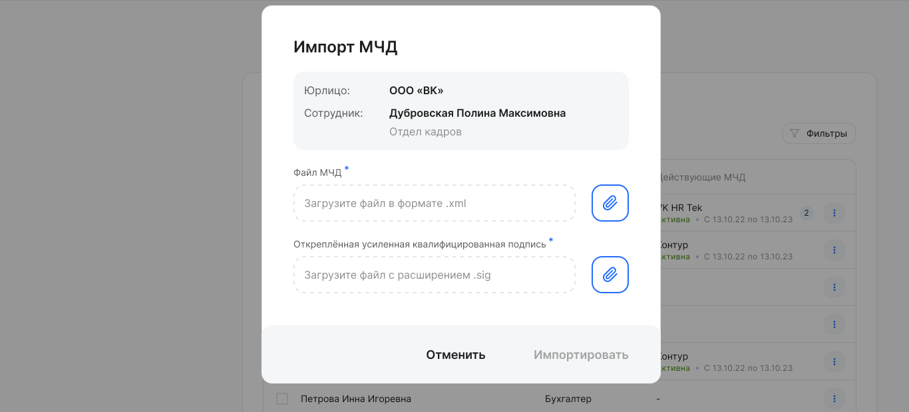

В сервисе предусмотрен импорт МЧД, выпущенных только в других системах. Допускается только единичный импорт — в сервис загружается отдельный файл по каждому пользователю. Импортированные МЧД могут дублироваться в сервисе.

В сервис могут быть импортированы МЧД форматов 002 и 003 (источник – [Госуслуги ](https://partners.gosuslugi.ru/catalog/attorney)).

Чтобы импортировать МЧД, необходимо:

1\. Перейти в **Сервисы компании →** **Настройки → Пользователи МЧД**.

2\. В рамках компании выбрать пользователя из списка и нажать кнопку **→ Импортировать МЧД**. В списке пользователей перечислены все сотрудники, у которых есть хотя бы одна роль в данной компании.

3\. В форму **Импорт МЧД** прикрепить файл МЧД в формате .xml и файл откреплённой УКЭП в формате .sig, оба файла обязательны.

4\. Нажать кнопку **Импортировать**. При успешной загрузке файлов МЧД и подписи появится уведомление, что МЧД для выбранного сотрудника импортирована. МЧД перейдет в состояние ***Действующая**.*

5\. Сервис проверяет загружаемые файлы по следующим условиям: 

- Срок действия МЧД ещё не истёк.
- СНИЛС представителя в МЧД совпадает со СНИЛС пользователя, которому импортируют МЧД.
- ОГРН/ОГРНИП доверителя из МЧД совпадает с ОГРН компании. Если иностранная компания — проверяется регистрационный номер в стране регистрации (инкорпорации).
- Файл подписи соответствует загружаемой МЧД.