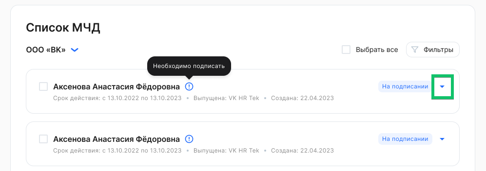
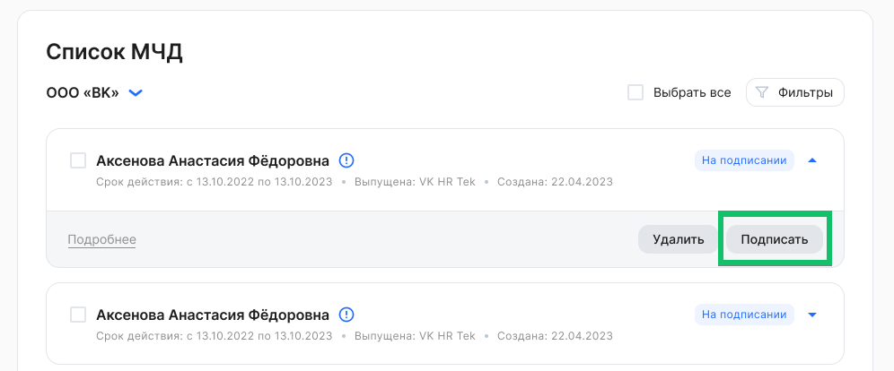
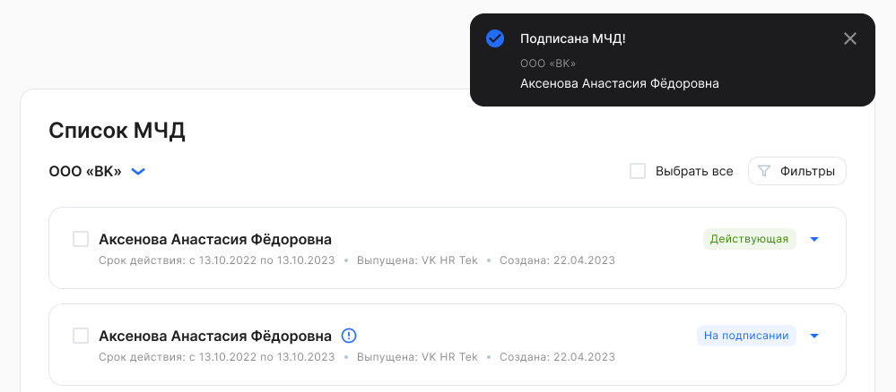

Подписание МЧД доступно только для пользователей с ролью «Руководитель организации».

<warn>

Следите за сроком действия МЧД.

Cистема НЕ запрещает подписание документов с использованием МЧД, у которой истек срок действия.

Система может направлять уведомления о том, что у доверенности истекает срок действия, но не запретит подписание без МЧД или с МЧД, у которой истек срок действия.

</warn>

Чтобы подписать МЧД, необходимо:

1\. Перейти в **Сервисы компании → Настройки → Список МЧД**.

2\. В рамках компании выбрать МЧД в состоянии ***На подписании***. Для массового подписания возможно выбрать несколько или все МЧД из списка.

3\. Нажать кнопку **Подписать.** МЧД подписывается УКЭПом.

4\. При успешном сохранении подписи появится уведомление, что МЧД для выбранного сотрудника подписана. МЧД перейдет в состояние **Действующая**.

