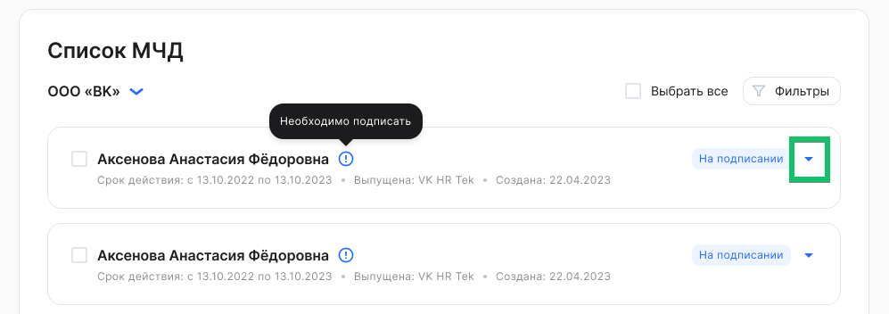
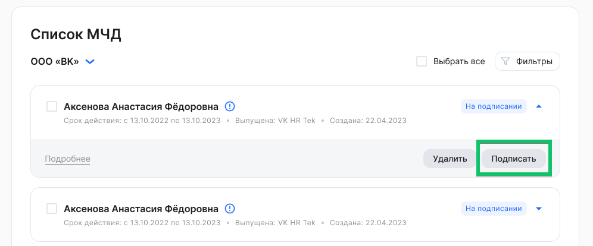
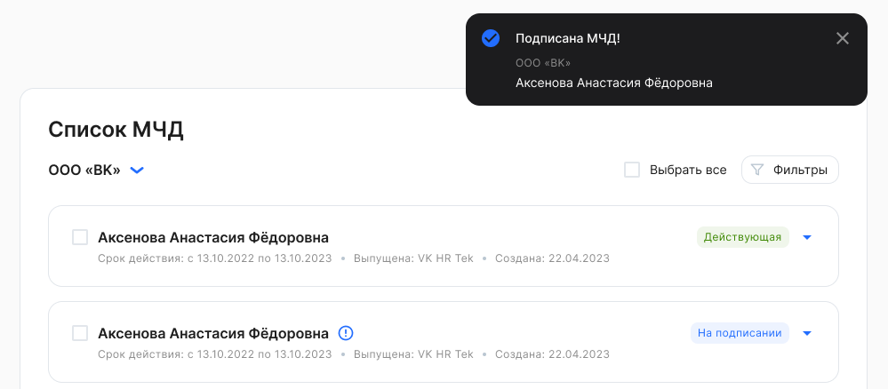
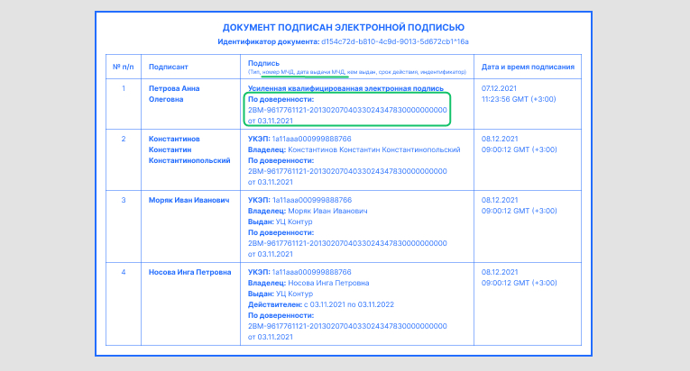

Подписание МЧД доступно только для пользователей с ролью «Руководитель организации».

<warn>

Следите за сроком действия МЧД.

Начиная с [релиза 2026.05](/ru/release_notes/saas/20260500Core#mchd), система запрещает подписание документов с использованием МЧД, у которой истёк срок действия.

Система может направлять уведомления о том, что у доверенности истекает срок действия, для настройки уведомления обратитесь в [поддержку VK HR Tek](/ru/hr/support/contact_channels)

</warn>

Чтобы подписать МЧД, необходимо:

1\. Перейти в **Сервисы компании** → **Настройки** → **Список МЧД**.

2\. В рамках компании выбрать МЧД в состоянии ***На подписании***. Для массового подписания возможно выбрать несколько или все МЧД из списка.

3\. Нажать кнопку **Подписать**. МЧД подписывается УКЭП.

4\. При успешном сохранении подписи появится уведомление, что МЧД для выбранного сотрудника подписана. МЧД перейдёт в состояние **Действующая**.

## Электронная подпись с МЧД

Документ, который был подписан сотрудником, имеющим МЧД, будет проштампован с отметкой «По доверенности: <номер МЧД> от <дата выдачи МЧД>».

Для подключения отображения данных о МЧД в штампе обратитесь в [поддержку VK HR Tek](/ru/hr/support/contact_channels). После изменения данных в штампе новый вид будет применяться только к новым документам.

Все возможные данные, которые могут отображаться в штампах УКЭП:

