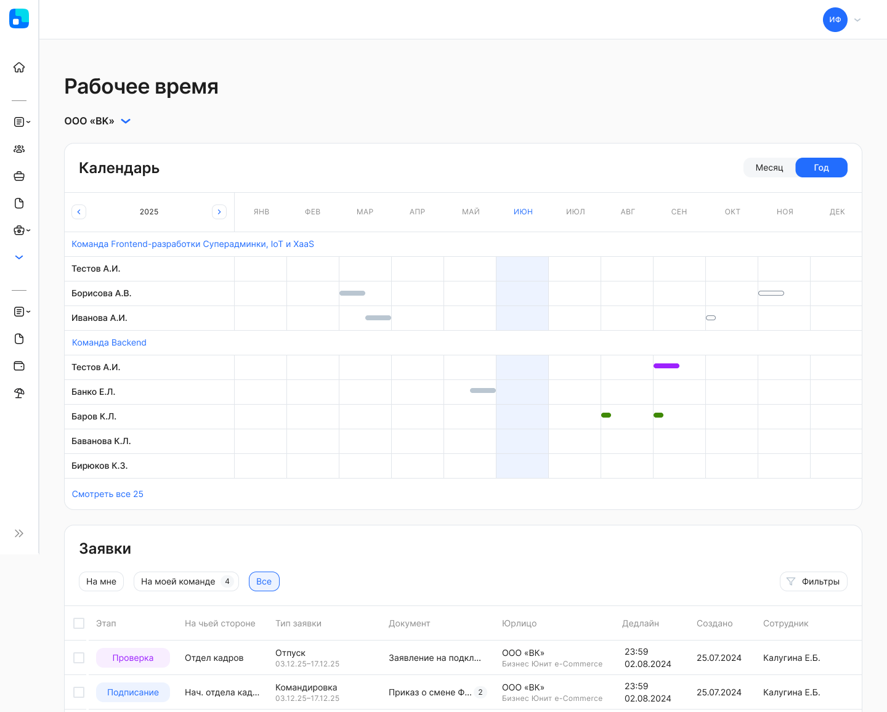
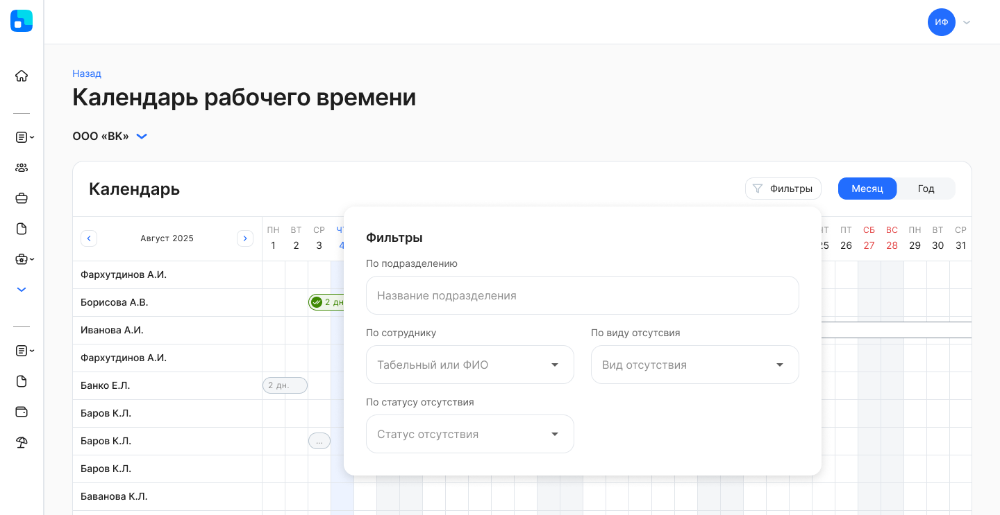
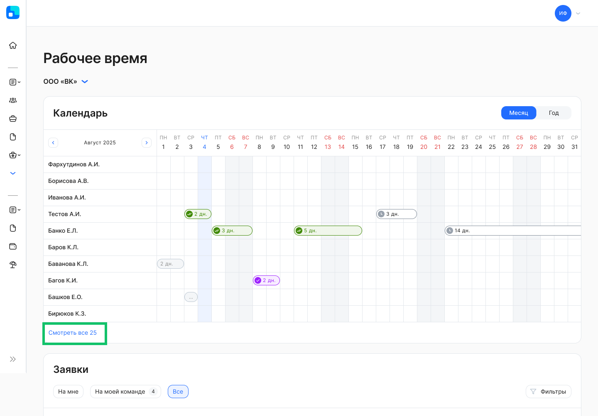

В разделе **Рабочее время** представители компании и руководители могут работать с заявками и  календарем отсутствий сотрудников: отпуск, командировка, больничный и др.

## Календарь отсутствий
Отсутствия сотрудников могут быть разных видов: отпуска/командировки/болезни и другие. 

Отсутствия в сервисе VK HR Tek создаются пока только на основании данных, которые передаются из системы управления персоналом по согласованным или прошедшим отсутствиям. Передача происходит автоматически по каждому сотруднику после проведения отсутствия в системе.

На данный момент реализована интеграция для обмена данных с 1С:ЗУП.

Информация об отсутствии обновляется в режиме реального времени. В случае изменения отсутствия на стороне 1С в сервисе будет отменено это отсутствие и создано новое с измененными данными. 

В **Календаре** содержится информация о фактических и запланированных днях отсутствий сотрудников.

Цветовая схема обозначений отсутствий:

 белый — запланированный отпуск по графику;

 фиолетовый — запланированный отпуск по графику, для оформления которого создана заявка или другой вид отсутствия, созданный и проведенный в системе управления персоналом (без заявки КЭДО);

 зеленый — отсутствие, созданное по заявке из КЭДО и проведенное в системе управления персоналом (текущее или запланированное);

 серый — отсутствие в прошлом, проведенное  в системе управления персоналом;

 заштриховано — пересечение отсутствий. 

В календаре также подсвечиваются даты праздников (федеральные и региональные, если компания использует и передает региональные календари).

Тип, даты отсутствия указываются в подсказке при наведении на закрашенную ячейку в календаре.

Есть возможность выбрать период отображения данных: месяц или год. При просмотре календаря в формате месяца можно увидеть детализацию по дням, а в формате года — по месяцам. 

К отсутствиям в календаре можно применить фильтры:

- **По подразделению** — выбор одного значения из предложенного списка с возможностью текстового поиска.
- **По сотруднику** — выбор одного значения из предложенного списка с возможностью текстового поиска по ФИО или табельному номеру сотрудника. 
- **По виду отсутствия** — выбор одного значения из предложенных вариантов: основной/дополнительный отпуск, командировка и т.д.
- **По статусу отсутствия** — выбор одного значения из предложенных вариантов:
    - **Запланировано** — отсутствие не связано с оформленной заявкой. Период ещё не наступил или находится в ожидании. Может быть изменено или удалено без согласования.
    - **Оформлено** — отсутствие связано с активной заявкой, но ещё не согласовано. Требует дальнейшего согласования или подтверждения от руководителя или представителя компании.
    - **Согласовано** — отсутствие связано с завершённой и согласованной заявкой, период ещё не начался.
    - **В процессе** — отсутствие связано с завершённой и согласованной заявкой, период которого актуален (начался, но ещё не завершился). Сотрудник находится в отсутствии.
    - **Завершено** — отсутствие связано с завершённой заявкой, и его период полностью прошёл. 

<warn>

Отменённые отсутствия не отображаются в календаре и не участвуют в расчётах рабочего времени.

</warn>

 

Чтобы просмотреть отсутствия всех сотрудников в календаре, нажмите на кнопку **Смотреть все**. Откроется страница **Календарь рабочего времени**, где пользователь будет видеть полный список сотрудников. 

## Заявки, связанные с отсутствиями
В листинге собраны заявки, которые имеют отношение к отсутствиям сотрудников. Сейчас это все типы заявок, в названии которых встречаются слова «отпуск» или «командировка».

### Фильтры списка
- **По сотруднику** — выбор одного значения из списка с возможностью текстового поиска по ФИО или табельному номеру сотрудника. 
- **По этапу заявки** — выбор любого количества значений из предложенных вариантов: Загрузка, Подписание, Проверка, Успешно закрыты, Отменены, В бумаге.
- **По виду отсутствия** — выбор одного значения из списка.
- **По подразделению** — выбор одного значения из списка с возможностью поиска.
- **На чьей стороне** — выбор одного значения из вариантов: Компания или Сотрудник.
- **По причине отмены заявки** — выбор любого количества значений из предложенных вариантов: По дедлайну, Отменено сотрудником, Отменено представителем компании, Изменен порядок оформления, Сотрудник уволен. 
- **По типу документа** — выбор любого количества значений из предложенных типов документов, которые есть в бизнес-процессах компании.
- **Период отсутствия в указанном промежутке** — выбор любой даты из открывшегося календаря. При этом нет необходимости указывать весь период, можно выбрать одну дату либо начала, либо окончания периода. 

В момент применения фильтров происходит поиск заявок и список заявок автоматически обновляется.

## Доступ к разделу
Отображение отсутствий по всем сотрудникам в компании доступно для пользователя с ролью «Менеджер раздела отсутствий».

Руководители видят в разделе своих прямых подчиненных и сотрудников нижестоящих подразделений (если применимо). В том случае, если пользователь является руководителем нескольких подразделений, то подчиненные будут показаны с разбивкой по подразделениям. 

Чтобы открыть информацию о руководителе подразделения сотрудника, нажмите на название подразделения в календаре.

Если пользователь является представителем или руководителем в нескольких компаниях, то нужно выбрать юрлицо, с которым хотите работать.