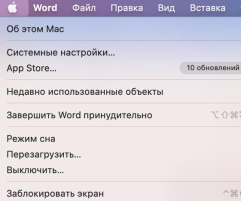

1. Скачайте КриптоПро CSP с [официального сайта ](https://cryptopro.ru/products/csp), выбрав версию для ОС macOS.
1. Запустите установочный файл КриптоПро CSP. 
1. Пройдите все этапы в диалоговом окне Мастера установки, оставляя настройки по умолчанию.
1. После завершения установки рекомендуется перезагрузить компьютер.

<warn>
На компьютерах Mac с процессорами Apple M1 (а не производства Intel) нельзя ставить драйверы для токена. Проверить тип процессора можно в разделе «Об этом Mac» в строке «Процессор».
</warn>

