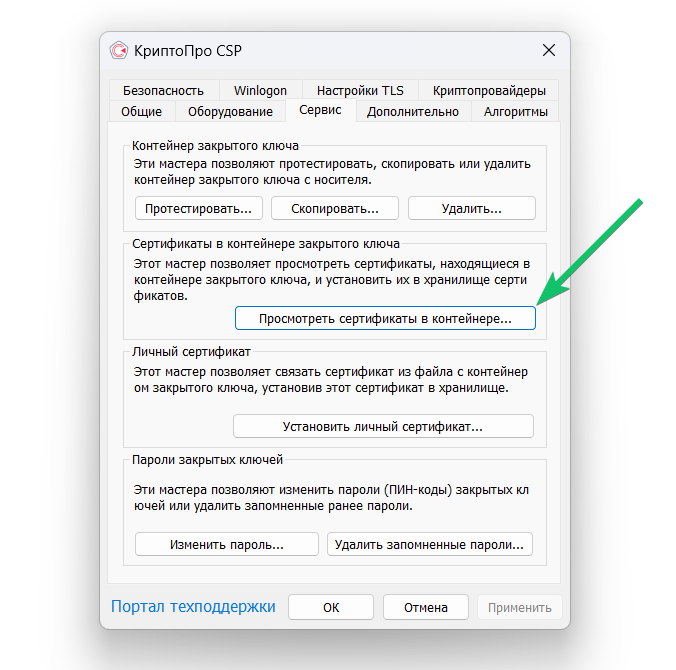
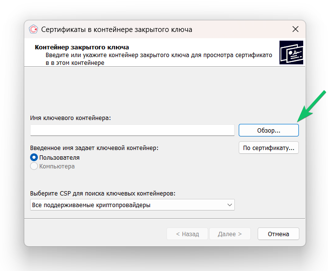
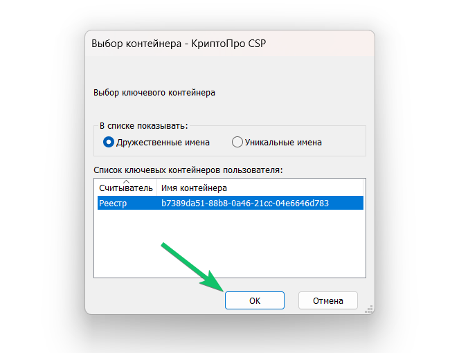
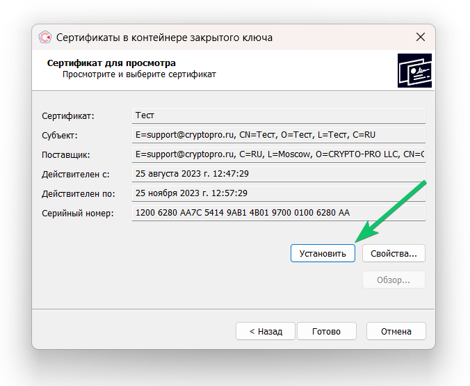
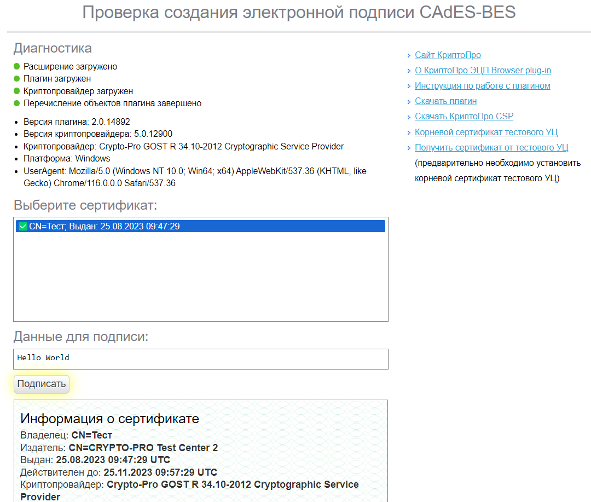

1. Убедитесь, что ключевой носитель подключен к компьютеру. Если в качестве ключевого носителя используется флешка, то она должна отображаться как съёмный диск в папке «Мой компьютер» («Этот компьютер»). Если в качестве ключевого носителя используется токен, то в нём должна постоянно гореть лампочка.

<warn>

Закрытый ключ может быть в виде шести файлов: *header.key*, *masks.key*, *masks2.key*, *name.key*, *primary.key*, *primary2.key*. Если эти файлы находятся на жёстком диске, то КриптоПро CSP их не распознает. 

Поэтому для установки сертификата потребуется перенести каждый файл на флешку, в папку первого уровня (НЕ в корневую папку).

</warn>

1. Откройте программу КриптоПро CSP.
1. На вкладке **Сервис** нажмите кнопку **Просмотреть сертификат в контейнере**.

3. Нажмите кнопку **Обзор**.

4. Откроется окно со списком ключевых контейнеров. Здесь же будет отображаться доступный считыватель. Выберите контейнер и нажмите кнопку **OK**.

5. Убедитесь, что выбрали нужный сертификат, и установите его.

6. Если установка прошла успешно, откроется окно с сообщением о завершении операции.

Проверить корректность установки электронной подписи можно на странице [Проверка создания электронной подписи ](https://www.cryptopro.ru/sites/default/files/products/cades/demopage/cades_bes_sample.html). Нужно ввести данные для подписи, выбрать сертификат и нажать **Подписать**.

