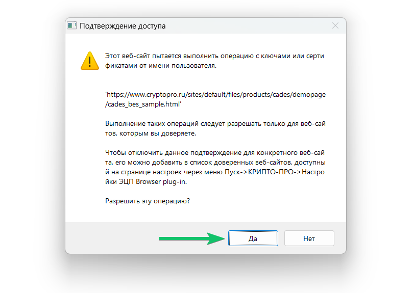

Проверить корректность установки плагина можно на странице [Проверка создания электронной подписи ](https://www.cryptopro.ru/sites/default/files/products/cades/demopage/cades_bes_sample.html). Для этого в открывшемся окне подтвердите доступ путем нажатия кнопки «Да».

Если установка КриптоПро ЭЦП Browser plug-in прошла успешно, появится окно с надписью «Плагин загружен», с указанием его версии и версии КриптоПро CSP.

