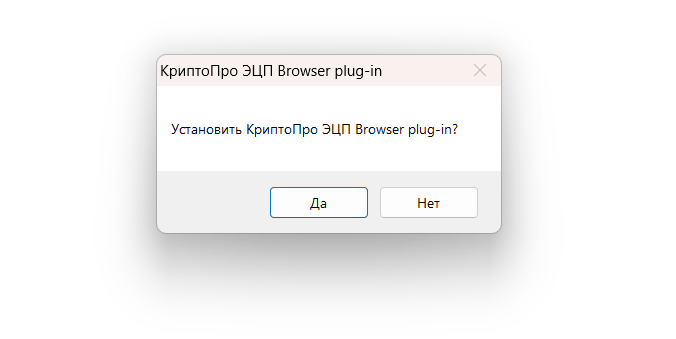
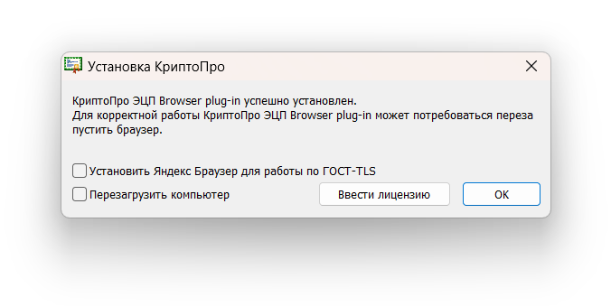

Для создания и проверки электронной подписи на веб-страницах необходимо установить плагин.

Порядок установки:

1. Скачайте [программу установки ](https://www.cryptopro.ru/products/cades/plugin) и запустите установочный файл. Разрешите программе внести изменения на вашем компьютере, если потребуется.

1. Подтвердите установку КриптоПро ЭЦП Browser plug-in.

3. Дождитесь окончания установки КриптоПро ЭЦП Browser plug-in.

4. После окончания установки КриптоПро ЭЦП Browser plug-in нажмите **OK**.

Дальнейшие настройки различаются в зависимости от используемого браузера.

Активацию плагина нужно осуществлять в каждом браузере отдельно.