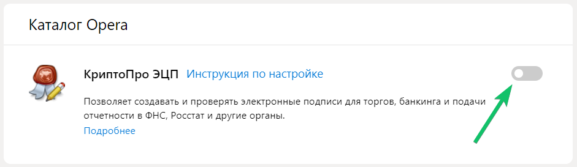
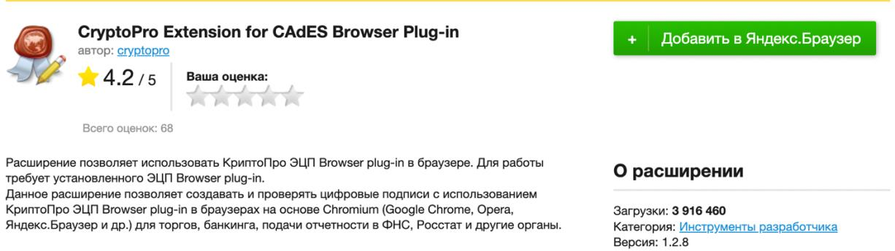

1. В браузере откройте **Настройки** (три полоски в правом верхнем углу) **→ Дополнения**. В зависимости от версии браузера путь к дополнениям может отличаться.
1. В списке дополнений проверьте наличие КриптоПро ЭЦП и активируйте его.

3. Если CryptoPro Extension for CAdES Browser Plug-in отсутствует в дополнений, перейдите в каталог расширений браузера и [установите его ](https://addons.opera.com/ru/extensions/details/cryptopro-extension-for-cades-browser-plug-in/), затем повторите шаг 2.

3. После завершения настройки рекомендуется перезагрузить браузер. 