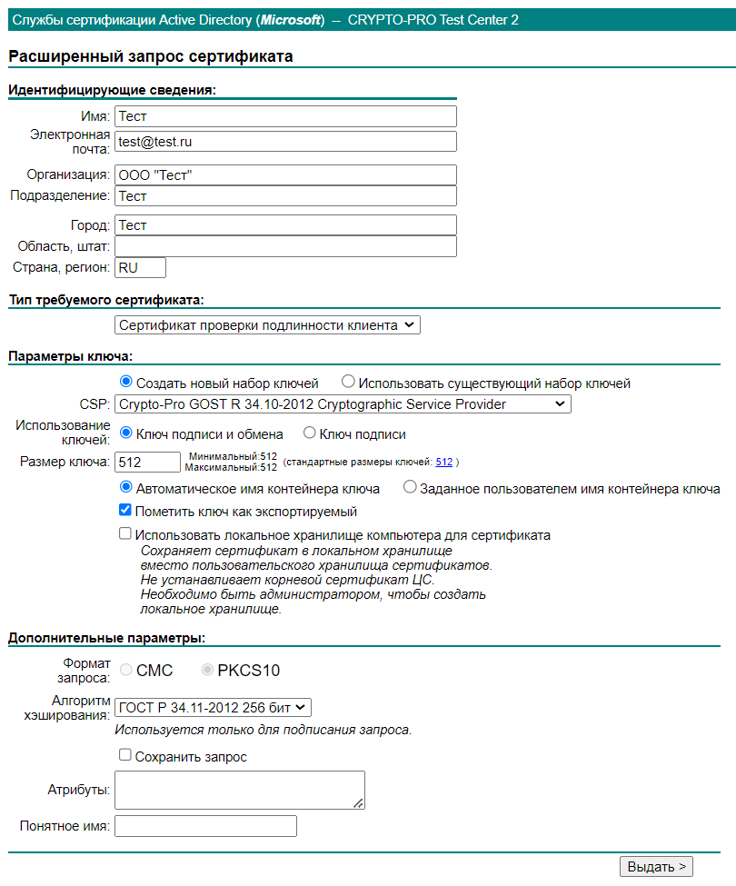
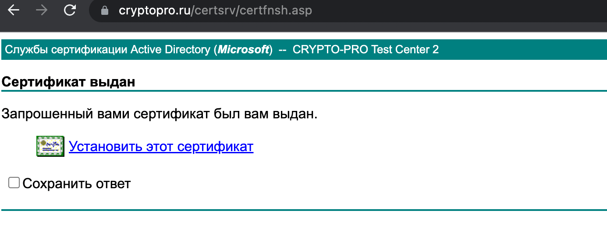
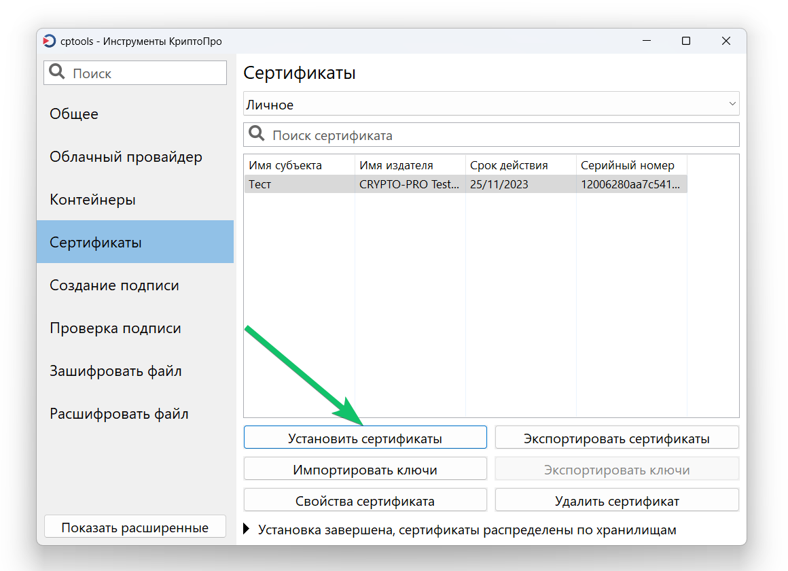
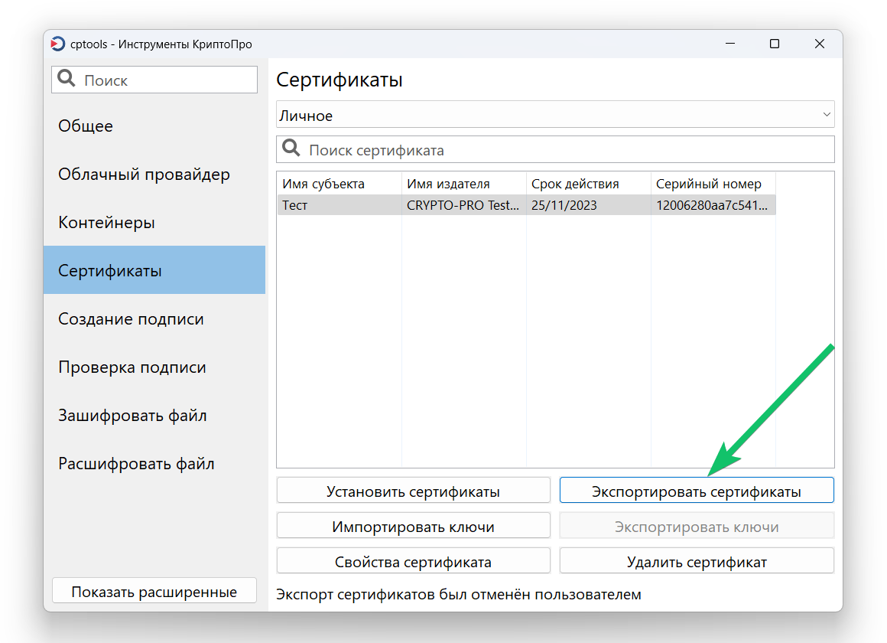

Чтобы проводить демо и тестовое подписание, можно самостоятельно выпускать тестовый УКЭП. Он будет полностью валиден для подписания, т.е. в веб-сервисе и расширении 1С всё будет работать. Только такая подпись не будет проходить проверку на публичных сайтах. Весь процесс займет 15–30 мин.

## **Установка КриптоПро и сертификата**
1. Скачайте и установите пробную версию программы [КриптоПро CSP](https://www.cryptopro.ru/products/csp) на 90 дней. 
1. Скачайте и установите плагин [КриптоПро ЭЦП Browser plug-in](https://www.cryptopro.ru/products/cades/plugin) для браузера Google Chrome. 
1. Проверьте работу программы КриптоПро и плагина на [сайте](https://www.cryptopro.ru/sites/default/files/products/cades/demopage/cades_bes_sample.html). Все пункты из диагностики должны быть отмечены зеленым.
1. Выпустите тестовый сертификат и ключи на [сайте](https://www.cryptopro.ru/certsrv/certrqma.asp). Заполните поля на странице **Расширенный запрос сертификата** и нажмите кнопку **Выдать**. 

5. Выберите ключевой носитель для создания контейнера, по умолчанию выбран *Реестр*. 
6. Перемещайте указатель мыши или нажимайте различные клавиши для генерации случайных последовательности ключей.
6. Установите сертификат.

Если у вас не установлен доверенный корневой сертификат (появится соответствующее сообщение об ошибке), то нужно его скачать и установить через **Инструменты КриптоПро** (программу скачали и установили в п. 1).

Чтобы установить выданный сертификат, выберите его в списке и нажмите на кнопку **Установить сертификаты**. 

8. Чтобы избежать случайных подписаний неверными сертификатами, менеджер ВК загружает для конкретного подписанта открытый ключ его ЭЦП. Чтобы его выгрузить и передать вашему менеджеру для загрузки, экспортируйте сертификат в формате .p7b (подробнее в [статье](/ru/hr/company/actions_eds/upload_ukep)).

