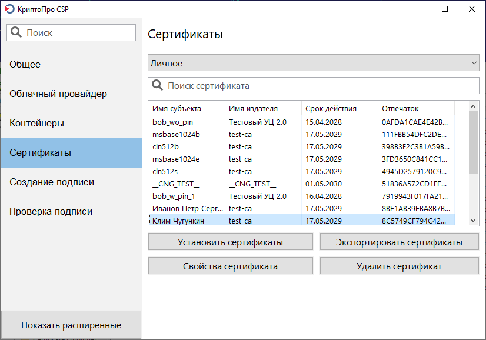

Чтобы выгрузить сертификат УКЭП в формате .p7b, сотруднику необходимо:
1. Проверить, что на его компьютере установлена программа [КриптоПро CSP](https://www.cryptopro.ru/products/csp). 
1. Перейти на вкладку **Сертификаты**.
   
1. Выбрать нужный сертификат из представленного списка и нажать на кнопку **Экспортировать сертификаты**.
4. Выбрать формат .p7b и сохранить сертификат.