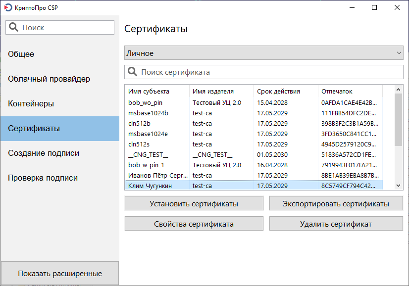

<warn>
Срок действия сертификата УКЭП составляет один год
</warn>

Рекомендуется контролировать срок действия сертификата и заблаговременно выполнять его перевыпуск.

После перевыпуска необходимо повторно направить обращение с запросом на загрузку сертификата в техническую поддержку VK HR Tek на адрес support@hrtek.ru.

Чтобы выгрузить сертификат УКЭП в формате .p7b, сотруднику необходимо:
1. Проверить, что на его компьютере установлена программа [КриптоПро CSP](https://www.cryptopro.ru/products/csp). 
1. Перейти на вкладку **Сертификаты**.

3. Выбрать нужный сертификат из представленного списка и нажать кнопку **Экспортировать сертификаты**.
4. Выбрать формат .p7b и сохранить сертификат.
5. Отправить сертификат в формате .p7b на адрес support@hrtek.ru, обязательно указав:

   - ФИО сотрудника;
   - названия компаний, в которые необходимо загрузить УКЭП;
   - прикрепить в качестве вложения файл с сертификатом в формате .p7b.