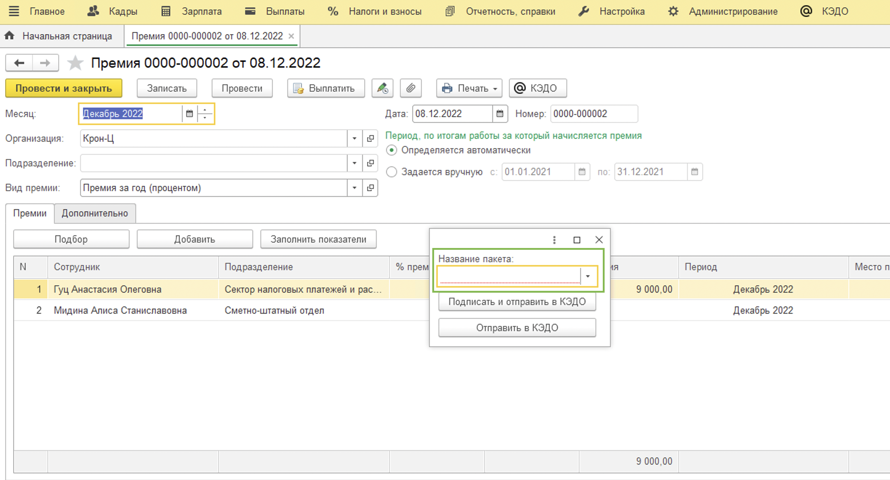
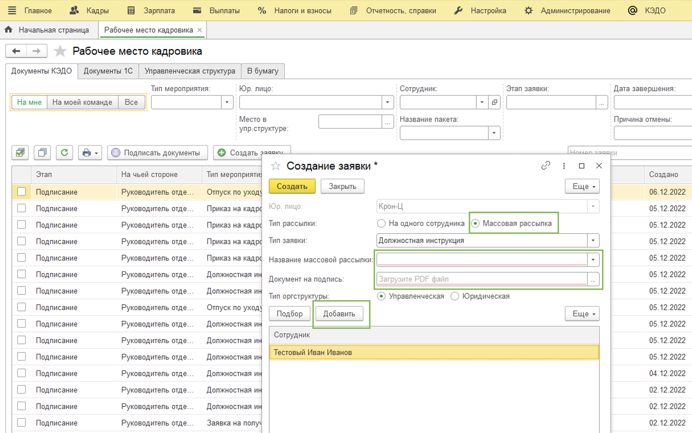
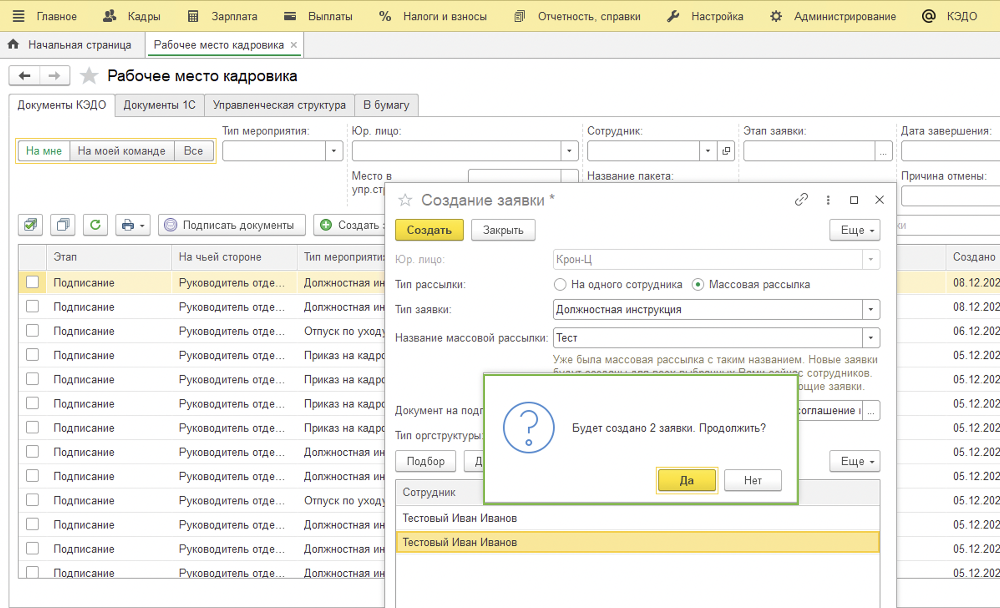
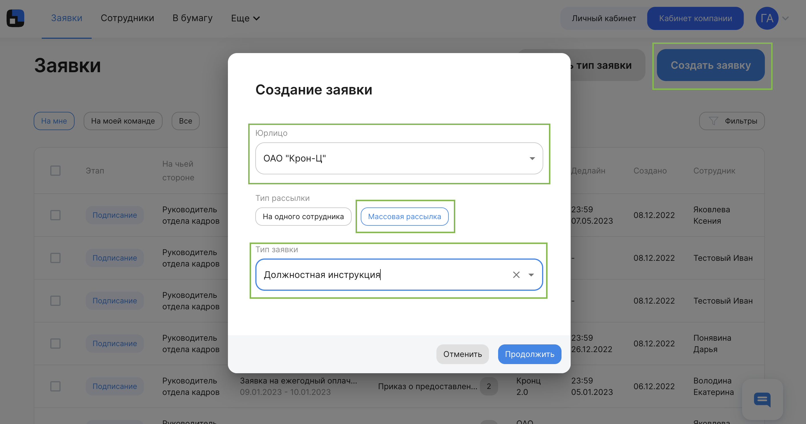
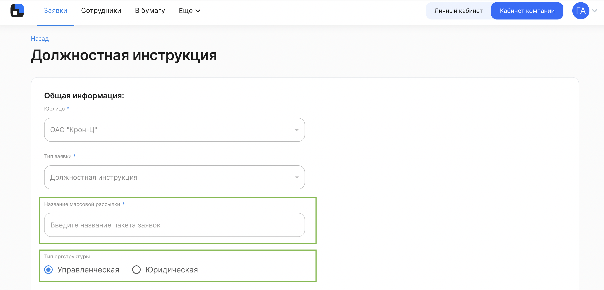
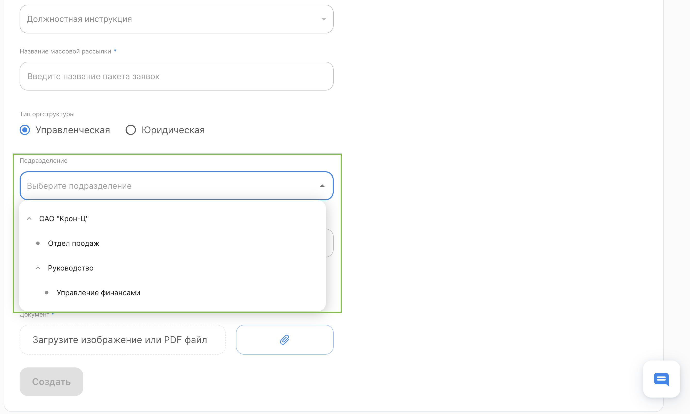
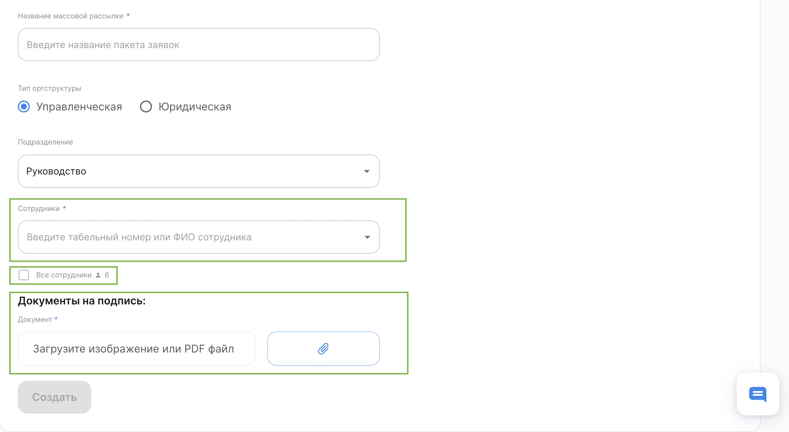
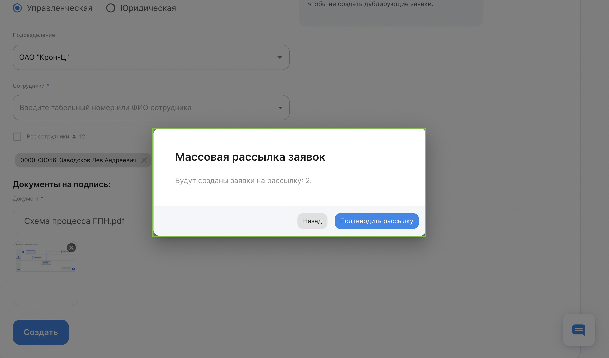

У Отдела кадров есть возможность создания пакетных заявок – одинаковых заявок на несколько человек. 

Пример: Рассылка должностной инструкции на N новых сотрудников.

<info>

Отдел кадров может создавать и в 1С и в вебе **Кабинет компании**. Вы можете сразу перейти к нужной части статьи с помощью оглавления справа в зависимости от того, где вам удобно работать

</info>

## 1С "Рабочее место кадровика"
Доступны два варианта

### Отправка групповых документов
Возможно сделать массовую рассылку из следующих 1С документов:

1. Изменение графика работы списком (Приказ об изменении графика работы).
2. Кадровый перевод списком (Приказ о перевода (Т-5а)).
3. Работа в выходные и праздничные дни​​​​​​​ (Приказ о работе в выходной (праздничный день)).
4. График отпусков (Выписка из графика отпусков).
5. Премия (Приказ на премию Т-11).

При этом групповой документ (Например, приказ на премию сразу на группу сотрудников) будет разделен и каждый сотрудник из списка получит заявку только со своей частью и персональной информацией. 

Для отправки группового документа в КЭДО убедитесь, что у вас есть соответсвующий бизнес-процесс. 

Затем нажмите кнопку **КЭДО** и задайте название пакета. 

<info>
По названию пакета вы сможете отфильтровать отправленные заявки и отследить статус подписания/ознакомления всеми сотрудниками.
Если несколько раз задать одинаковое название пакета, то все заявки объединятся в один фильтр
</info>

### Отправка одного документа

Возможно сделать массовую рассылку одного и того же документа сразу на группу сотрудников. Функциональная возможность подойдёт для отправки таких документов, как должностная инструкция, когда требуется направить один документ сразу нескольким сотрудникам и не создавать заявку на каждого отдельно. 

Переходим в 1С → КЭДО → Рабочее место кадровика.

Нажимаем кнопку **Создать заявку**.

Далее:

- Проверяем поле Юр. лицо;

- Выбираем Тип рассылки - Массовая рассылка;

- Тип заявки - Выбираем из выпадающего меню нужную;

- Добавляем название массовой рассылки;

- Загружаем документ (если требуется);

- Выбираем Тип оргструктуры;

- Добавляем сотрудников.

<info>
Если выбрать пакетную и добавить всего одного сотрудника, то создастся обычная заявка, как если создавать её на одного сотрудника
</info>

Подтверждаем отправку заявок.

В нижней части 1С появится системное оповещение об успешном создании заявок.

Процесс завершён.

## Веб "Кабинет компании"

Переходим в веб **Кабинет компании** (https://vkdoc.mail.ru/)

Нажимаем кнопку **Создать заявку**.

Заполняем пустые поля в открывшемся окне:

- Выбираем **Юрлицо**;

- Тип рассылки **Массовая рассылка**;

- Тип заявки выберите из выпадающего списка;

Нажимаем кнопку **Продолжить**.

В открывшейся заявке поля **Юрлицо** и **Тип заявки** заполняются автоматически. 

Вам нужно:

- Придумать название массовой рассылки;

- Выбрать тип оргструктуры: управленческая или юридическая. В соответствии с выбранным типом у вас появится возможность создать заявку на то или иное подразделение.

<info>
Если выбрать пакетную и добавить всего одного сотрудника, то создастся обычная заявка, как если создавать её на одного сотрудника.
</info>

 

 

- Если выбрать основное подразделение компании (родительское) документ можно будет направить сразу на всю компанию;

- Либо можно указать конкретное подразделение, в котором находятся сотрудники, которым предназначен отправляемый документ.

- Далее можно выбрать из выпадающего списка сотрудниов указанного подразделения, на которых требуется направить документ;

- Либо поставить флаг напротив опции **Все сотрудники**, при необходимости, лишних сотрудников можно будет удалить, нажав крестик рядом с ФИО;

- Следующим шагом потребуется через скрепку загрузить документ в формате pdf, который будет направлен выбранным сотрудникам и нажать кнопку **Создать**.

- Подтвердите отправку в открывшемся окне.

В правом верхнем углу появится сообщение об успешной отправке заявок и их количестве.

Процесс завершён.