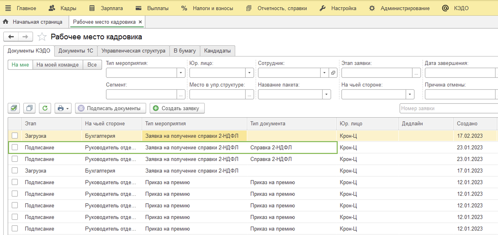
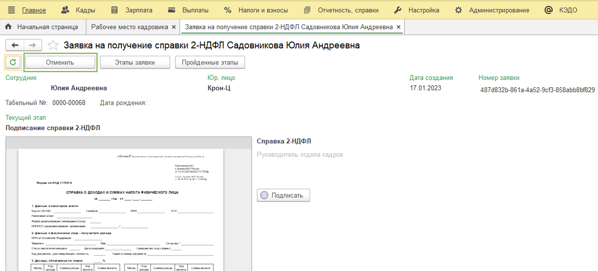
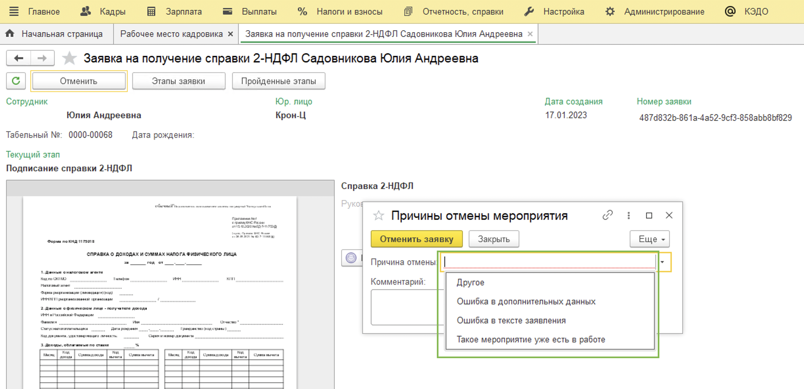
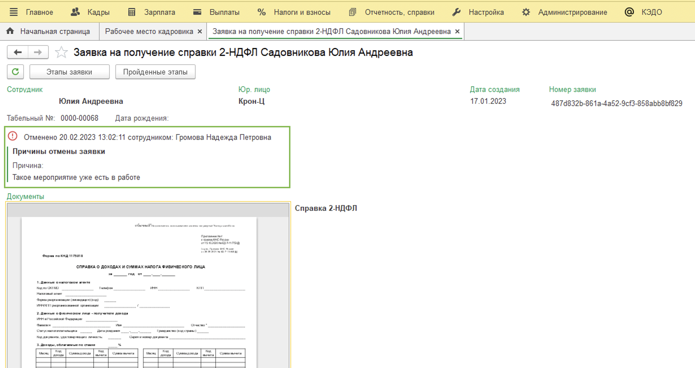
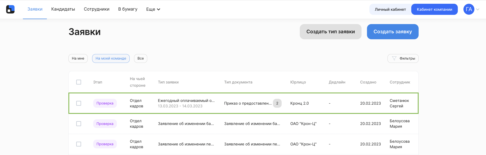
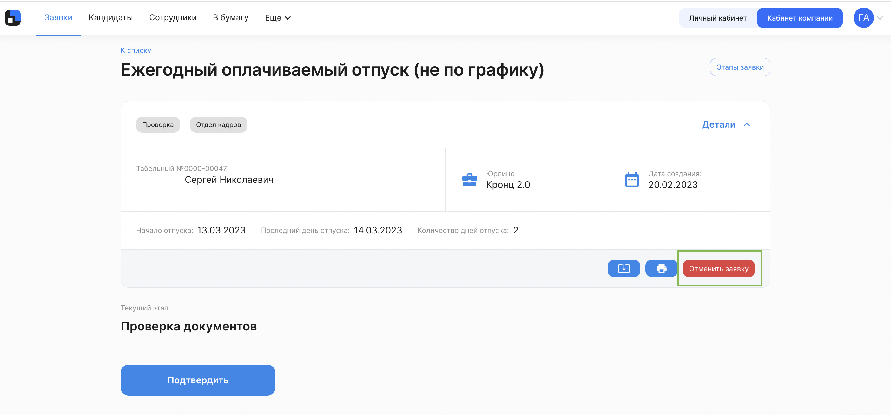
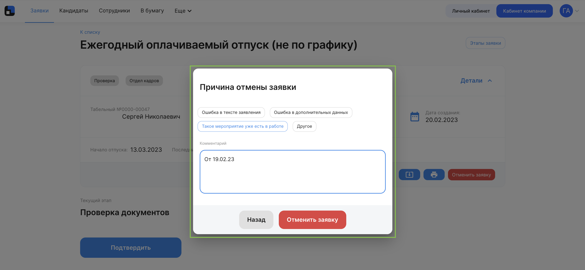
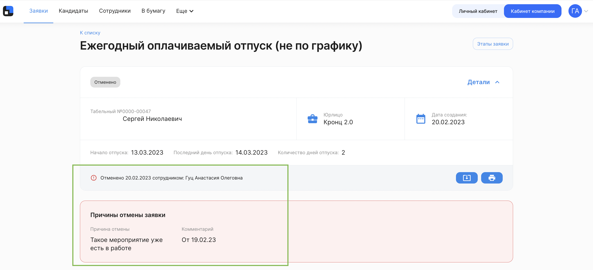

У Отдела кадров есть возможность в любой момент до полного завершения заявки (статус **Завершено**) отменить ее.

<info>

Отдел кадров может отменить заявки и в 1С, и в веб-интерфейсе **Кабинет компании**. Вы можете сразу перейти к нужной части статьи с помощью оглавления справа в зависимости от того, где вам удобно работать

</info>

## 1С "Рабочее место кадровика"

Для того чтобы отменить заявку, сотруднику Отдела кадров нужно перейти в 1С → КЭДО → Рабочее место кадровика. 

Выбираем нужную заявку и переходим в неё.

<warn>

Обратите внимание! Для того чтобы увидеть эту кнопку, необходимо прокрутить страницу до упора вверх

</warn>

Нажимаем кнопку **Отменить**.

Выбираем **Причину отмены** и при необходимости добавляем комментарий.

После нажатия на кнопку **Отменить заявку**, на странице появится общая информация о документе, дата и причина отмены.

Процесс завершён.

## Веб-интерфейс "Кабинет компании"

Переходим в веб-интерфейс **Кабинет компании** (https://vkdoc.mail.ru/)

Находим нужную заявку, заходим в неё. Нажимаем кнопку **Отменить заявку**.

Выбираем **Причину отмены** и при необходимости добавляем комментарий.

После нажатия на кнопку **Отменить заявку**, на странице появится общая информация о документе, дата и причина отмены. Сотруднику нужно будет создать заявку повторно.

Процесс завершён.