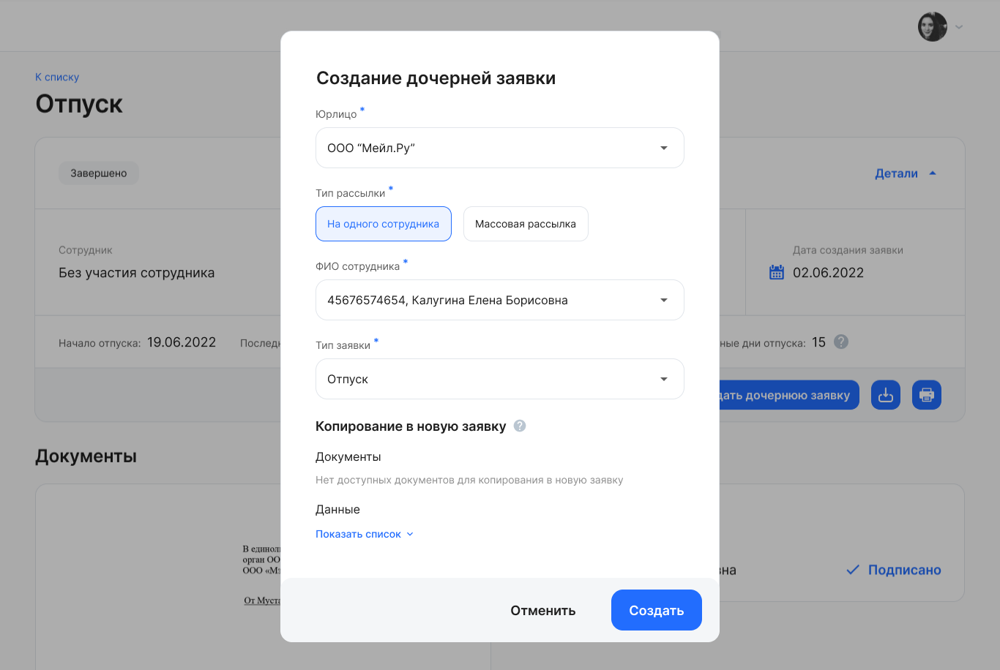

Дочерние заявки с документами и/или данными (атрибутами), которые могут быть скопированы, должны создаваться только из родительской.

В случае копирования документов и атрибутов из родительской заявки будут пропущены отдельные этапы для заполнения атрибутов и загрузки документов в дочерней заявке, т.е. дочерняя заявка будет создана уже с ними.

Если в дочерней заявке для типа документа есть этап загрузки или создания из шаблона, то такой документ не будет копироваться из родительской.

## Примеры

Создание дочерней заявки с копированием документов и данных: 

В выбранном типе заявки нет атрибутов, скопируются только документы:

Создание связанной заявки с копированием данных (атрибутов):

Создание связанной заявки без копирования данных (атрибутов) и документов:

## Копирование документов

1. Можно копировать только все типы документов вместе, без выбора типа документа в отдельности.  
2. В дочернюю заявку копируется оригинал документа, копия со штампом(ами), подпись(и), МЧД (если есть), а также информация о том, является ли документ кадровым или нет. Если документ кадровый, то копируется xml, тип, дата и номер документа.  
3. В дочерней заявке тип документа из исходной заявки:   
   1. Может быть скопирован, только если в дочерней есть этап с подписанием этого типа документа (так как только так тип документа может быть добавлен в тип заявки с учётом следующего пункта (п. 3.2));  
   2. Не может быть на этапе загрузки или создания из шаблона.

В случае если для дочерних заявок указано копирование документов, то при создании дочерней заявки всегда копируется всё, что возможно.

## Копирование атрибутов

1. Можно копировать только все значения атрибутов вместе, без отдельного выбора пользователем.  
2. Можно копировать атрибуты любого типа (текстовые, дата, опция, файл).  
3. Копирование значений атрибутов не зависит от:  
   * исходной заявки с сотрудником или без участия сотрудника;  
   * того, что в дочерней заявке выбран тот же сотрудник, другой сотрудник или другая компания.  
4. В дочерней заявке скопированные из родительской заявки значения атрибутов работают так же, как предзаполненные атрибуты в текущей версии: если записать в атрибут новое значение, то исходное будет перезаписано.

В случае если для дочерних заявок указано копирование атрибутов, то при создании дочерней заявки всегда копируем всё, что возможно.

