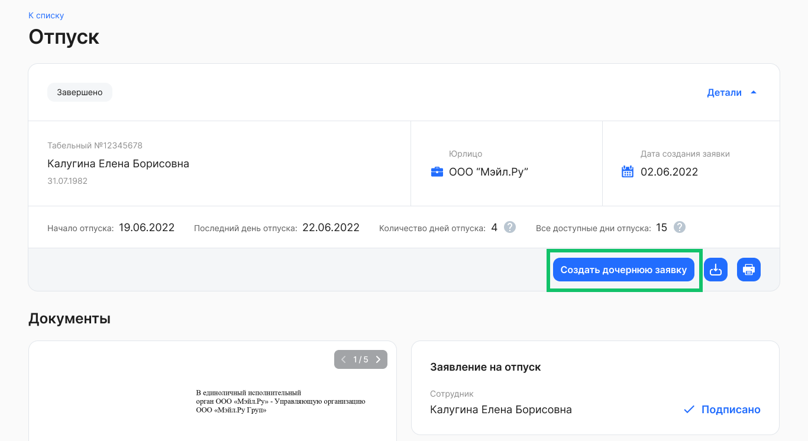
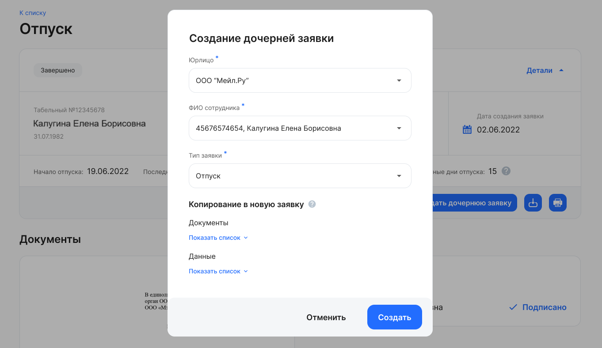
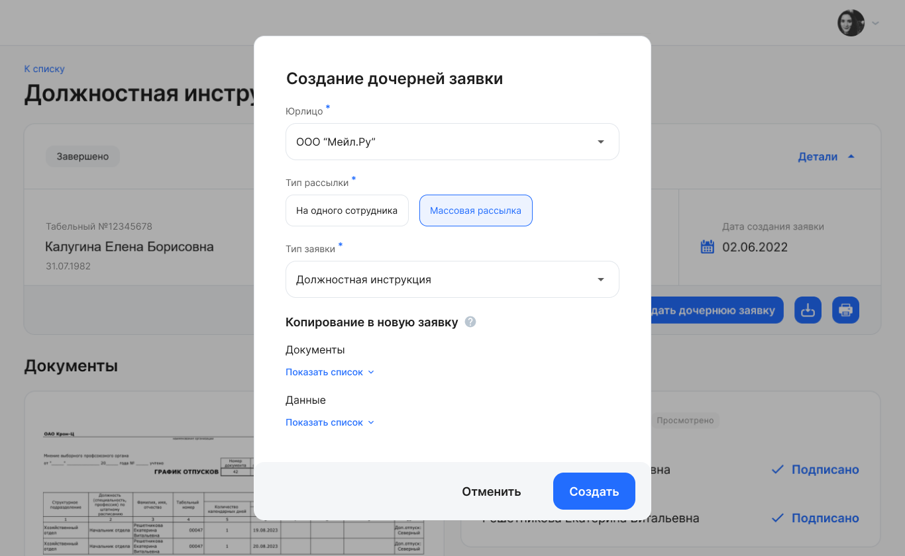
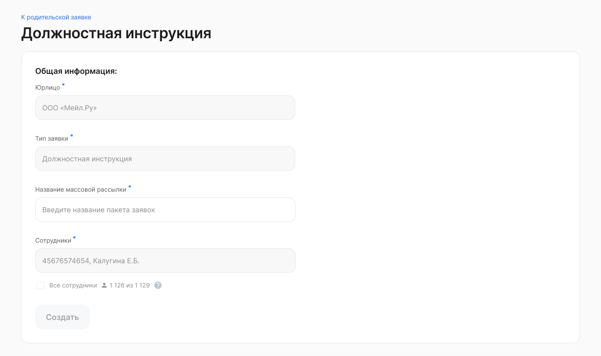

## **Создание дочерней заявки на одного сотрудника**

В разделе **Сервисы компании** → **Заявки** перейдите в родительскую заявку сотрудника на этапе *Завершено* или *Отказ от подписания*.

Чтобы создать дочернюю заявку из заявки с сотрудником:

1. Нажмите на кнопку **Создать дочернюю заявку**.

<info>

Можно изменить текст кнопки **Создать дочернюю заявку** в родительской заявке и таким образом адаптировать формулировку под конкретные бизнес-процессы в компании

</info>

2. В форме **Создание дочерней заявки** заполните следующие поля:  
* **Юрлицо**. Выберите название своей компании из списка, если компания из исходной заявки входит в аккаунт; 
* **ФИО сотрудника**. Введите имя сотрудника или его табельный номер. Из найденного списка сотрудников выберите нужного:  
  * если выбран тот же сотрудник, что и в исходной заявке, то будут доступны все привязанные типы заявок компании; 
  * если выбран другой сотрудник, то доступны только типы заявок БЕЗ копирования документов из исходной заявки;  
* **Тип заявки**. Из выпадающего списка выберите название бизнес-процесса, на основе которого будут копироваться данные (атрибуты) и документы в создаваемой заявке.   
3. Нажмите кнопку **Создать**.

## **Создание дочерней заявки с массовой рассылкой** 

В разделе **Сервисы компании** → **Заявки** перейдите в родительскую заявку сотрудника на этапе *Завершено* или *Отказ от подписания*.

1. На странице заявки нажмите кнопку **Создать дочернюю заявку**.  
2. В форме **Создание дочерней заявки** заполните следующие поля:  
* **Юрлицо**. Выберите название своей компании из списка, если компания из исходной заявки входит в аккаунт:   
  * если выбрана компания как в исходной заявке, то при выборе типов заявок без копирования документов, заявки с такими типами будут доступны всем сотрудникам компании; 
  * если выбрана компания как в исходной заявке, то при выборе типов заявок с копированием документов, заявки с такими типами будут доступны только сотруднику из исходной заявки;  
  * если выбрана другая компания из аккаунта, то для всех сотрудников доступны только типы заявок без копирования документов;  
* **Тип рассылки**. Выберите вариант **Массовая рассылка**;  
* **Тип заявки**. Из выпадающего списка выберите название бизнес-процесса, на основе которого будут копироваться атрибуты и документы в создаваемой заявке.   
3. В блоке **Копирование в новую заявку** перечислены документы и данные (атрибуты), которые будут скопированы в дочернюю заявку, если в типе новой заявки есть такие же поля и типы документов. Все данные и документы перенесутся в заполненном виде и со всеми подписями.  
4. Нажмите кнопку **Создать**.

При создании заявки с копированием документов отсутствуют поля **Оргструктура** и **Подразделение**, поле **Сотрудник** автозаполнено табельным номером и ФИО сотрудника из исходной заявки, а также скрыт блок загрузки документов.

