Настройка бизнес-процесса без участия сотрудника является платной. Для подключения бизнес-процесса обратитесь [в техническую поддержку](/ru/hr/support/contact_channels).

## Создание дочерней заявки на одного сотрудника

В разделе **Сервисы компании** → **Заявки** откройте родительскую заявку без участия сотрудника на этапе *Завершено* или *Отказ от подписания*.

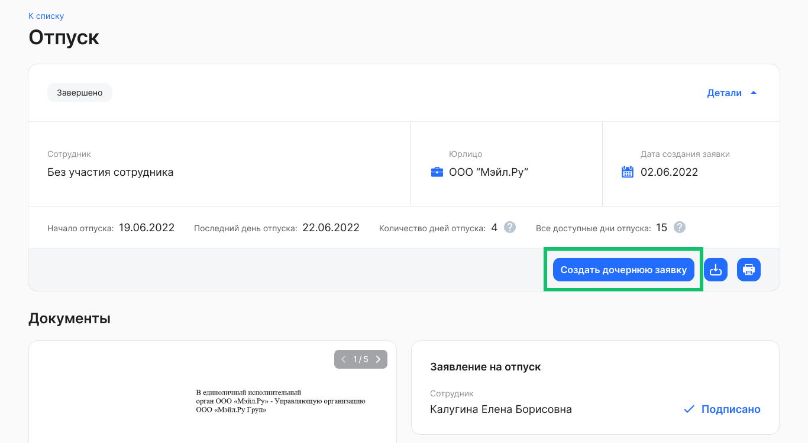

1. На странице заявки нажмите кнопку **Создать дочернюю заявку**.

<info>

Возможно изменить текст кнопки **Создать дочернюю заявку** в родительской заявке. Это позволит адаптировать формулировку под конкретные бизнес-процессы в компании

</info>

2. В форме **Создание дочерней заявки** заполните следующие поля:  
* **Юрлицо**. Выберите название своей компании из списка, если компания из исходной заявки входит в аккаунт:   
  * если выбрана компания как в исходной заявке, то будут доступны все привязанные к этой компании типы заявок; 
  * если выбрана другая компания из аккаунта, то доступны только типы заявок без копирования документов из исходной заявки;  
* **Тип рассылки**. Выберите вариант **На одного сотрудника**;  
* **ФИО сотрудника**. Введите имя сотрудника или его табельный номер. Из найденного списка сотрудников выберите нужного;  
* **Тип заявки**. Из выпадающего списка выберите название бизнес-процесса, на основе которого будут копироваться атрибуты и документы в создаваемой заявке.   
3. В блоке **Копирование в новую заявку** перечислены документы и данные (атрибуты), которые будут скопированы в дочернюю заявку, если в типе новой заявки есть такие же поля и типы документов. Все данные и документы перенесутся в заполненном виде и со всеми подписями.  
4. Нажмите кнопку **Создать**.

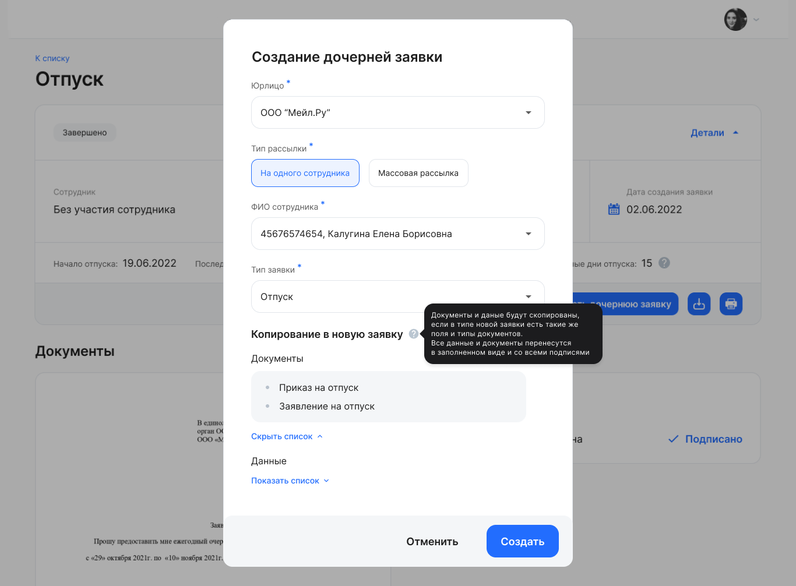

После создания в дочерней заявке появится ссылка на родительскую в блоке **Связанные заявки**. Перейдите по ссылке, если хотите вернуться к исходной заявке.

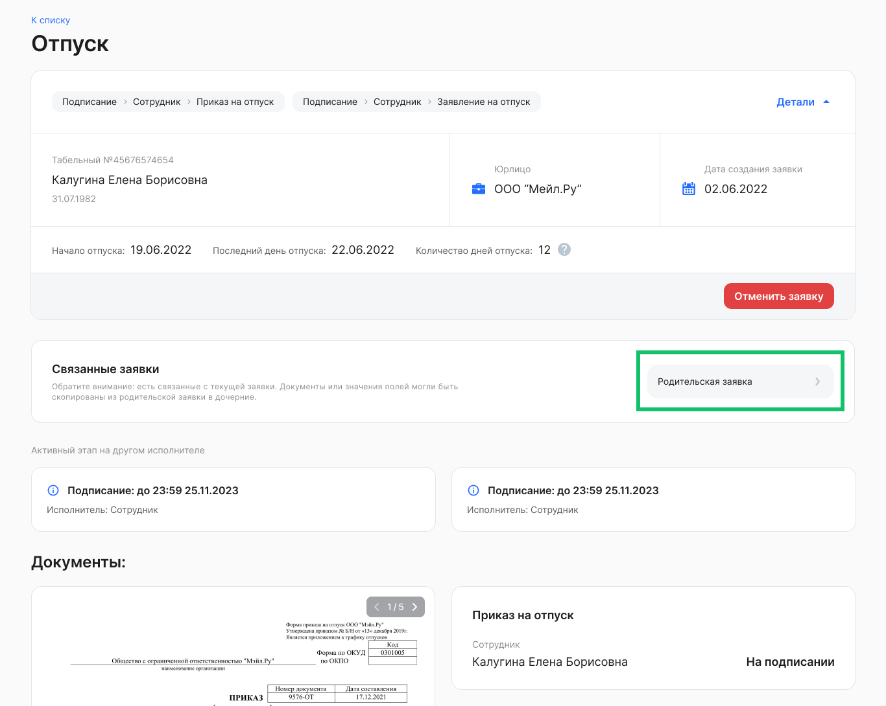

После создания дочерних заявок в родительской появится ссылка на связанные заявки.

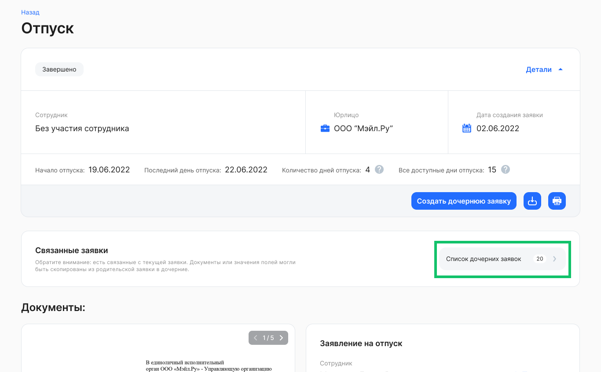

Также в случае когда дочерняя заявка переходит на этап *Завершено* или *Отказ от подписания*, можно создавать новые дочерние заявки для текущей, если это предусмотрено для бизнес-процесса. Ссылка на список дочерних заявок отобразится рядом с родительской в блоке **Связанные заявки**.

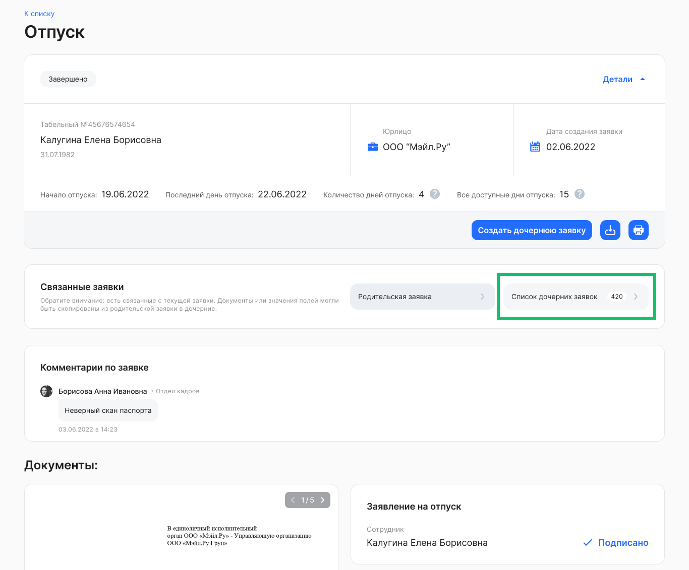

Перейдите к списку дочерних заявок. Список дочерних заявок заранее отфильтрован по родительской заявке.

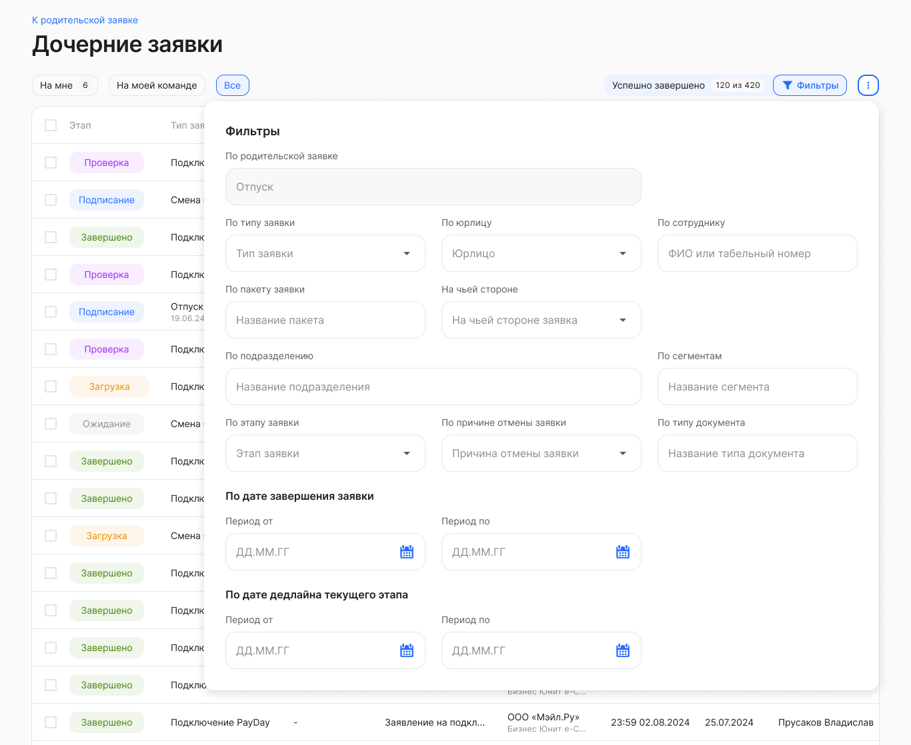

Другие фильтры, которые применимы для списка:

**По сотруднику** — выбор одного значения из предложенного списка с возможностью текстового поиска по ФИО или табельному номеру сотрудника. 

**По этапу заявки** — выбор любого количества значений из предложенных вариантов: **Загрузка**, **Подписание**, **Проверка**, **Успешно закрыты**, **Отменены**, **В бумаге**.

**По типу заявки** — выбор любого количества значений из предложенных вариантов бизнес-процессов, которые есть в компании.

**По юрлицу** — как правило, здесь уже указано название вашей компании и поле недоступно для редактирования. В случае если к вашему аккаунту привязано несколько юридических лиц, то в этом фильтре можно выбрать все юрлица или одно из них.

**По подразделению** — выбор одного значения из предложенного списка с возможностью текстового поиска.

**По сегментам** — выбор любого количества значений из предложенных вариантов. Пример: офис, склад, название города или помещения. 

<info>

Компания может использовать фильтр **По сегментам**. Для этого компания должна самостоятельно настроить использование функционала сегментов в расширении 1С

</info>

**На чьей стороне** — выбор одного значения из предложенных вариантов: *Компания* или *Сотрудник*. При применении варианта *Компания* будут отображаться заявки с согласующими руководителями, а также с пользователями с ролями **Отдел кадров**, **Бухгалтерия** и др.

**По причине отмены заявки** — выбор любого количества значений из предложенных вариантов: **По дедлайну**, **Отменено сотрудником**, **Отменено представителем компании**, **Изменен порядок оформления**, **Сотрудник уволен**. 

**По типу документа** — выбор любого количества значений из предложенных типов документов, которые есть в бизнес-процессах компании.

**По пакету заявки** — выбор одного значения из предложенного списка с возможностью текстового поиска. В списке перечислены названия массовых рассылок, созданных при создании заявки с типом **Массовая рассылка**.

**По дате завершения заявки** — выбор любой даты из открывшегося календаря. При этом нет необходимости указывать весь период, можно выбрать одну дату либо начала, либо окончания периода. 

**По дате окончания дедлайна активного этапа** — выбор любой даты из открывшегося календаря. При этом нет необходимости указывать весь период, можно выбрать одну дату либо начала, либо окончания периода. 

<info>

По фильтру **По дате окончания дедлайна активного этапа** можно посмотреть заявки, у которых в указанном промежутке наступит дедлайн, чтобы обработать их в первую очередь

</info>

В момент применения фильтров происходит поиск заявок и список заявок автоматически обновляется.

При необходимости вы можете сбросить любой из установленных параметров:

* если параметр предполагает одно значение, то нажмите «Х» справа от этого значения;  
* если параметр предполагает множественный выбор, то откройте список вариантов и снимите галочки у соответствующих чекбоксов;  
* для сброса даты завершения заявки кликните на дату и нажмите **Сбросить** внизу открывшегося календаря.

Чтобы сбросить сразу все параметры фильтра, нажмите кнопку **Сбросить** в правом верхнем углу формы.

Для выхода из формы установки фильтра нажмите на любое место на странице за пределами этой формы. Список заявок на странице будет отображаться с учетом настроенного фильтра.

<warn>

Фильтр может применяться только к текущему списку, выбранному для просмотра. Если поиск по фильтру не дал ожидаемых результатов, убедитесь в правильности выбора списка — **Все**, **На мне** или **На моей команде**

</warn>

## Создание дочерней заявки с массовой рассылкой

В разделе **Сервисы компании** → **Заявки** откройте родительскую заявку без участия сотрудника на этапе *Завершено* или *Отказ от подписания*.

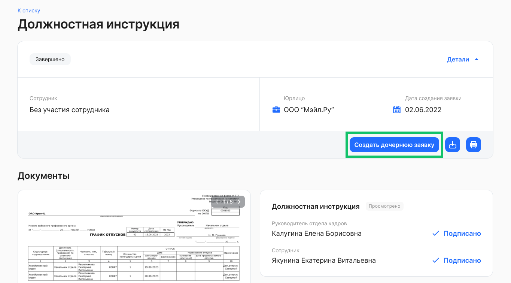

1. На странице заявки нажмите кнопку **Создать дочернюю заявку**.  
2. В форме **Создание дочерней заявки** заполните следующие поля:  
* **Юрлицо**. Выберите название своей компании из списка, если компания из исходной заявки входит в аккаунт:   
  * если выбрана компания как в исходной заявке, то при выборе типов заявок без копирования и с копированием документов, заявки с такими типами будут доступны всем сотрудникам;  
  * если выбрана другая компания из аккаунта, то для всех сотрудников доступны только типы заявок без копирования документов; 
* **Тип рассылки**. Выберите вариант **Массовая рассылка**;  
* **Тип заявки**. Из выпадающего списка выберите название бизнес-процесса, на основе которого будут копироваться атрибуты и документы в создаваемой заявке.   
3. В блоке **Копирование в новую заявку** перечислены документы и данные (атрибуты), которые будут скопированы в дочернюю заявку, если в типе новой заявки есть такие же поля и типы документов. Все данные и документы перенесутся в заполненном виде и со всеми подписями.  
4. Нажмите кнопку **Создать**.

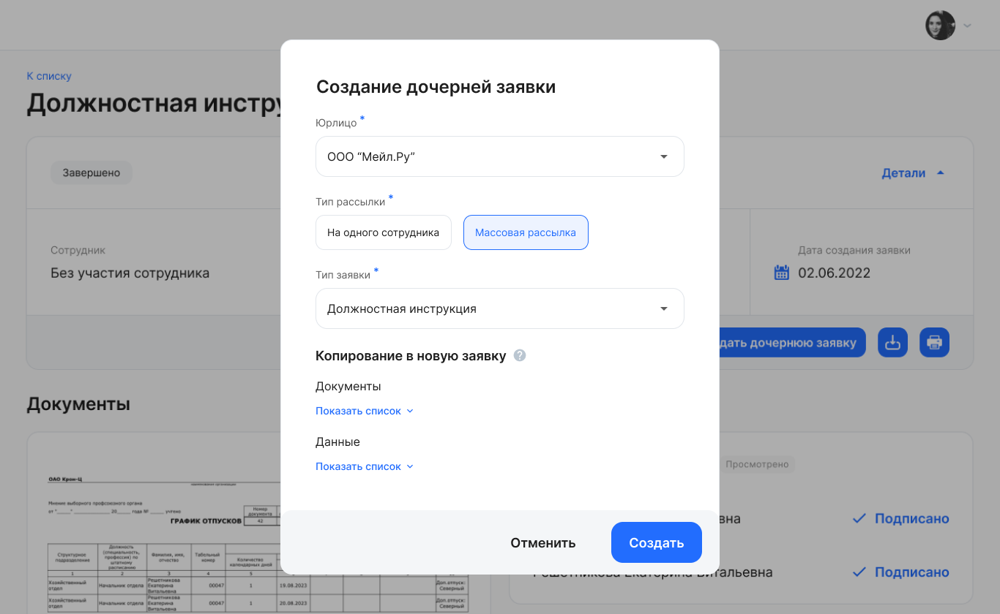

При создании заявки с копированием документов отсутствует поле для загрузки документов. 

Для дочерней заявки с массовой рассылкой укажите:

* **Название массовой рассылки**. Введите новое название рассылки. Новые заявки будут созданы для всех выбранных вами сотрудников. Будьте внимательны, если массовая рассылка уже была создана с таким названием, чтобы не создать дублирующие заявки;  
* **Тип оргструктуры**. Выберите Юридическую или Управленческую оргструктуру;  
* **Подразделение**. Выберите одно подразделение компании, в котором работают сотрудники, для которых создается рассылка;  
* **Сотрудники**. Введите табельный номер или ФИО сотрудников или выберите сотрудников из выпадающего списка. Также можно выбрать всех сотрудников подразделения. 

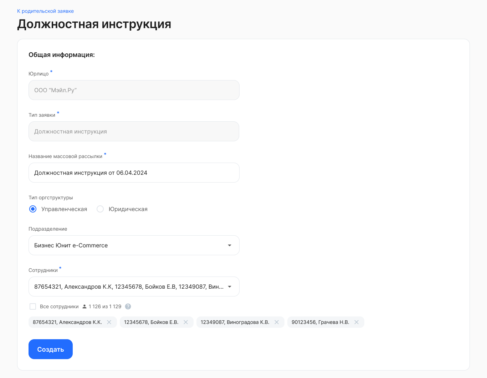

Нажмите кнопку **Создать** и подтвердите рассылку. Будет создано количество заявок, равное количеству сотрудников в массовой рассылке.

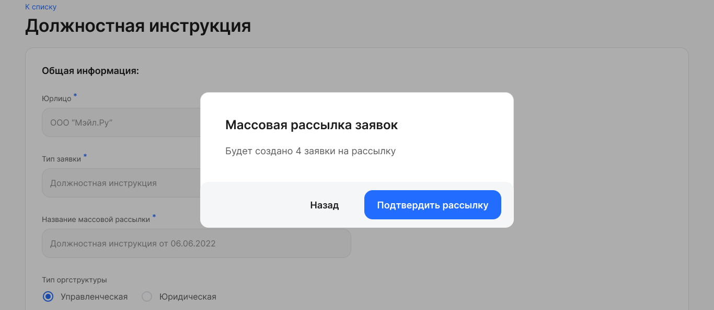

После создания массовой рассылки дочерних заявок в родительской появится ссылка на связанные заявки.

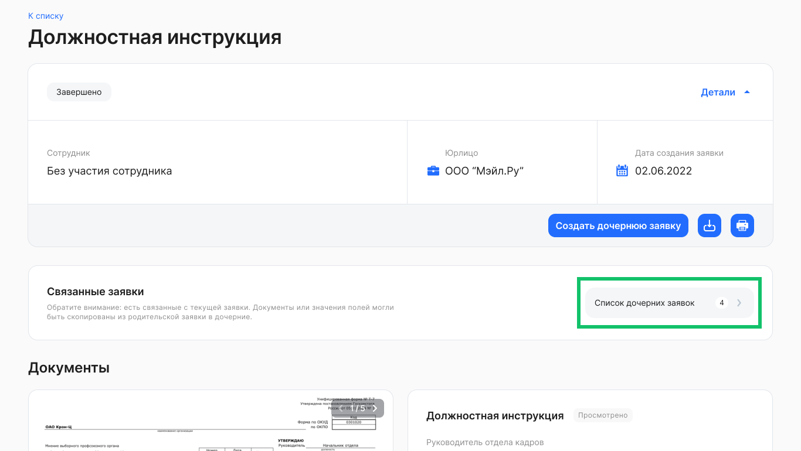