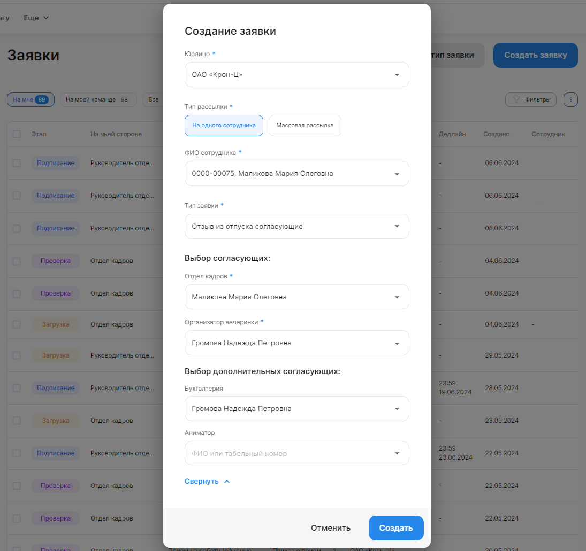
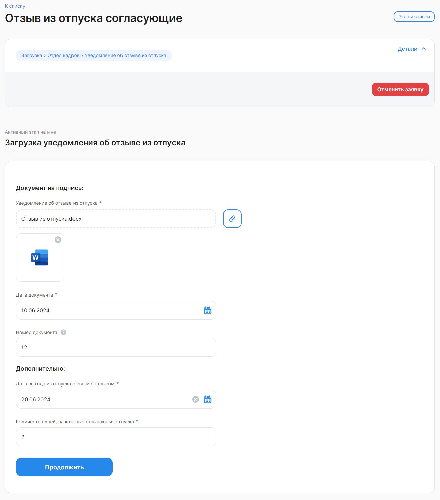
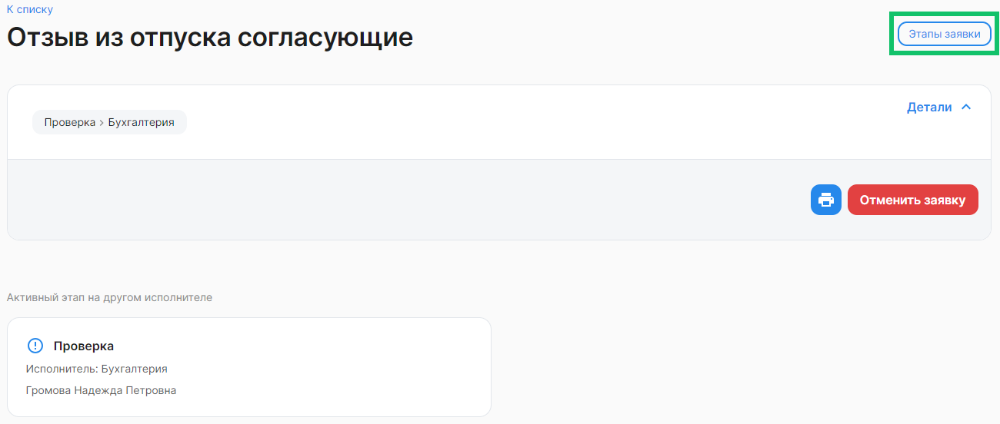
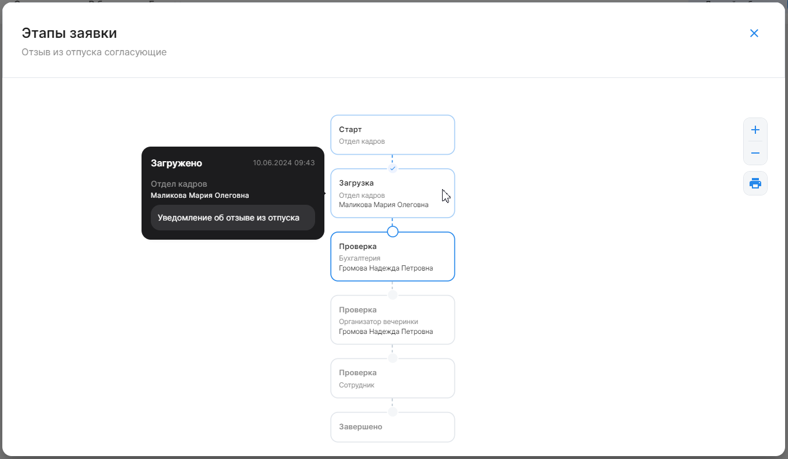

## Общие сведения

При создании заявки можно указывать одного или нескольких согласующих в бизнес-процессе. Для выбора согласующих может быть доступен список всех неуволенных сотрудников в рамках компании/аккаунта или группы в компании.

Настройка этой функции является платной. Для подключения обратитесь в поддержку VK HR Tek <support@hrtek.ru>.

В зависимости от бизнес-процесса для опции выбора согласующих предусмотрены следующие условия: 

- согласующих может быть несколько (по количеству этапов, где указана возможность выбора);
- если опция предоставлена, то обязательно выбрать хотя бы одного согласующего;
- список для выбора: список всех неуволенных сотрудников в рамках компании/аккаунта или группы в компании;
- опция может быть доступна для любого исполнителя стартового этапа заявки.

В любом бизнес-процессе (БП) для любой роли можно разрешить выбирать конкретного сотрудника для выполнения этапа в создаваемой заявке.

Выбор согласующих происходит в момент создания заявки. Если на этапе заявки потребуется добавить или изменить согласующих — это возможно только через отмену текущей и создание новой заявки.

Выбирать согласующих можно из множеств:

- Все неуволенные сотрудники компании или всех компаний аккаунта, где создается заявка. 
- Все пользователи, у которых есть группа, связанная с этой ролью, в компании, где создается заявка.

Выбор согласующего может быть обязательным — при создании заявки пользователь должен обязательно выбрать исполнителя. Выбрать можно только одного исполнителя для роли. Пользователи с ролями могут выполнять как последовательные, так и параллельные этапы. Выбирать согласующих можно как для единичных заявок, так и для массовых рассылок.

Если исполнитель не назначен для этапов с необязательным выбором и множеством «все сотрудники компании аккаунта», то этап будет пропущен в последовательности этапов заявки.

При необязательном выборе в рамках группы вне зависимости от того, был ли выбран конкретный пользователь с группой или нет, этап пропущен не будет — его сможет выполнить любой пользователь с такой же группой в компании.

Совместно с аналитиками сервиса VK HR Tek можно создавать различные типы БП с выбором согласующих в зависимости от потребностей компании.

Аналитики в json-файле БП прописывают роль, которая будет согласовывать этап заявки. Для роли с таким свойством можно указать опции:

- множество для выбора: компания/аккаунт/группа (обязательно);
- обязательность выбора, если опция не заполнена — выбор согласующего необязательный (необязательно).

## Выбор согласующих в заявках Кабинета компании

Создавать заявки с выбором согласующих, если это было настроено для БП, могут представитель компании и согласующий руководитель в Кабинете компании, а также сотрудник в Личном кабинете.

Рассмотрим выбор согласующих в заявке на примере БП «Отзыв из отпуска согласующие». Для других БП наименования ролей и другие настройки могут отличаться.

Чтобы представителю компании создать заявку с выбором согласующих, необходимо:

1. Перейти в **Кабинет компании → Заявки** и нажать на кнопку **Создать заявку**.

2. В форме **Создание заявки** заполните следующие поля:

- **Юрлицо**. Выберите название своей компании из списка;
- **Тип рассылки**. Выберите один вариант: **На одного сотрудника** или **Массовая рассылка**;
- **ФИО сотрудника**. Введите имя сотрудника или его табельный номер. Из найденного списка сотрудников выберите нужного;
- **Тип заявки**. Из выпадающего списка выберите название бизнес-процесса с выбором согласующих. 

3. В блоке **Выбор согласующих** выберите сотрудников, которые обязательно должны согласовать этап заявки, из списков:

- Все пользователи, у которых есть группа, связанная с этой ролью, в компании. В примере группа — это **Отдел кадров**; 
- Все неуволенные сотрудники компании или всех компаний аккаунта. В примере — это **Организатор вечеринки**.

<info>
Чтобы определить, что требуется выбрать именно сотрудника из группы, а не из списка сотрудников компании — в поле выбора группы должна быть указана надпись **Выберите согласующего** и в выпадающем списке перечислены сотрудники группы без табельных номеров
</info>

4. Раскройте блок **Выбор дополнительных согласующих**, если нужно указать сотрудников, которые будут согласовывать заявку вместе с исполнителями из блока **Выбор согласующих**. Выбор дополнительных согласующих является необязательным. 

Если дополнительный согласующий из множества «все сотрудники компании аккаунта» не назначен, то этап будет пропущен в последовательности этапов заявки.

При необязательном выборе в рамках группы вне зависимости от того, был ли выбран конкретный пользователь с группой или нет, этап пропущен не будет — его сможет выполнить любой пользователь с такой группой в компании.

5. Нажмите кнопку **Создать**.

 

После создания заявка сразу же перейдет на этап *Загрузка*. 

На этом этапе прикрепите документ в формате pdf или docx, требующийся для данного процесса, заполните необходимые данные и нажмите кнопку **Продолжить**.

 

Заявка перейдет на этап согласования (проверки) к следующему исполнителю.

Чтобы посмотреть этапы заявки с согласующими, откройте необходимую заявку и нажмите кнопку **Этапы заявки**.

 

Откроется схема с последовательностью этапов в заявке. При наведении указателя мыши на любой этап заявки появляются подсказки о деталях этапа: статусе этапа; дате и времени получения статуса; роли и ФИО сотрудника, обрабатывающего заявку на текущем этапе; типе заявки / типе документа. 

