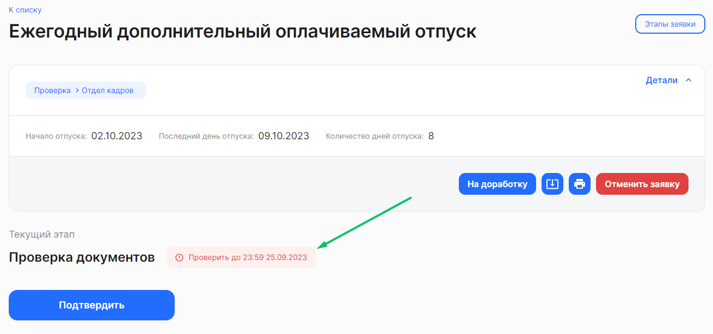

Каждый этап заявки может иметь срок окончания — дедлайн. Добавлять, редактировать и удалять дедлайны может только сотрудник с ролью «Администратор» в Кабинете компании, в разделе **Настройки → Типы заявок** (см. [статью](/ru/admin_actions/events_types/managing_event_types)).

У определенных типов заявок могут быть проставлены ограничения по времени, до которого документ должен быть подписан или проверен. По истечении этого срока заявка автоматически отменится и ее можно будет подписать только в бумажном виде (заявка перейдет в раздел **В бумагу**).

<warn>
Важно отслеживать дедлайны, чтобы заявка не отменилась
</warn>

## От чего считается дедлайн?
При создании/редактировании дедлайна Администратор выбирает событие, от которого будет рассчитываться дедлайн:

- **Без дедлайна**. Дедлайн на этап НЕ будет установлен, а заявка перейдет на следующий этап как будет совершено действие загрузка/подписание/проверка. 
- **От момента активации этапа**. Отсчет дедлайна по данному этапу станет активным, после того как заявка перейдет на следующий этап. 
- **От атрибута**. Атрибут – это поле, которое заполняет либо сотрудник, либо представитель компании, например, **Дата начала отпуска**, **Дата перевода**. Нельзя указывать дедлайн от атрибута на первом этапе заявки. 
- **От момента создания заявки**. Отсчет дедлайна станет активным после создания заявки. По умолчанию моментом создания заявки считается 00:00 даты создания заявки.

Не рекомендуем ставить дедлайны на последних этапах с типом **Проверка**.

## Дедлайн «От момента активации этапа»
Дедлайн может отсчитываться в *рабочих днях*, *календарных днях или часах*. 

Значения дедлайнов могут быть:

- Положительные целые числа. Пример: 2 дня. Руководитель должен согласовать документ в течение 2-х суток с момента перехода заявки на него. 01.09.2023 17:20:00 + 2 дня = 03.09.2023 17:20:00 → дедлайн наступит в 17:21:00 03.09.2023;
- Нулевое значение. Пример: 0 дней. Сотрудник должен выполнить этап до конца текущего дня с момента активации этапа. 01.09.2023 10:20:00 + 0 дней с округлением до конца дня = 02.09.2023 → дедлайн наступит в 00:00:00 02.09.2023.

## Дедлайн «От атрибута»
Дедлайн может отсчитываться в *рабочих или* *календарных днях*.

Значения дедлайнов могут быть:

- Положительные числа. Пример: 1 день. Сотрудник должен подписать документ за 1 день, отсчитывая от даты перевода на другую должность. 01.09.2023 + 1 день = 02.09.2023 → дедлайн наступит в 00:00:00 02.09.2023;
- Нулевое значение. Пример: 0 дней. Отдел кадров должен проверить документ до конца текущего дня, отсчитывая от даты начала перевода. 01.09.2023 + 0 дней с округлением до конца дня = 02.09.2023 → дедлайн наступит в 00:00:00 02.09.2023;
- Отрицательные числа. Пример: -3 дня. Сотрудник должен подписать приказ за 3 дня (не включительно) до даты начала отпуска. 01.09.2023 - 3 дня = 29.08.2023 → дедлайн наступит в 00:00:00 29.08.2023.

## Дедлайн «От момента создания заявки»
Дедлайн может отсчитываться в *рабочих днях*, *календарных днях или часах*. 

Значения дедлайнов могут быть:

- Положительные целые числа. Пример: 3 дня. Сотрудник должен подписать приказ в течение 3-х суток от даты создания заявки. 01.09.2023 + 3 дня = 04.09.2023 → дедлайн наступит в 00:00:00 04.09.2023;
- Нулевое значение. Пример: 0 дней. Сотрудник должен выполнить этап до конца текущего дня даты создания заявки. 01.09.2023 + 0 дней с округлением до конца дня = 02.09.2023 → дедлайн наступит в 00:00:00 02.09.2023.

## Округление дедлайна до конца дня
Дедлайн можно округлять до конца календарного или рабочего дня.

Например, установлен дедлайн, равный одному дню с момента перехода заявки на следующий этап. В таком случае: 

***Дедлайн НЕ округляется до полных суток*** 

Этап стал активен в 10:04:00 15 марта 2023.

Значение дедлайна: +1 день.

Дедлайн наступит 16 марта 10:05:00.

***Дедлайн округляется до полных суток*** 

Этап стал активен в 10:04:00 15 марта 2023.

Значение дедлайна: +1 день.

Дедлайн наступит 17 марта в 00:00:00.

Если дедлайн этапа случится через 0 дней, то автоматически установится округление до конца дня.

Этап стал активен в 10:04:00 15 марта 2023.

Значение дедлайна: 0 дней. 

Дедлайн наступит 16 марта в 00:00:00.

## Что происходит при наступлении дедлайна?
Если по какой-то причине сотрудник или представитель компании до наступления дедлайна не успеет загрузить/подписать/проверить документ из заявки, то для заявки можно установить действие:

- **Отмена заявки с опцией перехода в бумагу**.  При наступлении дедлайна заявка будет отменена и попадёт в список **В бумагу**;
- **Отмена заявки**. При наступлении дедлайна заявка будет отменена (в список **В бумагу** не попадёт);
- **Переход на следующий этап**. При наступлении дедлайна заявка перейдет на следующий этап. Работает только на этапе **Проверка**. На этапах загрузки и подписания не работает. 