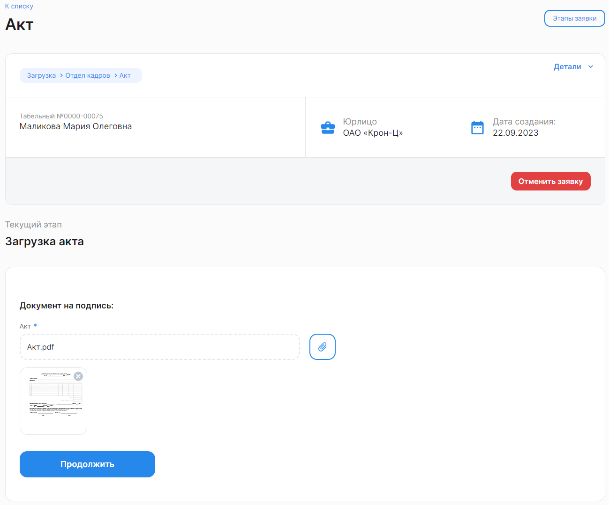

Чтобы создать новую заявку на одного сотрудника, необходимо:

1. Перейти в **Кабинет компании → Заявки** и нажать на кнопку **Создать заявку**.
1. В форме **Создание заявки** заполните следующие поля:
- **Юрлицо**. Выберите название своей компании из списка;
- **Тип рассылки**. Выберите вариант **На одного сотрудника**;
- **ФИО сотрудника**. Введите имя сотрудника или его табельный номер. Из найденного списка сотрудников выберите нужного;
- **Тип заявки**. Из выпадающего списка выберите название бизнес-процесса, по которому будут загружаться/подписываться/согласовываться документы в создаваемой заявке. 
3. Нажмите кнопку **Создать**.

После создания заявка сразу же перейдет на этап *Загрузка*. 

На этом этапе прикрепите документ в формате pdf, требующийся для данного процесса, и нажмите кнопку **Продолжить**.

Заявка перейдёт на следующий этап.

