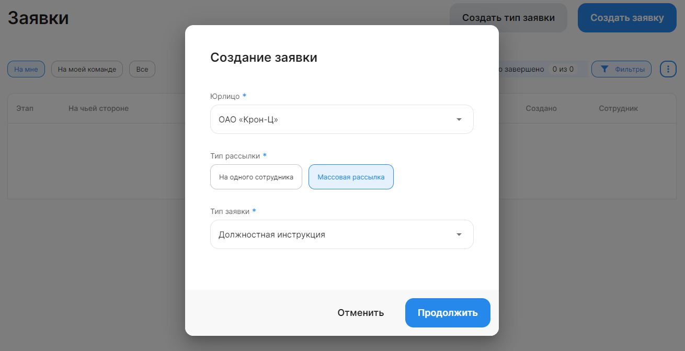
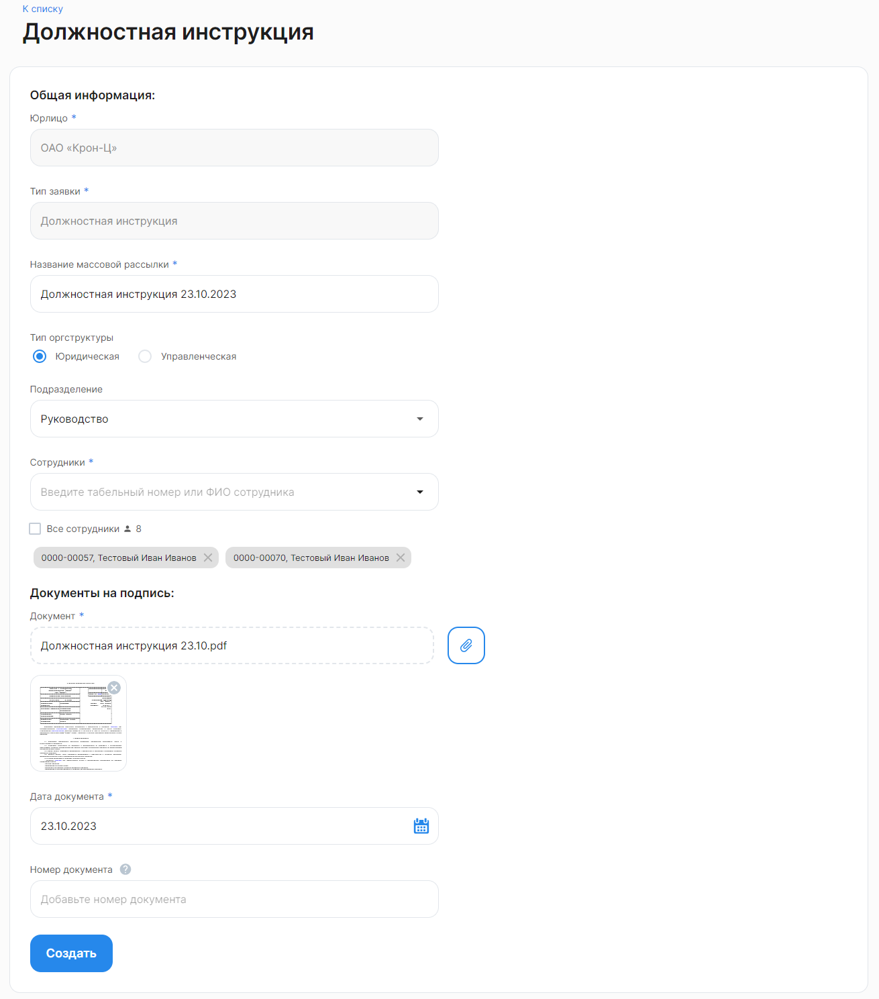

При создании заявки с массовой рассылкой документ, который будут направлен сотрудникам и другим участникам процесса, будет одинаковым для всех. Таким образом, рекомендуется рассылать <u>только неперсонализированные</u> документы/заявки.

Чтобы создать новую заявку с массовой рассылкой документов всем или нескольким сотрудникам компании/подразделения, необходимо:

1. Перейти в **Кабинет компании → Заявки** и нажать на кнопку **Создать заявку**.
1. В форме **Создание заявки** заполните следующие поля:
- **Юрлицо**. Выберите название своей компании из списка;
- **Тип рассылки**. Выберите вариант **Массовая рассылка**;
- **Тип заявки**. Из выпадающего списка выберите название бизнес-процесса, по которому будут загружаться/подписываться/согласовываться документы в создаваемой заявке. 
3. Нажмите кнопку **Продолжить**.

4. Заполните значения для конкретного бизнес-процесса:
- **Название массовой рассылки**. Введите новое название рассылки. Новые заявки будут созданы для всех выбранных вами сотрудников. Будьте внимательны, если массовая рассылка уже была создана с таким названием, чтобы не создать дублирующие заявки;
- **Тип оргструктуры**. Выберите Юридическую или Управленческую оргструктуру;
- **Подразделение**. Выберите одно подразделение компании, в котором работают сотрудники, для которых создается рассылка;
- **Сотрудники**. Введите табельный номер или ФИО сотрудников или выберите сотрудников из выпадающего списка. Также можно выбрать всех сотрудников подразделения; 
- **Документ**. Прикрепите документ в формате pdf, требующийся для данного процесса;
- **Дата документа**. Выберите дату документа в календаре;
- **Номер документа**. Номер обязателен, если он есть у документа; 
5. Нажмите кнопку **Создать**.
1. Подтвердите рассылку. Будет создано количество заявок, равное количеству сотрудников в массовой рассылке.

