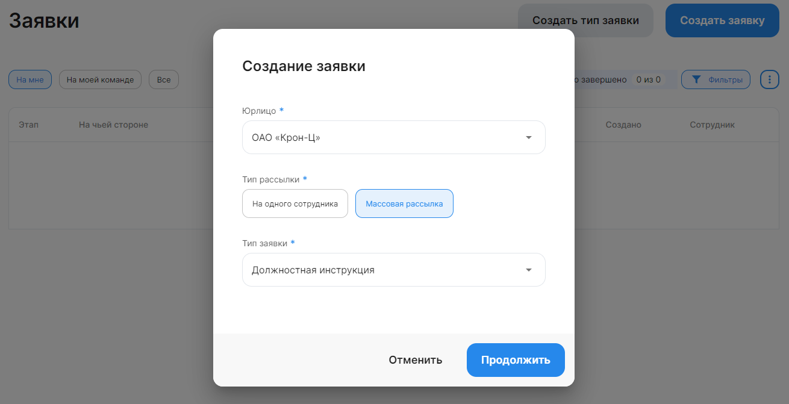
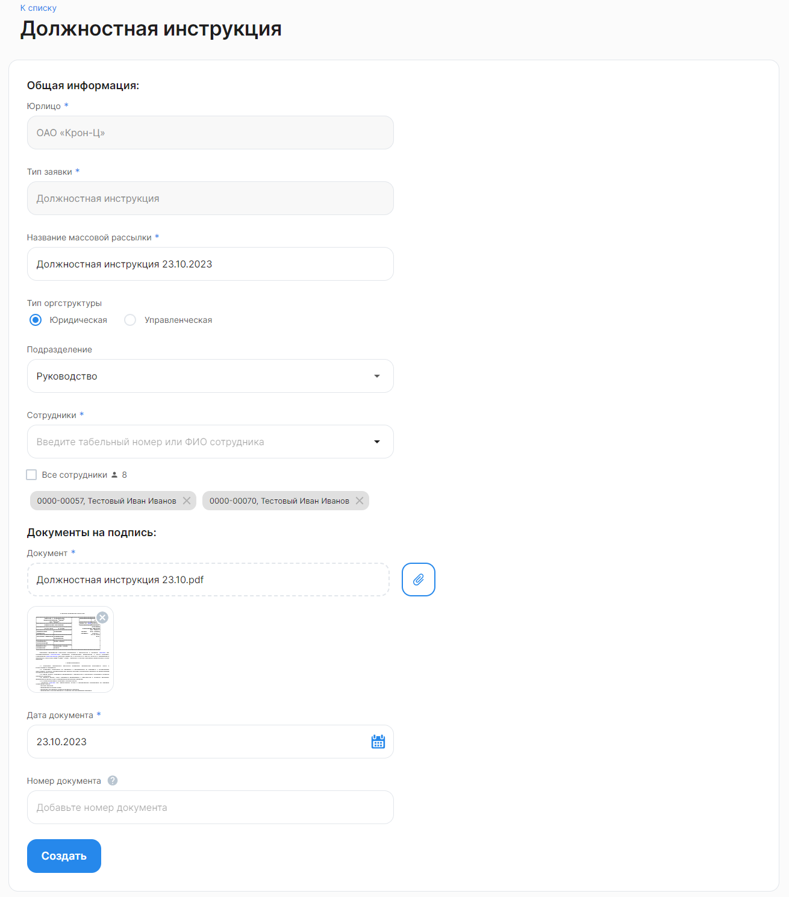
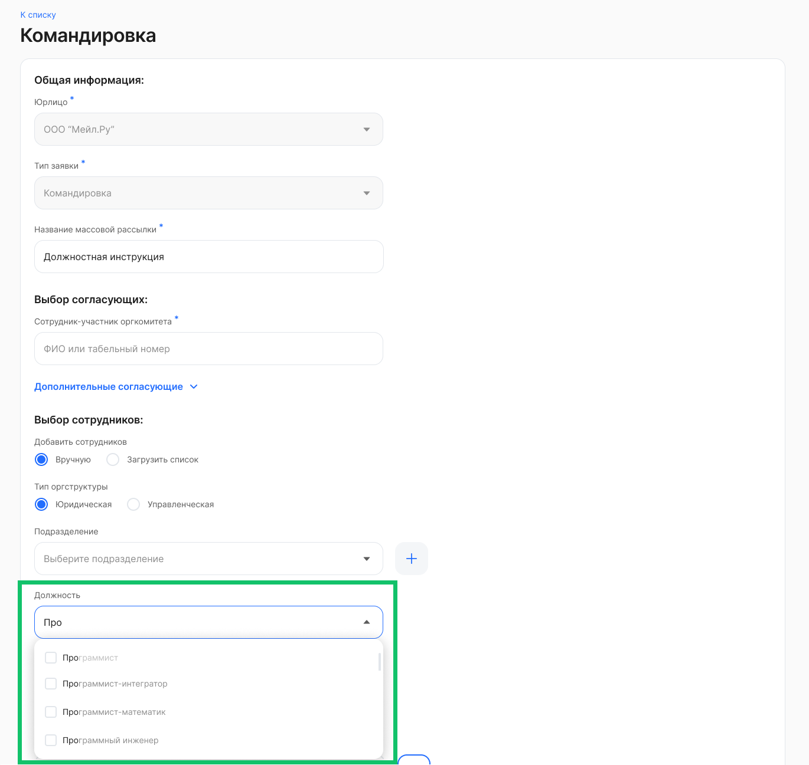

При создании заявки с массовой рассылкой документ, который будет направлен сотрудникам и другим участникам процесса, будет одинаковым для всех. Таким образом, рекомендуется рассылать <u>только неперсонализированные</u> документы/заявки.

Чтобы создать новую заявку с массовой рассылкой документов всем или нескольким сотрудникам компании/подразделения, необходимо:

1. Перейти в **Сервисы компании → Все заявки** и нажать кнопку **Создать заявку**.
1. В форме **Создание заявки** заполните следующие поля:
- **Юрлицо**. Выберите название своей компании из списка, если подключены к аккаунту компаний;
- **Тип рассылки**. Выберите вариант **Массовая рассылка**;
- **Тип заявки**. Из выпадающего списка выберите название бизнес-процесса, по которому будут загружаться/подписываться/согласовываться документы в создаваемой заявке. 
3. Нажмите кнопку **Продолжить**.

4. Заполните значения для конкретного бизнес-процесса:
- **Название массовой рассылки**. Введите новое название рассылки. Новые заявки будут созданы для всех выбранных вами сотрудников. Будьте внимательны, если массовая рассылка уже была создана с таким названием, чтобы не создать дублирующие заявки;
- **Тип оргструктуры**. Выберите Юридическую или Управленческую оргструктуру;
- **Подразделение**. Выберите одно подразделение компании, в котором работают сотрудники, для которых создается рассылка;
- **Сотрудники**. Введите табельный номер или ФИО сотрудников или выберите сотрудников из выпадающего списка. Также можно выбрать всех сотрудников подразделения; 
- **Документ**. Прикрепите документ в формате pdf, требующийся для данного процесса;
- **Дата документа**. Выберите дату документа в календаре;
- **Номер документа**. Номер обязателен, если он есть у документа; 
5. Нажмите кнопку **Создать**.
1. Подтвердите рассылку. Будет создано количество заявок, равное количеству сотрудников в массовой рассылке.

 

При создании заявки с другим типом заявки и с массовой рассылкой может быть представлен иной список атрибутов для заполнения. 

Доступные типы атрибутов:

- дата;
- текст;
- выбор из заданных вариантов (без зависимостей);
- файлы — с возможностью одиночного или множественного добавления.

## Загрузка списка сотрудников через CSV-файл

Чтобы сократить время на выбор сотрудников для массового создания заявок в тех случаях, когда списки сотрудников ведутся и согласуются вне КЭДО, воспользуйтесь загрузкой списка сотрудников через CSV-файл.

Опцию необходимо включить в настройках бизнес-процесса.

<info>

Настройка бизнес-процесса является платной. Для подключения обратитесь в [поддержку VK HR Tek](/ru/hr/support/contact_channels)  

</info>

Работа с опцией:

1. В форме создания заявки с типом рассылки «Массовая рассылка» загрузите список сотрудников из файла .csv. Вариант с ручным выбором сотрудников остаётся доступным.  
2. После загрузки файла система должна отобразить уведомление об успешном добавлении сотрудников.  
3. Если в файле обнаружена хотя бы одна блокирующая ошибка из возможных типов, загрузка считается неуспешной — отображается сообщение в зависимости от ошибки.

Загрузка файла .csv доступна при одновременном выполнении следующих условий:

1. Размер файла — не более 2 МБ.  
2. Каждая строка файла соответствует одному сотруднику.  
3. Строка содержит поля:

* EmployeeID, обязательное.  
* ФИО и прочие поля, необязательные.

[Шаблон для загрузки сотрудников по EmployeeID.csv](./assets/csv-EmployeeID.csv "download")

Также в интерфейс массовой рассылкой добавили возможность отфильтровать список сотрудников по должности. Должности в списке для выбора приведены в алфавитном порядке.

Посмотреть интерфейс заявки
 

 

