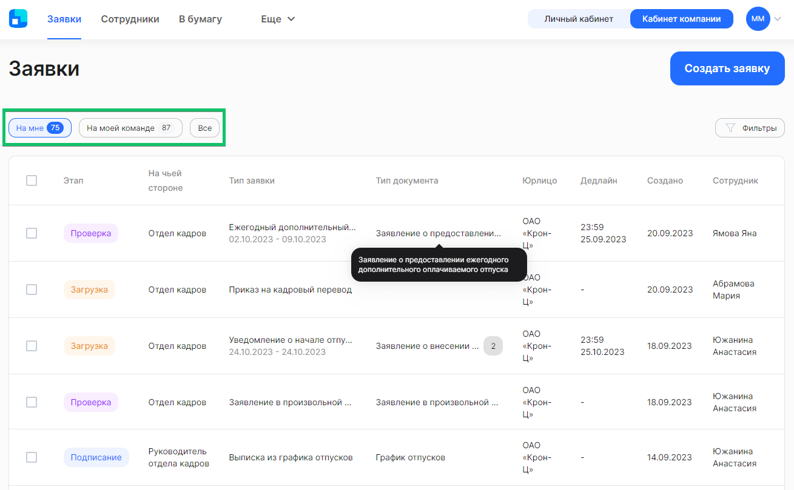

Все заявки, к просмотру и редактированию которых у вас есть доступ, отображаются списком в **Кабинете компании**, в разделе **Заявки**. По умолчанию список отфильтрован по заявкам, созданным вами и/или активный этап которых на вас (кнопка **На мне**).

Вы можете открыть полный список доступных заявок или список заявок, активный этап которых на членах вашей команды, нажав на кнопку **Все** или **На моей команде**.

Заявка содержит следующие сведения:

- **Этап**. У заявки бывает 6 этапов: *Загрузка, Подписание, Проверка, Завершено, Отменено, В бумаге*. Чтобы просмотреть, сколько дней заявка находится на текущем этапе, наведите указатель мыши на метку этапа;
- **На чьей стороне**. Этап заявки может быть в работе либо на *Сотруднике,* либо на представителе компании с такими ролями, как *Отдел кадров, Руководитель отдела кадров, Бухгалтерия* и др.;
- **Тип заявки**. Название бизнес-процесса, в рамках которого обрабатывается заявка на стороне сотрудника и компании. Для некоторых заявок указаны периоды. Это те заявки, у которых есть даты начала и окончания события, например, Уведомление о начале отпуска;
- **Тип документа**. Название типа документа, который предусмотрен в текущем типе заявки;
- **Юрлицо**. Наименование компании, для которой была создана заявка;
- **Дедлайн**. Присутствует в некоторых заявках, в которых предусмотрен дедлайн. Время и дата окончания текущего этапа заявки;
- **Создано**. Дата создания заявки;
- **Сотрудник**. Фамилия и имя сотрудника, для которого была создана заявка. При наведении указателя мыши на имя можно посмотреть карточку с ФИО, датой рождения и табельным номером сотрудника.

Список заявок можно скачать в формате XLSX-таблицы. Для этого нажмите на кнопку  и выберите опции компоновки внутри таблицы:

- по заявкам: в одной строке данные по одной заявке;
- по документам: в одной строке данные по одному документу из заявки, таким образом может быть несколько строк по одной заявке.

Все результаты выгружаются с учетом установленных фильтров.

## Применение фильтров
Для вашего удобства предусмотрена более тонкая настройка отображения списка заявок. Нажмите на кнопку **Фильтры**. Откроются поля для редактирования фильтра с выбором значений из выпадающего списка.

Рассмотрим фильтры подробнее:

**По сотруднику** — выбор одного значения из предложенного списка с возможностью текстового поиска по ФИО или табельному номеру сотрудника. 

**По этапу заявки** — выбор любого количества значений из предложенных вариантов: Загрузка, Подписание, Проверка, Успешно закрыты, Отменены, В бумаге.

**По типу заявки** — выбор любого количества значений из предложенных вариантов бизнес-процессов, которые есть в компании.

**По юрлицу** — как правило, здесь уже указано название вашей компании и поле недоступно для редактирования. В случае если к вашему аккаунту привязано несколько юридических лиц, то в этом фильтре можно выбрать все юрлица или одно из них.

**По подразделению** — выбор одного значения из предложенного списка с возможностью текстового поиска.

**По сегментам** — выбор любого количества значений из предложенных вариантов. Пример: офис, склад, название города или помещения. 

<info>

Компания может использовать фильтр **По сегментам**. Для этого компания должна самостоятельно настроить использование функциональности сегментов в расширении 1С

</info>

**На чьей стороне** — выбор одного значения из предложенных вариантов: *Компания* или *Сотрудник*. При применении варианта *Компания* будут отображаться заявки с согласующими руководителями, а также с пользователями с ролями **Отдел кадров**, **Бухгалтерия** и др.

**По причине отмены заявки** — выбор любого количества значений из предложенных вариантов: **По дедлайну**, **Отменено сотрудником**, **Отменено представителем компании**, **Изменен порядок оформления**, **Сотрудник уволен**. 

**По типу документа** — выбор любого количества значений из предложенных типов документов, которые есть в бизнес-процессах компании.

**По пакету заявки** — выбор одного значения из предложенного списка с возможностью текстового поиска. В списке перечислены названия массовых рассылок, созданных при создании заявки с типом **Массовая рассылка**.

**По дате завершения заявки** — выбор любой даты из открывшегося календаря. При этом нет необходимости указывать весь период, можно выбрать одну дату либо начала, либо окончания периода. 

**По дате окончания дедлайна активного этапа** — выбор любой даты из открывшегося календаря. При этом нет необходимости указывать весь период, можно выбрать одну дату либо начала, либо окончания периода. 

<info>

По фильтру **По дате окончания дедлайна активного этапа** можно посмотреть заявки, у которых в указанном промежутке наступит дедлайн, чтобы обработать их в первую очередь

</info>

В момент применения фильтров происходит поиск заявок и список заявок автоматически обновляется.

При необходимости вы можете сбросить любой из установленных параметров:

- Если параметр предполагает одно значение, то нажмите «Х» справа от этого значения;
- Если параметр предполагает множественный выбор, то откройте список вариантов и снимите галочки у соответствующих чекбоксов;
- Для сброса даты завершения заявки кликните на дату и нажмите **Сбросить** внизу открывшегося календаря.

Чтобы сбросить сразу все параметры фильтра, нажмите кнопку **Сбросить** в правом верхнем углу формы.

Для выхода из формы установки фильтра нажмите на любое место на странице за пределами этой формы. Список заявок на странице будет отображаться с учетом настроенного фильтра.

<warn>

Фильтр может применяться только к текущему списку, выбранному для просмотра. Если поиск по фильтру не дал ожидаемых результатов, убедитесь в правильности выбора списка — **Все**, **На мне** или **На моей команде**

</warn>