## Подписание документа в заявке
Чтобы быстрее найти заявки на этапе подписания в списке, примените фильтр **По этапу заявки** *= Подписание.* 

Откройте необходимую заявку. Если данные в заявке указаны верно, подпишите приказ. Для этого нажмите на кнопку **Подписать**.

Отдел кадров подписывает документы в заявках с помощью УКЭП.

Заявка перейдет на следующий этап.

## Проверка документа в заявке
Чтобы быстрее найти заявки на этапе подписания в списке, примените фильтр **По этапу заявки** *= Проверка.* 

Откройте необходимую заявку. Если сведения указаны корректно, в блоке «Проверка документов» нажмите на кнопку **Подтвердить**.

Заявка перейдет на следующий этап.

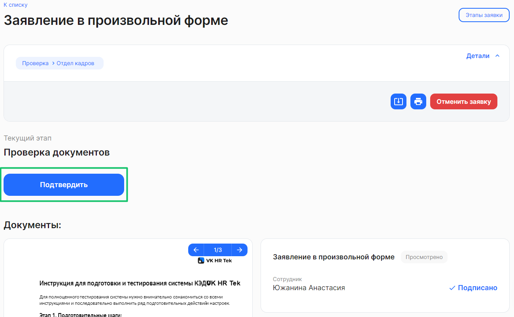

## Отмена заявки
Чтобы отменить заявку, откройте необходимую заявку и проверьте в ней корректность данных. Если указаны неверные данные, нажмите на кнопку **Отменить заявку**.

Заявка перейдет на этап *Отменено*.

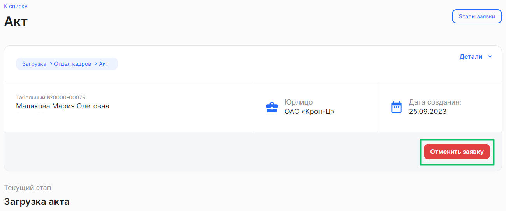

## Этапы заявки
Чтобы посмотреть этапы заявки, откройте необходимую заявку и нажмите кнопку **Этапы заявки**.

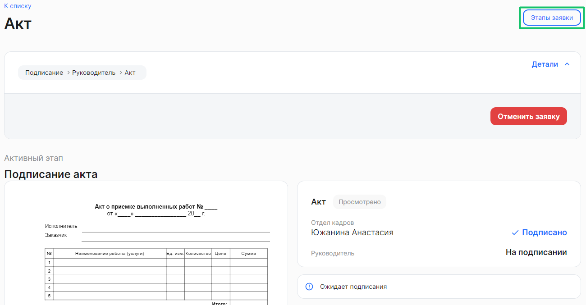

Откроется схема с последовательностью этапов в заявке. Схема может быть изначально почти не видна в том случае, если процесс имеет большое количество развилок. Тогда можно максимально приблизить схему — много раз нажать на кнопку .

Чтобы изменить масштаб схемы, нажмите на кнопку  или  справа от схемы.

При наведении указателя мыши на любой этап заявки появляются подсказки о деталях этапа: статусе этапа; дате и времени получения статуса; роли и ФИО сотрудника, обрабатывающего заявку на текущем этапе; типе заявки/типе документа. 

Блок этапа состоит из элементов:

1. Название этапа. Доступны этапы с названиями: **Загрузка**, **Подписание**, **Проверка**.
1. Исполнитель на этапе. Доступны этапы с исполнителями: **Сотрудник**, представитель или роль компании — например, **Отдел кадров, Руководитель отдела кадров, Руководитель**.
1. Название типа документа/типа заявки. 

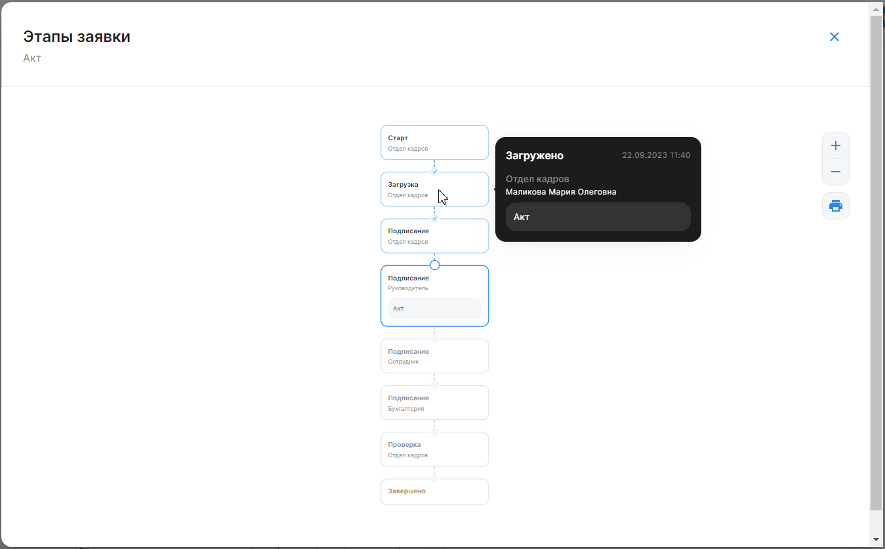

Из схемы этапов заявки можно вывести на печать протокол движения заявки и скачать его при необходимости. Для этого нажмите на кнопку .

## Опциональный этап в заявке

Для случаев, когда руководитель не успел подписать (или согласовать) заявку до наступления дедлайна этапа, в бизнес-процессе используется опциональный этап, который перейдет на второго руководителя. Опциональный этап будет активирован, только когда исходный этап подписания не будет исполнен первым руководителем. 

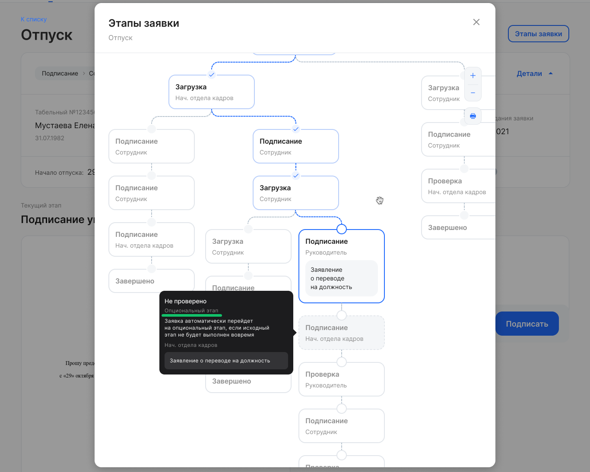

 

Исполнителем опционального этапа может быть как любой руководитель в иерархии, так и следующий руководитель после того, кто является исполнителем исходного этапа.

В случае если руководитель (или его заместитель) не успел подписать (согласовать) этап и этап завершился по дедлайну, то заявка переходит на этап со следующим руководителем. 

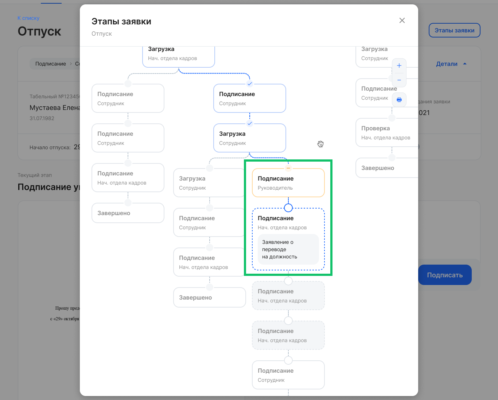

 

Если же первый руководитель подписал заявку вовремя, то заявка идет по флоу без участия второго руководителя.

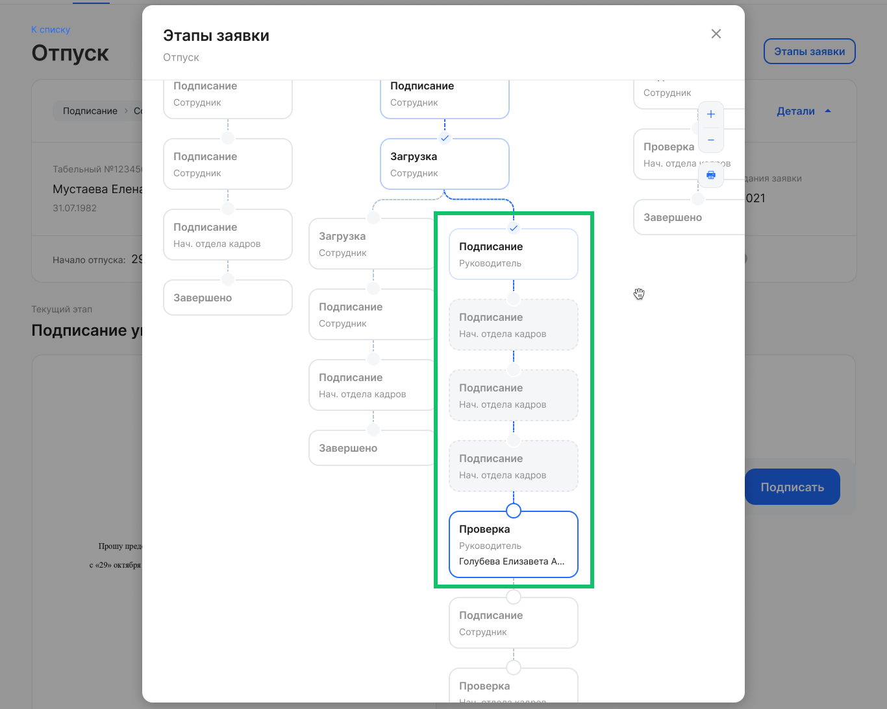

 

Если в заявке не будут пройдены все опциональные этапы, то заявка отменится.

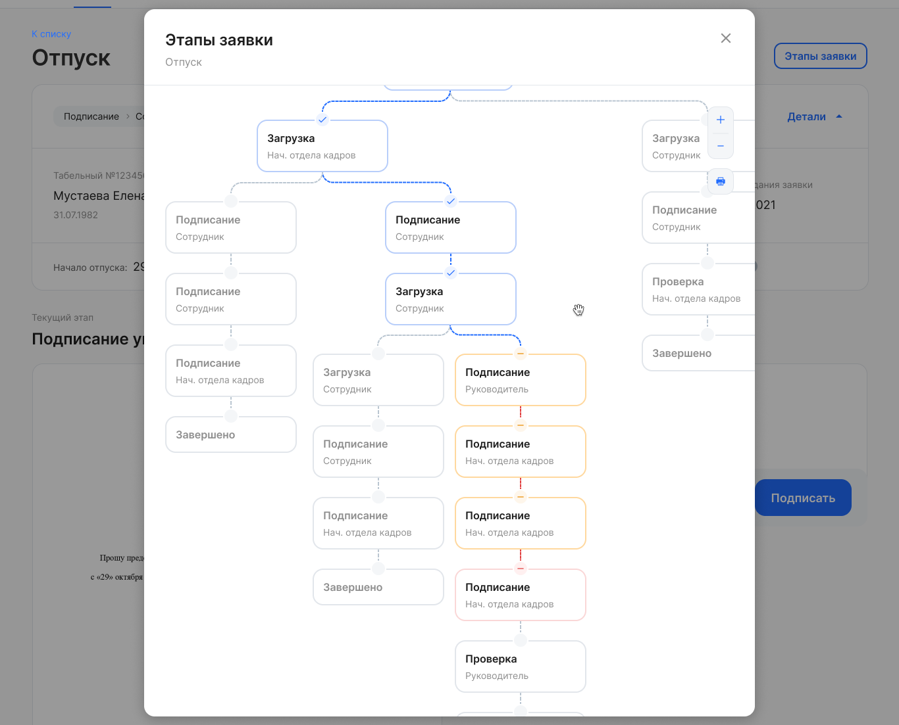

 

Для настройки опционального этапа в заявке обратитесь к вашему менеджеру VK HR Tek.

## Массовое согласование заявок

Массовое согласование заявок из списка доступно представителю компании при условиях, что на этапе **Проверка** в заявках:
- нет обязательных незаполненных данных;
- нет действия возврата на доработку;
- нет действия отказа от подписания.

Пользователь должен иметь одну из следующих ролей со стороны компании для выполнения массового согласования:

- руководитель;
- заместитель;
- ассистент;
- пользователи с группой.

Для согласования заявок в списке перейдите на вкладку **На мне**.

Для удобства просмотра заявок на этапе согласования в списке, примените фильтр **По этапу заявки** *= Проверка.* 

Установите флажки напротив тех заявок, которые нужно проверить, и нажмите кнопку **Подтвердить**. 

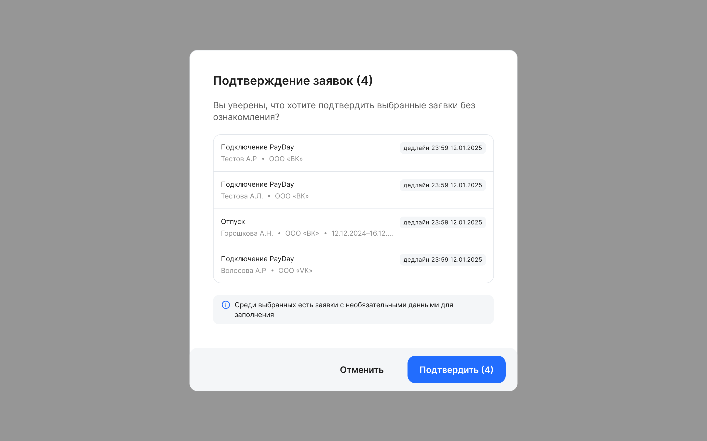

## Массовое подписание документов из заявок
Представитель компании может массово подписывать заявки через усиленную квалифицированную электронную подпись **(УКЭП)**.

Для подписания документов в нескольких заявках сразу вернитесь к списку заявок **На мне**.

Для удобства просмотра заявок на этапе подписания в списке, примените фильтр **По этапу заявки** *= Подписание.* 

Установите флажки напротив тех заявок, которые нужно подписать, и нажмите кнопку **Подписать документы**. На одной странице списка можно выбрать до 50 заявок. 

Подтвердите подписание и дождитесь сообщения об успешном подписании.

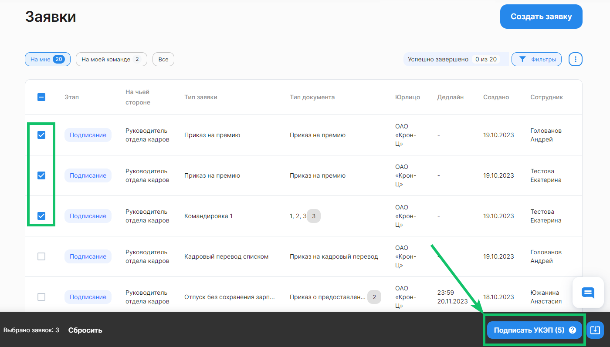

## Скачивание документов из заявок
Также возможно выбрать любое количество заявок из отображаемых на текущей странице и скачать их. Для этого проставьте галочки в чекбоксах перед строками с нужными заявками и нажмите на значок скачивания в правом нижнем углу. Архив с документами будет выгружен на ваш компьютер.

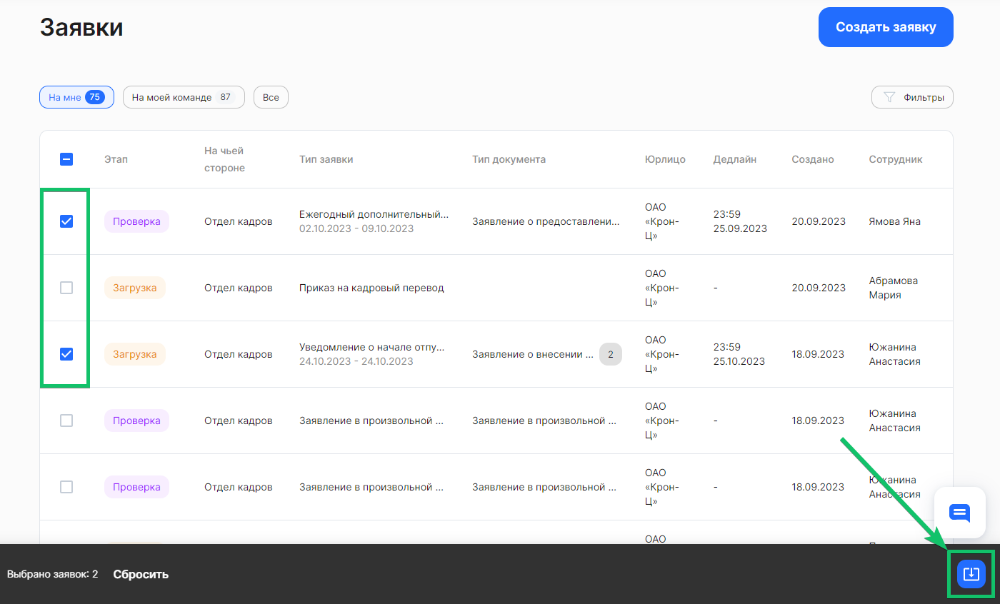

Чтобы скачать определенный документ из заявки, откройте нужную заявку и нажмите на кнопку скачивания в превью документа.

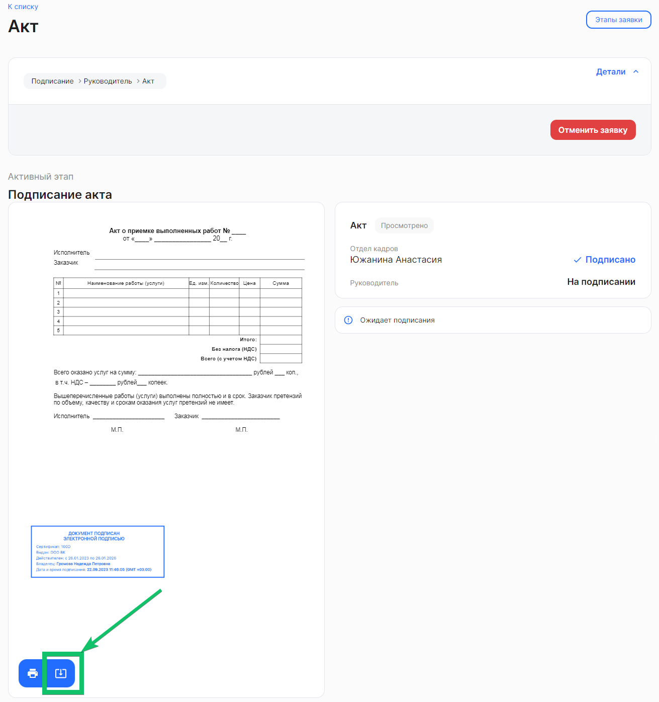