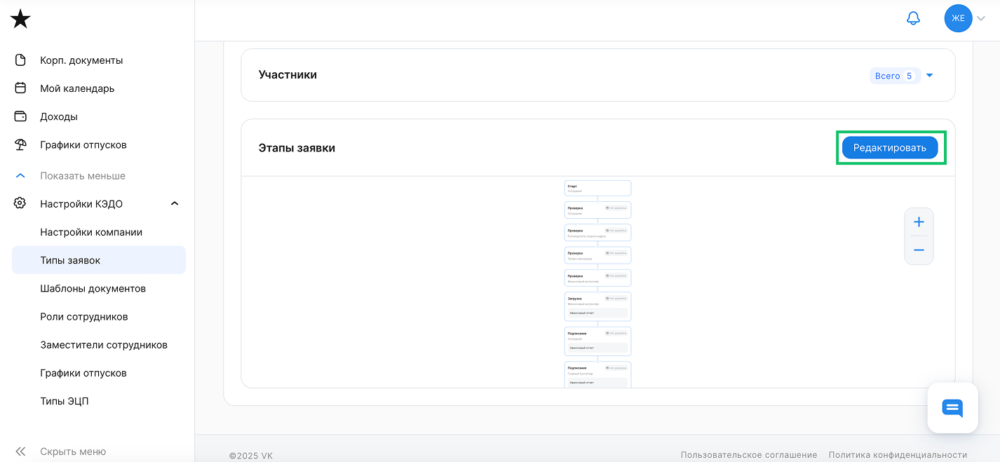
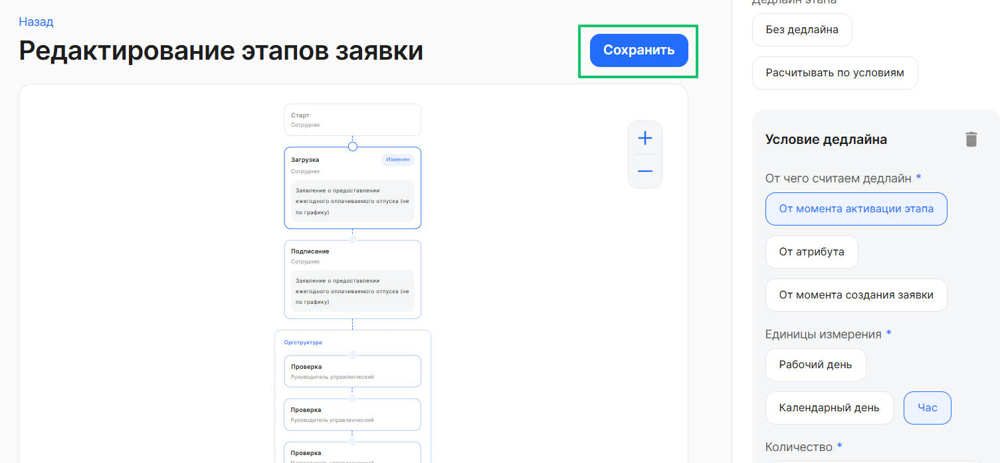
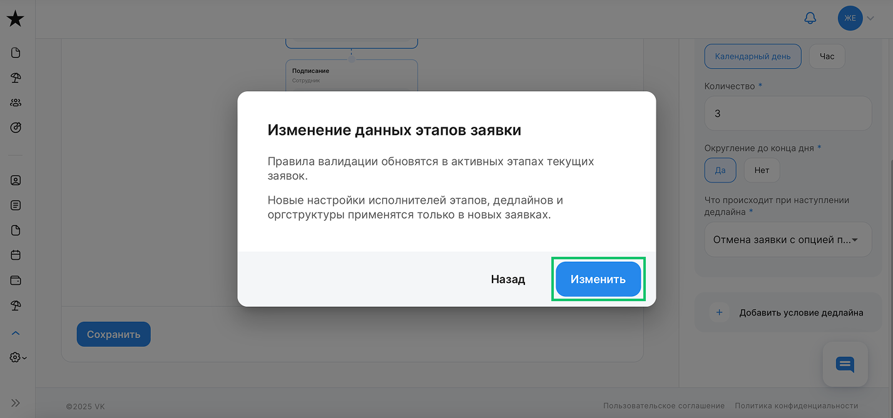

<warn>

При изменении данных этапов заявки правила валидации обновятся в активных этапах текущих заявок. Новые настройки исполнителей этапов, дедлайнов и оргструктуры применятся только в новых заявках.

Корректировать типы заявок может только пользователь с ролью **Администратор**.

</warn>

Для добавления и редактирования дедлайна на этапах бизнес-процесса перейдите в **Настройки КЭДО** → **Типы заявок**. Выберите интересующий тип заявки, в блоке **Этапы заявки** нажмите кнопку **Редактировать**.

На этапах заявки вы можете установить, отредактировать или удалить дедлайн. После редактирования нажмите кнопку **Сохранить**.

Можно внести изменения во все этапы, где это требуется, и сохранить все внесённые правки одновременно.

Чтобы подтвердить изменение дедлайна на этапе заявки, нажмите кнопку **Изменить**.

Важно помнить, что: 
1. Нельзя устанавливать дедлайн с автоматическим переходом на следующий этап для этапов **Загрузка** и **Подписание**, система выдаст ошибку.
2. Установить дедлайны можно и для [Универсального процесса](/ru/admin_actions/events_types/create_event_types).

Подробнее о дедлайнах см. в [статье](/ru/admin_actions/events_types/managing_event_types/deadline).