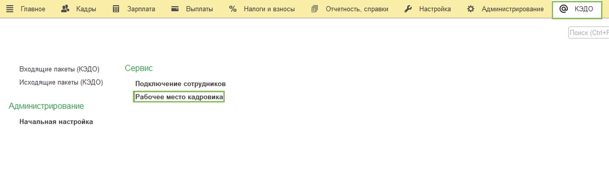
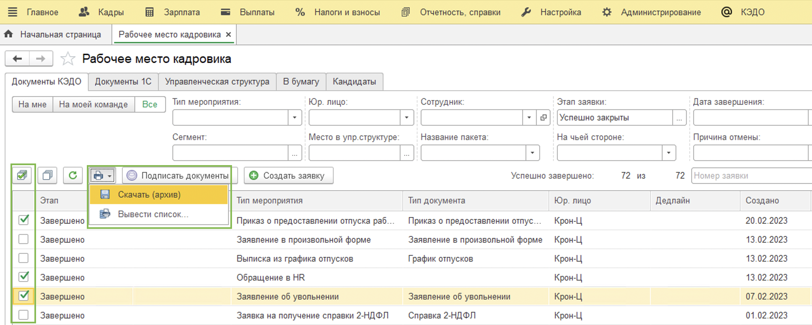
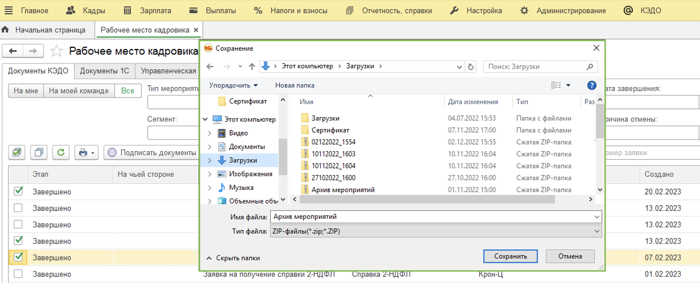
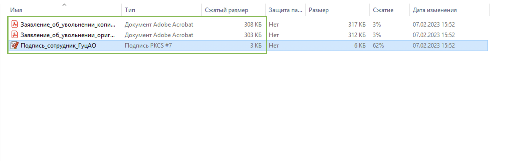
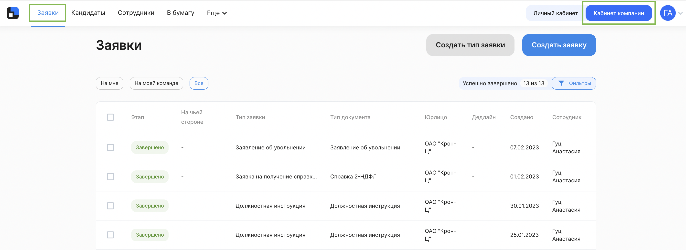
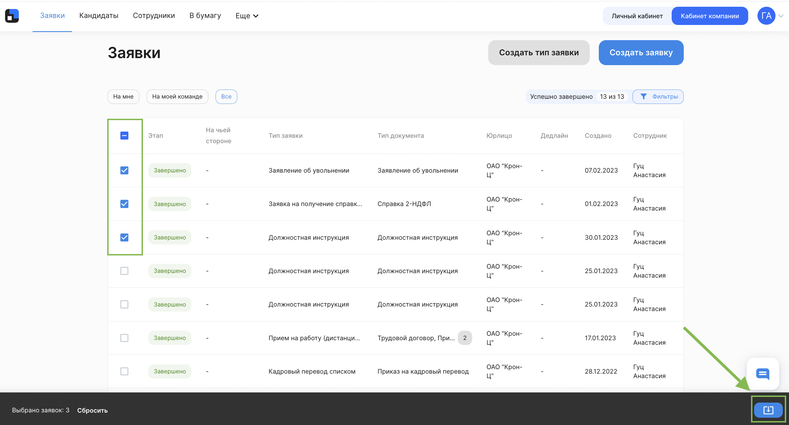
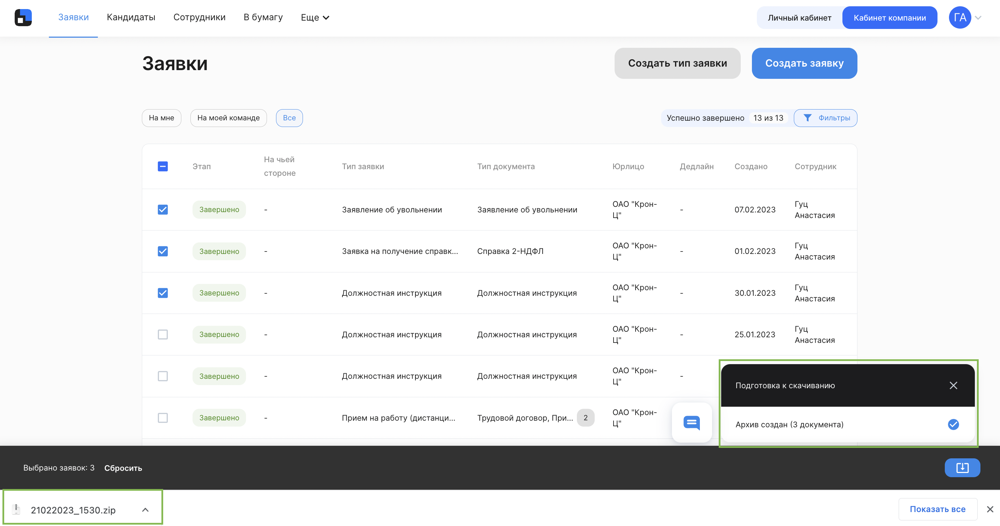
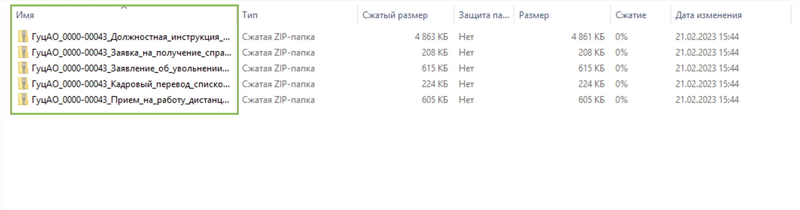

У Отдела кадров есть возможность массово скачать документы по выбранным заявкам

<info>

Отдел кадров может массово скачивать документы и в 1С и в вебе "Кабинет компании". Вы можете сразу перейти к нужной части статьи с помощью оглавления справа в зависимости от того, где вам удобно работать. 

</info>

## 1С "Рабочее место кадровика"

Сотрудник отдела кадров переходит в КЭДО → Рабочее место кадровика.

В списке выбираем заявки, которые хотим выгрузить → нажимаем на значок **Печать** → **Скачать (архив)**.

Выбираем удобное расположение, куда будет загружен архив и нажимаем **Сохранить**.

Скачивается общий архив, который содержит в себе отдельный архив по каждой заявке. В свою очередь архив заявки содержит в себе все документы из заявки и все файлы электронной подписи (отдельно подпись сотрудника и отдельно подпись представителя компании, если она предусмотрена).

Процесс завершён.

## Веб "Кабинет компании"

Переходим в веб "Кабинет компании" (https://vkdoc.mail.ru/).

В списке выбираем заявки, документы по которым хотим выгрузить → Нажимаем кнопку с изображением загрузки.

В правом нижнем углу появляется сообщение о том, что архив загружен.

Файл попадает в **Загрузки**.

Скачивается общий архив, который содержит в себе отдельный архив по каждой заявке. В свою очередь архив заявки содержит в себе все документы из заявки и все файлы электронной подписи (отдельно подпись сотрудника и отдельно подпись представителя компании).

Процесс завершён.