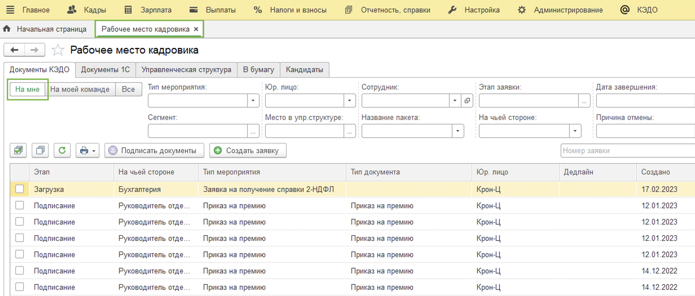
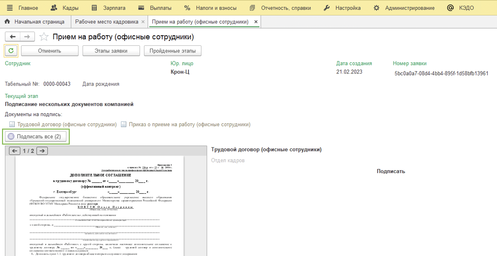
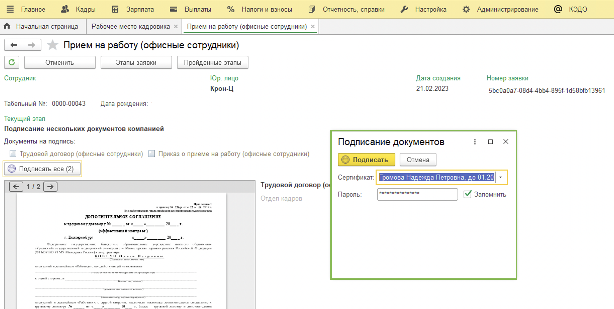
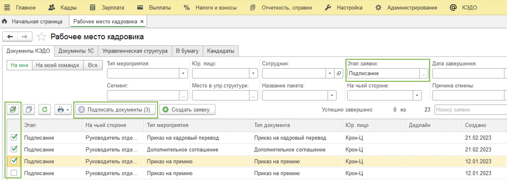
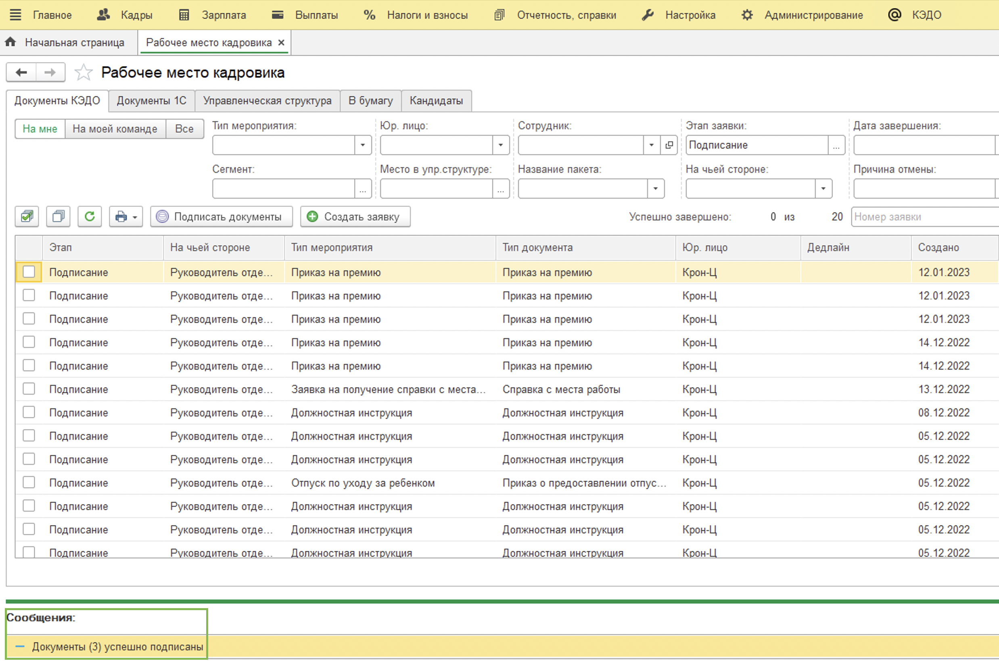
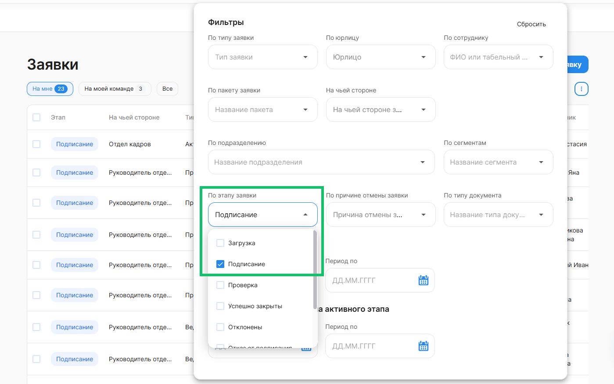
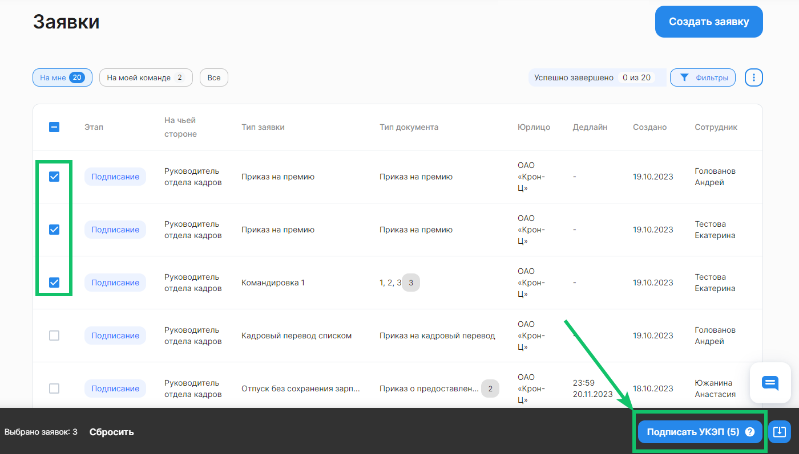

У представителей компании с соответствующей ролью и усиленной квалифицированной электронной подписью **(УКЭП)** есть возможность массово подписывать сразу все документы в выбранных заявках. 

<info>

Представители компании могут массово подписывать документы и в 1С, и в веб-сервисе, в разделе **Сервисы компании** → **Заявки** → **Все заявки** 

</info>

## 1С "Рабочее место кадровика"

Для подписания документов представитель компании с соответствующей ролью и электронной подписью (УКЭП) переходит в 1С **Рабочее место кадровика** → Вкладка **Документы КЭДО** → **На мне**.

Откройте нужную заявку → нажмите кнопку **Подписать**.

Подтвердите подписание.

Для подписания документов в нескольких заявках сразу, вернитесь в КЭДО → **Рабочее место кадровика**.

В общем списке заявок для удобства выберите фильтр по этапу заявки – **Подписание**.

Установите флажки напротив тех заявок, которые нужно подписать и нажмите кнопку **Подписать документы**.

Подтвердите подписание.

Дождитесь информационного сообщения об успешном подписании. 

Процесс завершён.

## Массовое подписание в сервисе VK HR Tek

Представитель компании может массово подписывать заявки через усиленную квалифицированную электронную подпись **(УКЭП)**.

Перейдите в раздел **Cервисы компании** → **Заявки** → **Все заявки** → вкладка **На мне**.

Для удобства просмотра заявок на этапе подписания в списке, примените фильтр **По этапу заявки** = *Подписание*.

Установите флажки напротив тех заявок, которые нужно подписать, и нажмите кнопку **Подписать документы**. На одной странице списка можно выбрать до 50 заявок.

Подтвердите подписание и дождитесь сообщения об успешном подписании.

Процесс завершён.
