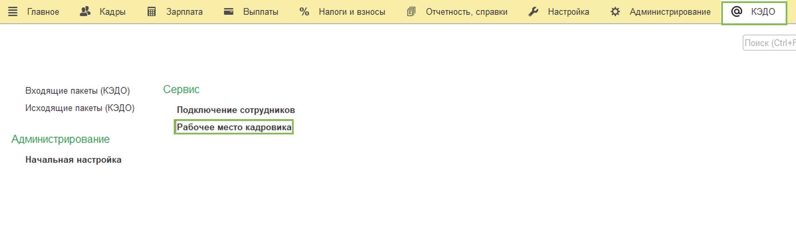
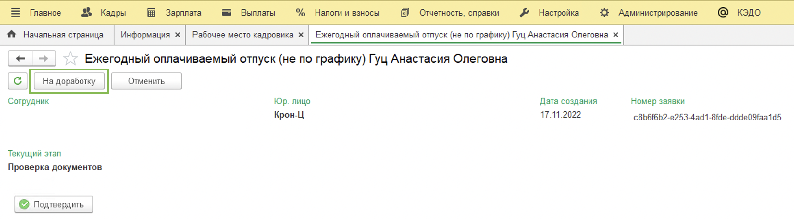
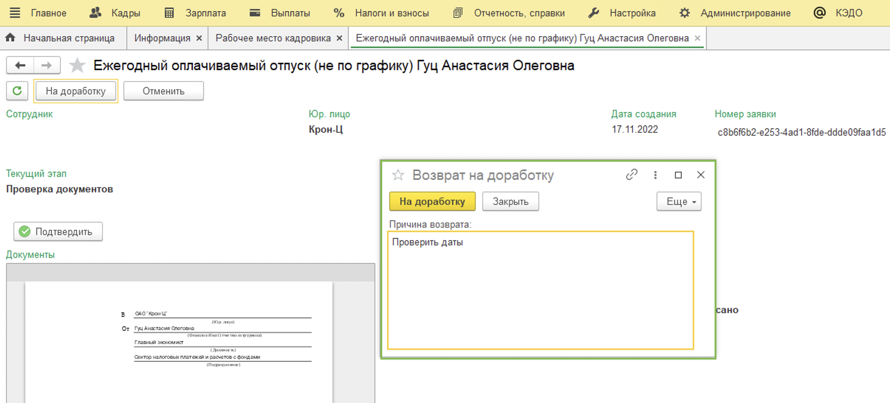
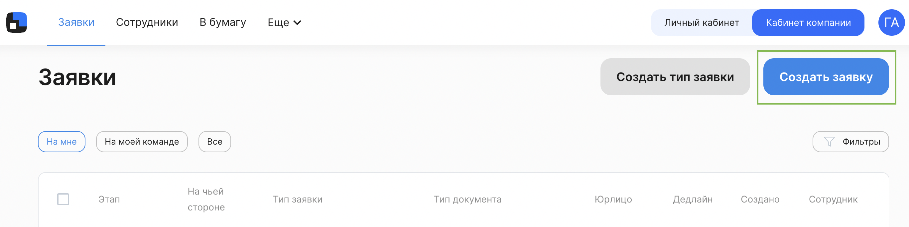
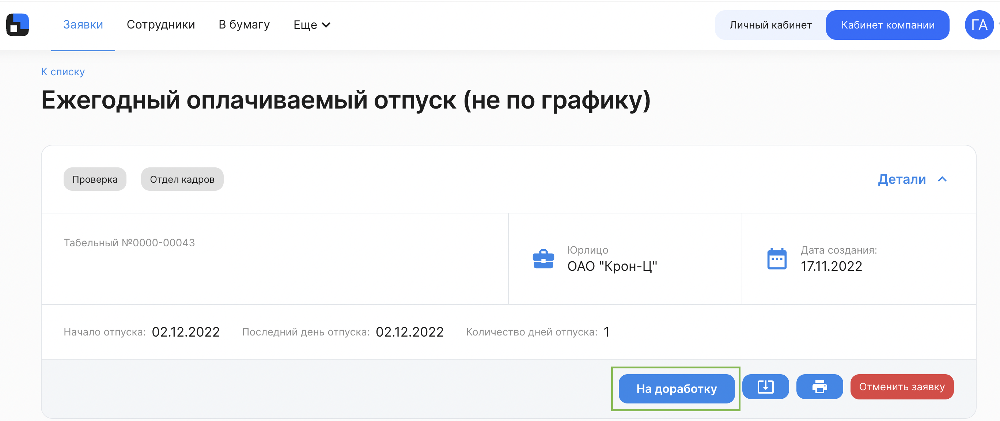
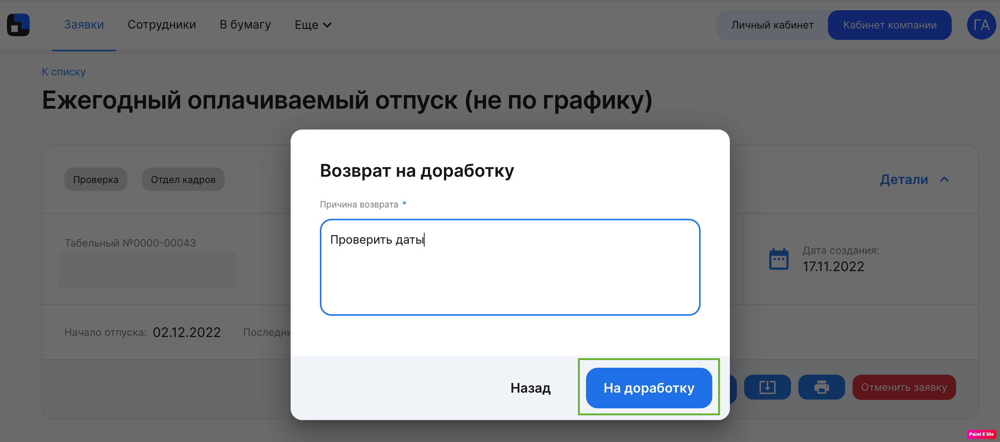
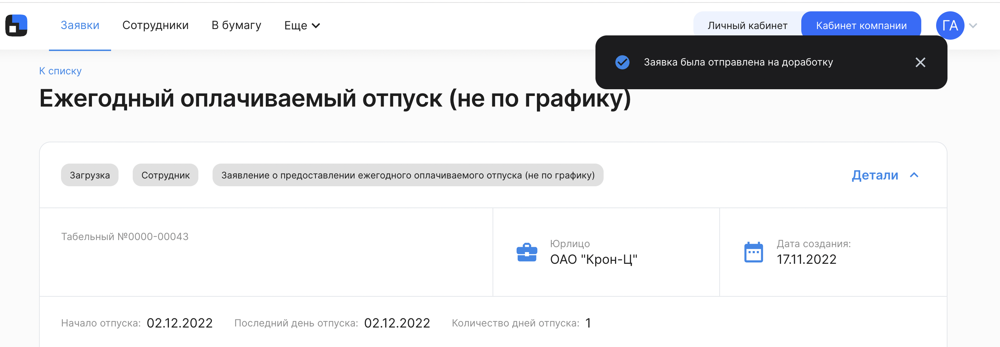
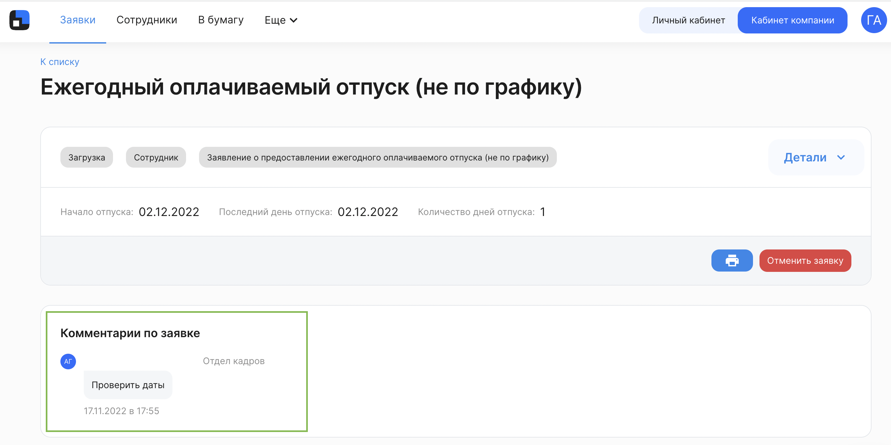

На этапе проверки заявки и загрузки приказа сотрудники Отдела кадров могут вернуть заявку на доработку.

<info>

Отдел кадров может работать с заявкой и в 1С и в вебе "Кабинет компании". Вы можете сразу перейти к нужной части статьи с помощью оглавления справа в зависимости от того, где вам удобно работать

</info>

## 1С "Рабочее место кадровика"

Отдел кадров переходит в **1С** → **КЭДО** → **Рабочее место кадровика**.

Находим нужную заявку и заходим в неё → Нажимаем кнопку **На доработку**.

<info>
Обратите внимание! Для того чтобы увидеть эту кнопку, необходимо прокрутить страницу до упора вверх
</info>

Нужно заполнить обязательное поле **Причина возврата** и нажать кнопку **На доработку**.

Процесс запустится с первого этапа и у сотрудника эта заявка появится с комментарием по заявке, который оставил сотрудник отдела кадров. Нужно будет снова сформировать и подписать документ.

Процесс завершён.

## Веб "Кабинет компании"

Переходим в веб "Кабинет компании" (https://vkdoc.mail.ru/)

Находим нужную заявку и заходим в неё → Нажимаем кнопку **На доработку**.

Нужно заполнить обязательное поле **Причина возврата** и нажать кнопку **На доработку**.

В правом верхнем углу появится сообщение:

Процесс запустится с первого этапа и у сотрудника эта заявка появится с комментарием по заявке, который оставил сотрудник отдела кадров. Нужно будет снова сформировать и подписать документ.

Процесс завершён.