На этапе проверки заявки и загрузки приказа сотрудники Отдела кадров могут вернуть заявку на доработку.

<info>

Отдел кадров может работать с заявкой и в 1С, и в веб-сервисе VK HR Tek

</info>

## 1С «Рабочее место кадровика»

Отдел кадров переходит в **1С** → **КЭДО** → **Рабочее место кадровика**.

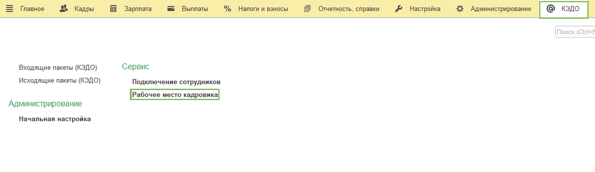

Найдите нужную заявку и перейдите к ней. Нажмите кнопку **На доработку**.

<info>

Чтобы увидеть кнопку **На доработку** в заявке, прокрутите страницу до упора вверх

</info>

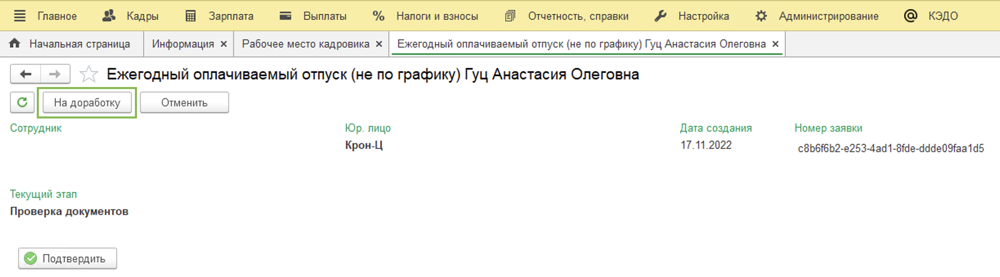

Заполните обязательное поле **Причина возврата** и нажмите кнопку **На доработку**.

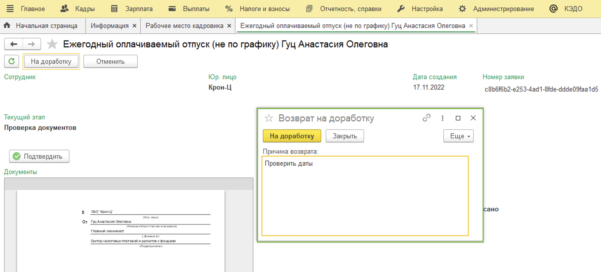

Процесс запустится с первого этапа, и у сотрудника эта заявка появится с комментарием по заявке, который оставил специалист отдела кадров. Нужно будет снова сформировать и подписать документ.

### **Заявки на доработке**

В карточке заявки и в списке документов КЭДО в **Рабочем месте кадровика** отображается отметка о возврате заявки на доработку. Также для списка документов КЭДО доступен фильтр **Только заявки на доработке**. 

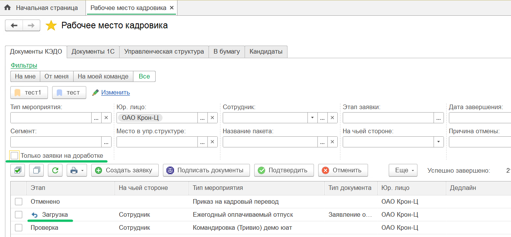

## Веб-сервис «Сервисы компании»

Перейдите в раздел **Cервисы компании → Заявки → Все заявки** → вкладка **На мне**.

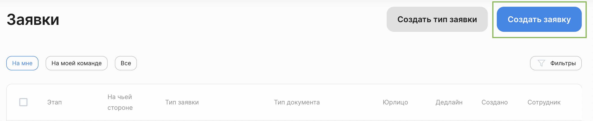

Найдите нужную заявку и перейдите к ней. Нажмите кнопку **На доработку**.

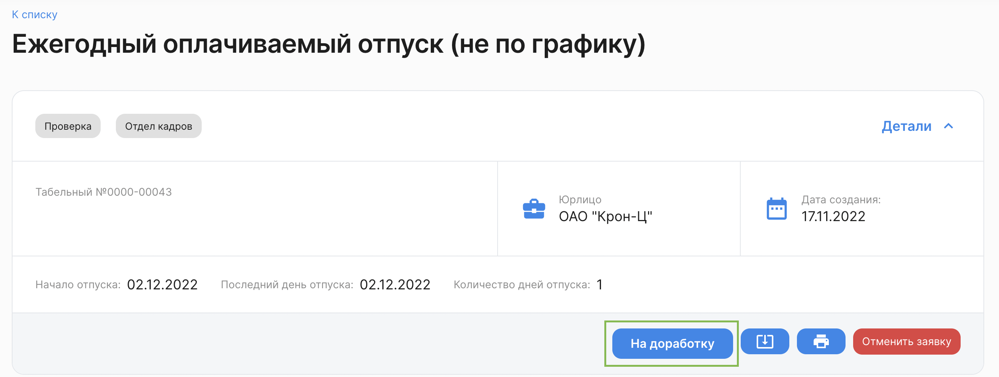

Заполните обязательное поле **Причина возврата** и нажмите кнопку **На доработку**.

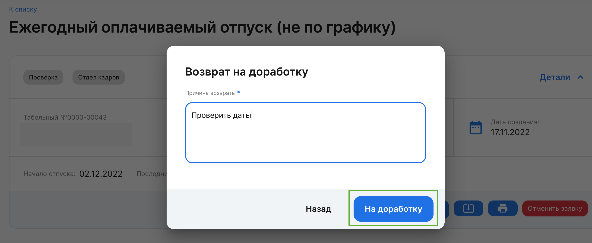

В правом верхнем углу появится сообщение:

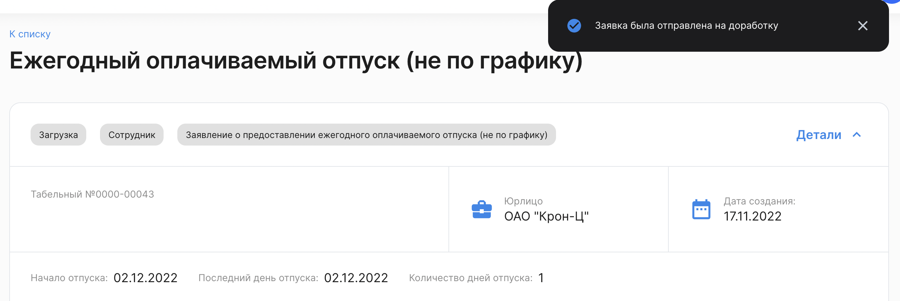

Процесс запустится с первого этапа, и у сотрудника эта заявка появится с комментарием по заявке, который оставил специалист отдела кадров. Нужно будет снова сформировать и подписать документ.

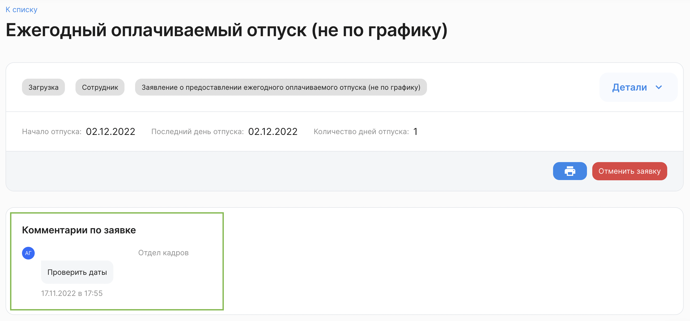

### **Заявки на доработке**

В карточке заявки и в списке заявок отображается метка «На доработке» — она показывает, что этап был активирован в результате возврата, а не первичного перехода заявки на исполнителя. При наведении на метку открывается история возвратов: дата, инициатор и этап, с которого вернули. В комментарии к заявке теперь указано, что он оставлен при возврате.  

В списке заявок (для представителей компании и сотрудников) доступен фильтр **Только заявки на доработке** — он выводит только те заявки, у которых текущий активный этап назначен в результате возврата. Работает вместе с остальными фильтрами и быстрыми фильтрами, поддерживает сохранение в выборку.  

Посмотреть интерфейсы
 

1. Заявка

2. Этапы заявки  

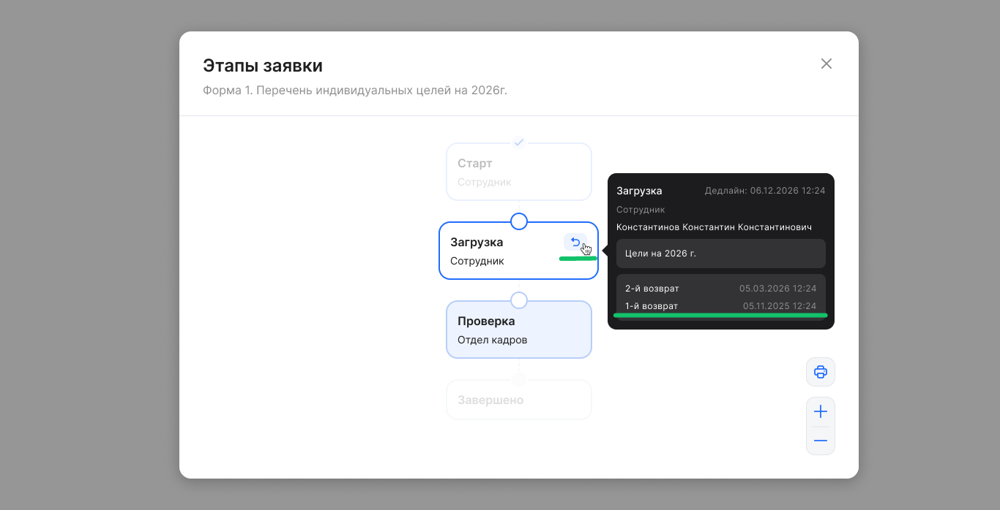

3. Список заявок  

4. Фильтр **Только заявки на доработке** 

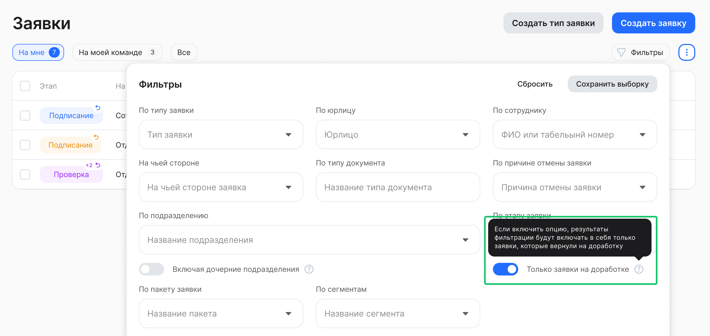

