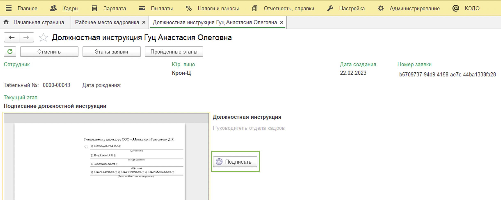
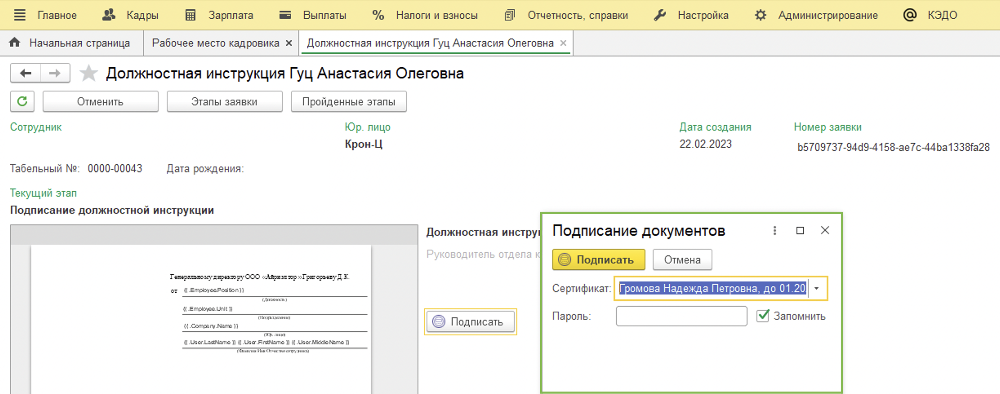
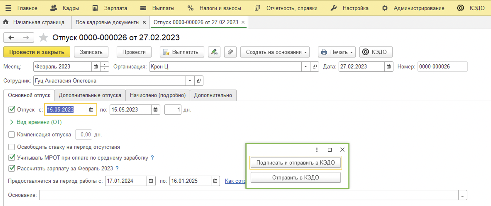
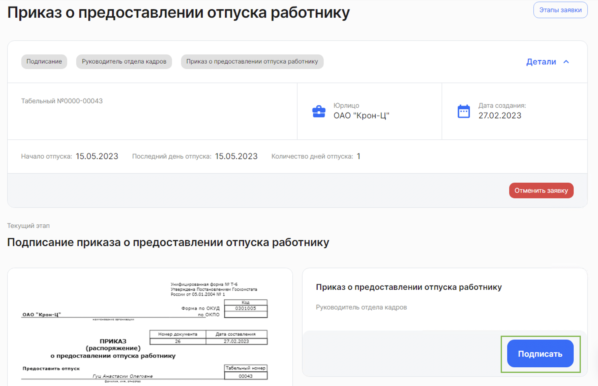
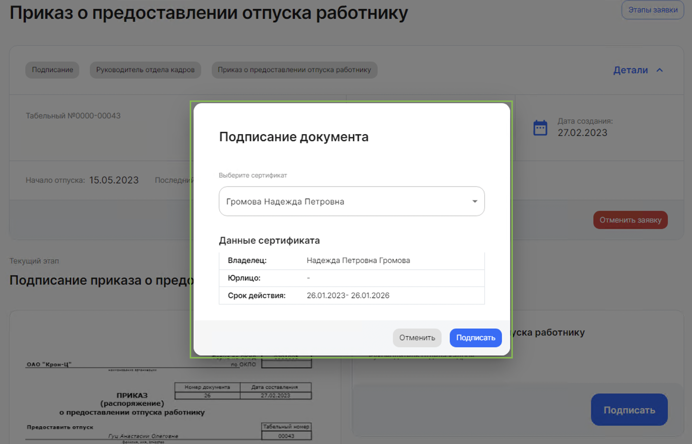

Представители компании с соответствующей ролью (Например, Руководитель отдела кадров) подписывают кадровые документы с помощью УКЭП (усиленной квалифицированной электронной подписи)

<info>

Представители компании могут подписывать документы и в 1С и в вебе "Кабинет компании". Вы можете сразу перейти к нужной части статьи с помощью оглавления справа в зависимости от того, где вам удобно работать

</info>

## 1С "Рабочее место кадровика"

Для успешного подписания документов должны быть выполнены следующие условия: 
1. У вас есть соответствующая роль.
2. У вас есть личный сертификат УКЭП.
3. Ваш сертификат был загружен в 1С Администратором.
4. Публичный ключ сертификата УКЭП в формате p7b был загружен в систему через команду внедрения.
5. Вы подписываете документы верным сертификатом УКЭП именно в той компании, для котоой был загружен публичный ключ.

<info>

Подписать документы в 1С можно разными способами

</info>

### В конкретной заявке

Для подписания документов представитель компании с соответствующей ролью и электронной подписью (УКЭП) должен перейти в **1С** →  **Рабочее место кадровика** → Раздел **На мне** → и открыть заявку, которую нужно подписать.

Нажимаем кнопку **Подписать**.

Подтверждаем подписание.

Дожидаемся информационного сообщения об успешном подписании. 

Процесс завершён.

### При отправке документа в КЭДО

Для подписания документов представитель компании с соответствующей ролью и электронной подписью (УКЭП) должен перейти в **1С** и создать кадровый документ.

Нажимаем кнопку **КЭДО** → **Подписать и отправить**.

Подтверждаем подписание и ожидаемся информационного сообщения об успешном подписании. 

Процесс завершён.

## Веб "Кабинет компании"

Для успешного подписания документов должны быть выполнены следующие условия: 
1. У вас есть соответствующая роль.
2. У вас есть личный сертификат УКЭП.
3. У вас установлена специальная программа для подписания (КриптоПро или иная) и расширение для браузера.
4. Публичный ключ сертификата УКЭП в формате p7b был загружен в систему через команду внедрения.
5. Вы подписываете документы верным сертификатом УКЭП именно в той компании, для котоой был загружен публичный ключ.

Переходим в веб "Кабинет компании" (https://vkdoc.mail.ru/).

**Заявки** → Раздел **На мне** → открываем заявку, которую нужно подписать.

Нажимаем кнопку **Подписать**.

Подтверждаем подписание.

Дожидаемся информационного сообщения об успешном подписании. 

Процесс завершён.
