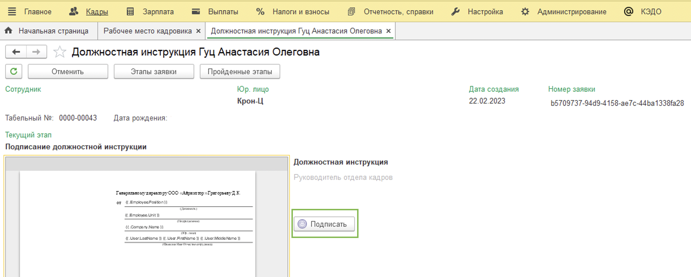
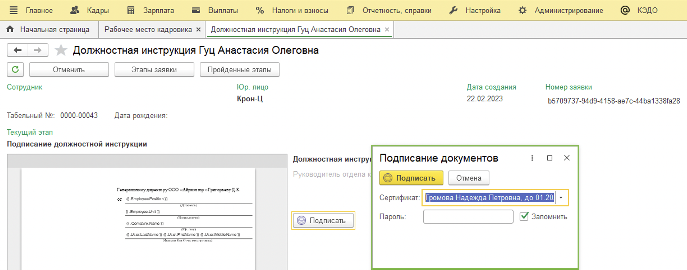
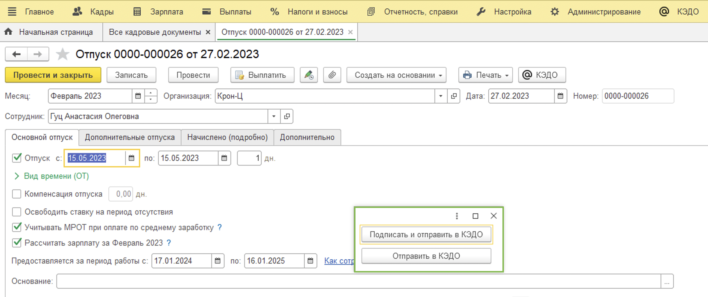
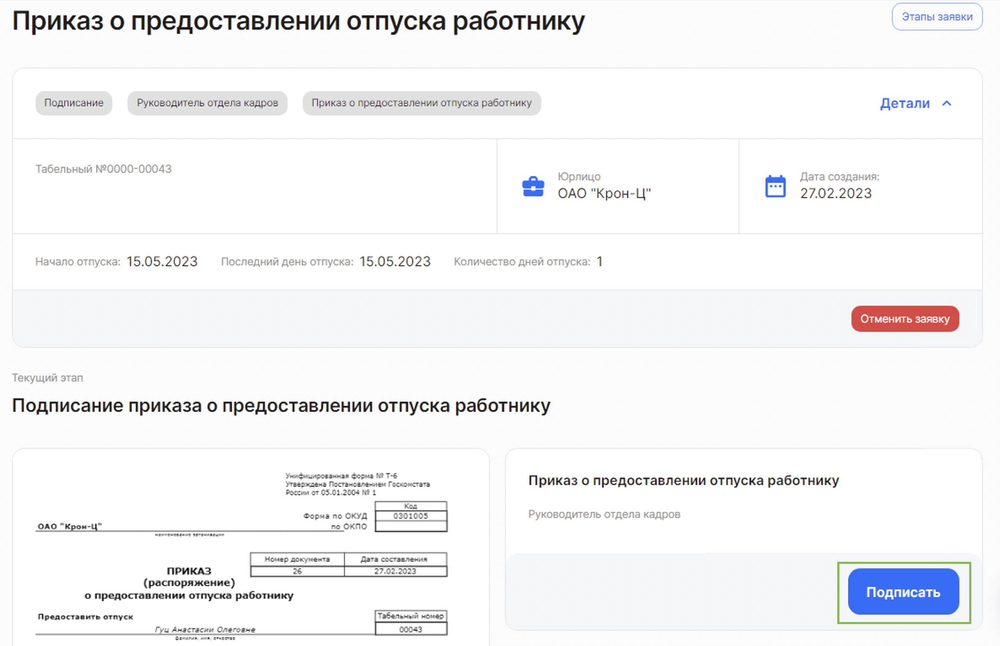
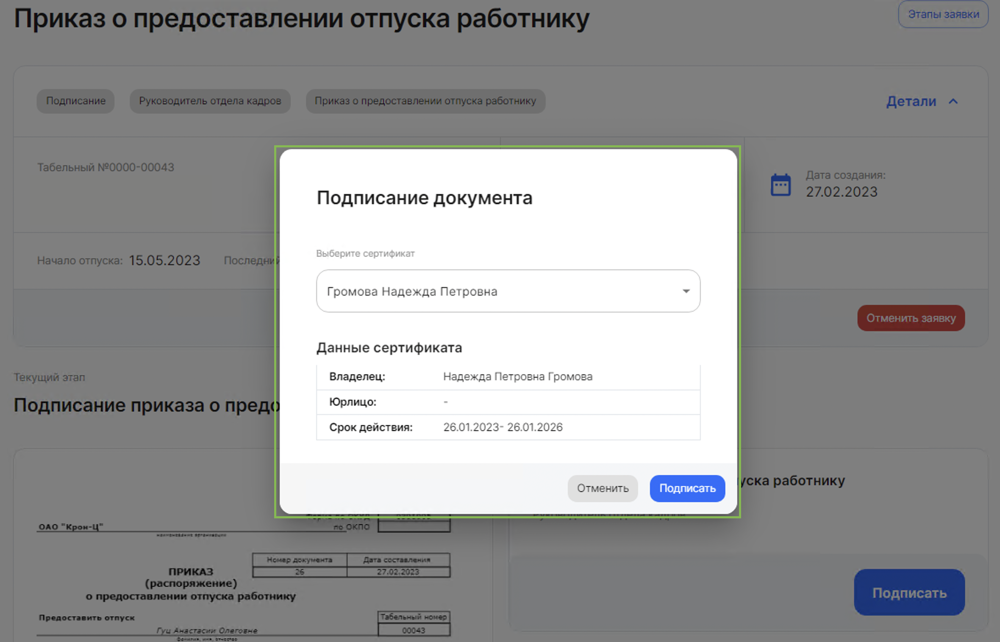

Представители компании с соответствующей ролью (например, Руководитель отдела кадров) подписывают кадровые документы с помощью усиленной квалифицированной электронной подписи — УКЭП.

<info>

Представители компании могут подписывать документы и в 1С, и в веб-сервисе, в разделе **Сервисы компании**

</info>

## Рабочее место кадровика в 1С

Для успешного подписания документов должны быть выполнены следующие условия: 

Если у компании включена настройка проверки подписи без загрузки открытого ключа, то:
1. У вас есть соответствующая роль.
2. У вас есть личный сертификат УКЭП.
3. Ваш сертификат был загружен в 1С Администратором.

Подробнее об [использовании УКЭП без загрузки открытого ключа](#ispolzovanie_ukep_bez_zagruzki_otkrytogo_klyucha_v_kedo).

Если у компании не включена настройка проверки подписи без загрузки открытого ключа, то:
1. У вас есть соответствующая роль.
2. У вас есть личный сертификат УКЭП.
3. Ваш сертификат был загружен в 1С Администратором.
4. Публичный ключ сертификата УКЭП в формате p7b должен быть загружен в систему с помощью команды внедрения VK HR Tek.
5. Проверьте, что подписываете документы верным сертификатом УКЭП именно в той компании, для которой был загружен публичный ключ.

<info>

Подписать документы в 1С можно разными способами

</info>

### В конкретной заявке

Для подписания документов представитель компании с соответствующей ролью и электронной подписью (УКЭП) должен перейти в **1С** →  **Рабочее место кадровика** → Раздел **На мне** → и открыть заявку, которую нужно подписать.

Нажмите кнопку **Подписать**.

Подтвердите подписание.

Дождитесь информационного сообщения об успешном подписании. 

Процесс завершён.

### При отправке документа в КЭДО

Для подписания документов представитель компании с соответствующей ролью и электронной подписью (УКЭП) должен перейти в **1С** и создать кадровый документ.

Нажмите кнопку **КЭДО** → **Подписать и отправить**.

Подтвердите подписание и ожидайте информационного сообщения об успешном подписании. 

Процесс завершён.

## Сервисы компании в веб-сервисе

Для успешного подписания документов должны быть выполнены следующие условия: 

Если у компании включена настройка проверки подписи без загрузки открытого ключа, то:
1. У вас есть соответствующая роль.
2. У вас есть личный сертификат УКЭП.
3. Ваш сертификат был загружен в 1С Администратором.

Подробнее об [использовании УКЭП без загрузки открытого ключа](#ispolzovanie_ukep_bez_zagruzki_otkrytogo_klyucha_v_kedo).

Если у компании не включена настройка проверки подписи без загрузки открытого ключа, то:
1. У вас есть соответствующая роль.
2. У вас есть личный сертификат УКЭП.
3. Ваш сертификат был загружен в 1С Администратором.
4. Публичный ключ сертификата УКЭП в формате p7b должен быть загружен в систему с помощью команды внедрения VK HR Tek.
5. Проверьте, что подписываете документы верным сертификатом УКЭП именно в той компании, для которой был загружен публичный ключ.

В разделе **Сервисы компании** → **Заявки** → фильтр **На мне** откройте заявку, которую нужно подписать.

Нажмите кнопку **Подписать**.

Подтвердите подписание.

Дождитесь информационного сообщения об успешном подписании. 

Процесс завершён.

## **Использование УКЭП без загрузки открытого ключа в КЭДО**

В системе доступен режим подписания УКЭП без обязательной предзагрузки открытого ключа в КЭДО. Это упрощает старт подписания, снижает число ошибок из-за неверно предоставленного ключа или неподходящего формата, уменьшает количество обращений в поддержку и особенно полезно для компаний с большим числом кадровых специалистов. 

Если у компании включена настройка проверки подписи без загрузки открытого ключа, то:
1. После подписания документа вашим сертификатом УКЭП (из браузера или 1С) система VK HR Tek выполнит несколько проверок. В случае успеха — процесс перейдет на следующий этап.
2. В случае ошибки при проверке — процесс вернется на этап подписания, а в веб-сервисе/1С будет указана причина ошибки. 
3. Сначала система проверит, что сертификат УКЭП совпадает с вашими данными (то есть нельзя подписать чужой подписью). Проверка проводится по ФИО, СНИЛС и ИНН (при наличии).
4. Две другие проверки технические: проверка по списку отозванных сертификатов и на корректность аккредитации удостоверяющего центра.

<warn>

Проверка подписания МЧД в КЭДО сертификатом УКЭП руководителя организации остается по прежней логике — по предзагруженному открытому ключу

</warn>

Если подпись не проходит и возникает ошибка, то необходимо:
- Проверить, что пользователь подписывает документ своим сертификатом, а не чужим.
- Проверить, что ФИО, ИНН и СНИЛС в системе заполнены корректно.
- Проверить срок действия сертификата.

<warn>

Если открытый ключ сертификата не загружен в КЭДО, то в профиле сотрудника не будет отображаться срок действия сертификата, поскольку пользователь может подписать документы любым своим сертификатом КЭП и система заранее не знает, какой именно сертификат будет выбран пользователем для подписания.

</warn>
