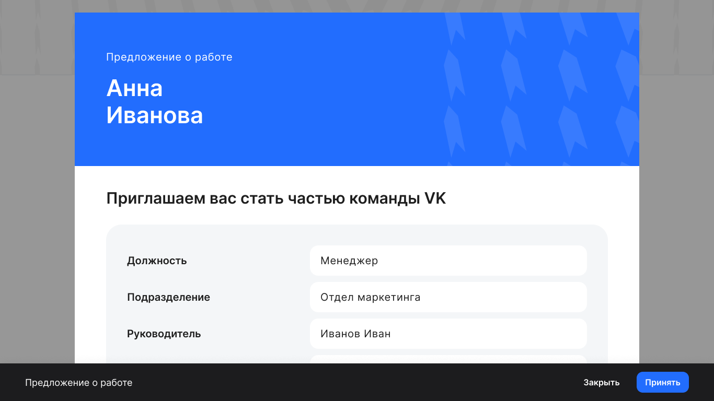

Кандидат проходит по ссылке-приглашению и авторизуется в личном кабинете VK HR Tek по номеру телефона, который вы указали при [создании анкеты](/ru/hr/company/candidates/create).

При наличии в заявке этапа «Предложение о работе» кандидат видит сформированный вами оффер:

 

Кандидат может либо принять его, либо, если у него возникли какие-то вопросы, обратиться к своему контактному лицу в компании для уточнения:

 

Пока кандидат не принял оффер, БП остается на этапе «Предложение о работе» в ожидании действий кандидата.

Когда кандидат примет оффер, оформление перейдет на следующий этап.