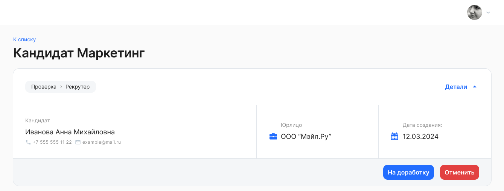
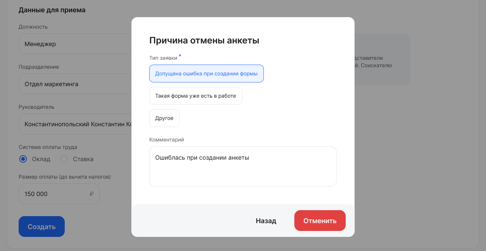

Для отмены заявки нажмите кнопку «Отменить» в блоке с общими данными анкеты. 

 

В открывшейся форме выберите причину отмены, при необходимости укажите комментарий и нажмите кнопку «Отменить»:

 

<info>
Если вы не нашли кнопку «Отменить» в блоке с общими данными анкеты, то это значит, что настройки текущего этапа не позволяют такое действие.
</info>