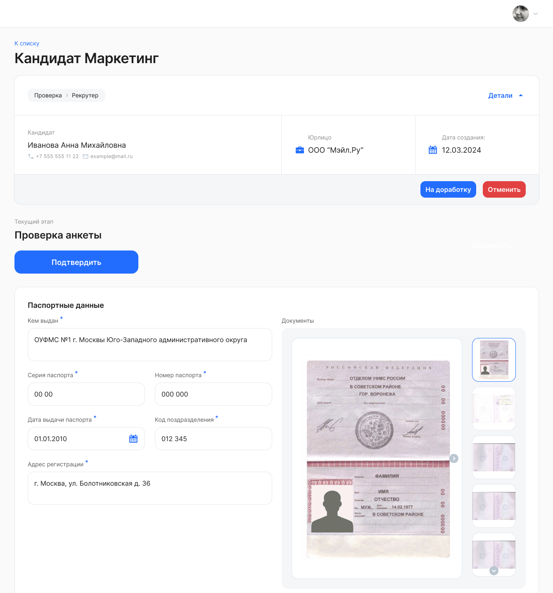
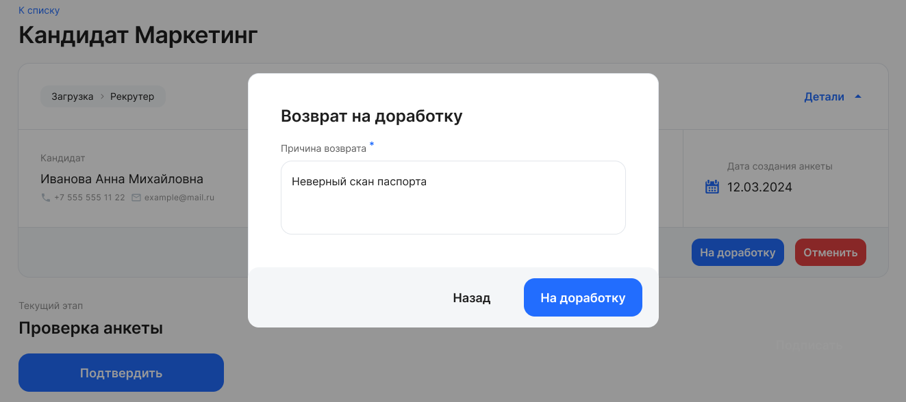
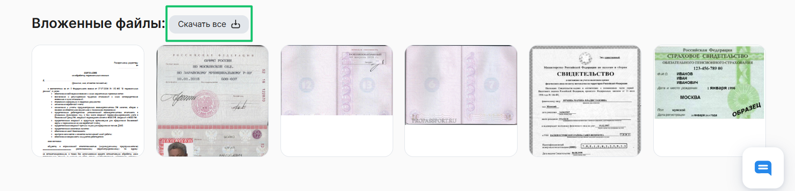

На данном этапе в заявке отображается заполненная кандидатом анкета. 

В соответствии с настройками проверяющий может просматривать и редактировать некоторые данные в полях анкеты, просматривать сканы документов. 

Проверьте указанные данные и документы, при необходимости внесите изменения и нажмите кнопку **Подтвердить**:

 

Данные кандидата автоматически отправятся в 1С, а заявка перейдёт в статус **Отправка данных**.

<info>

Если бизнес-процесс по заполнению и проверке анкеты кандидата в вашей компании требует доработки, обратитесь к вашему менеджеру VK HR Tek. Донастройка бизнес-процесса является платной.

Пример. Если выбранный при создании бизнес-процесса тип документа предполагает согласование с каким-либо подразделением компании, то кнопка **Подтвердить** может иметь вид **Отправить в отдел**, где в качестве отдела указано соответствующее подразделение. После нажатия кнопки **Отправить в отдел** БП автоматически перейдёт на этап согласования этим подразделением. Так исполнитель с ролью **Рекрутер** может отправить анкету и документы кандидата на проверку в Службу безопасности

</info>

 

Если необходимо изменить данные в неактивных полях анкеты либо требуются новые сканы документов, нажмите кнопку **На доработку** в блоке с общими данными по бизнес-процессу и в открывшемся диалоговом окне укажите причину возврата:

 

В этом случае бизнес-процесс будет возвращён на этап **Необходимо заполнить анкету**, а кандидат получит уведомление о необходимости внести изменения в анкету.

В сервисе VK HR Tek, на этапе **Проверка** кандидат-заявки рекомендуется скачать документы, которые прикрепил кандидат, чтобы на этапе **Сохранение кандидата** сверить данные кандидата в модуле 1С с его документами. Скачать документы, которые прикрепил кандидат, можно и на этапе **Сохранение кандидата**.

