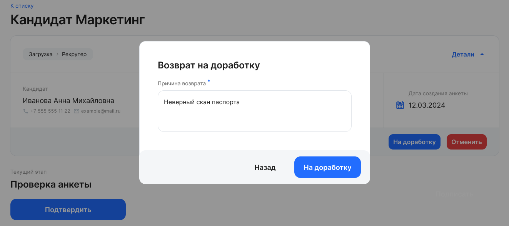

На данном этапе в заявке отображается заполненная кандидатом анкета. 

В соответствии с настройками проверяющий может просматривать и редактировать некоторые данные в полях анкеты, просматривать сканы документов. 

Проверьте указанные данные и документы, при необходимости внесите изменения и нажмите кнопку «Подтвердить»:

 

Данные кандидата автоматически отправятся в 1С, а заявка перейдет в статус «Отправка данных».

<info>

Если БП по заполнению и проверке анкеты кандидата в вашей компании требует доработки, обратитесь к вашему менеджеру VK HR Tek. Донастройка БП является платной.

Пример. Если выбранный при создании БП тип документа предполагает согласование с каким-либо подразделением компании, то кнопка «Подтвердить» может иметь вид «Отправить в отдел», где в качестве отдела указано соответствующее подразделение. После нажатия кнопки «Отправить в отдел» БП автоматически перейдет на этап согласования этим подразделением. Так исполнитель с ролью «Рекрутер» может отправить анкету и документы кандидата на проверку в Службу безопасности.

</info>

 

Если необходимо изменить данные в неактивных полях анкеты либо требуются новые сканы документов, то нажмите кнопку «На доработку» в блоке с общими данными по БП и в открывшемся диалоговом окне укажите причину возврата:

 

В этом случае БП будет возвращен на этап «Необходимо заполнить анкету», а кандидат получит уведомление о необходимости внести изменения в анкету.

В сервисе VK HR Tek, на этапе **Проверка** кандидат-заявки скачайте все документы, которые прикрепил кандидат, чтобы на этапе **Сохранение кандидата** сверить данные кандидата в модуле 1С с его документами. 

<warn>

На этапе **Сохранение кандидата** документы будут недоступны.

</warn>

