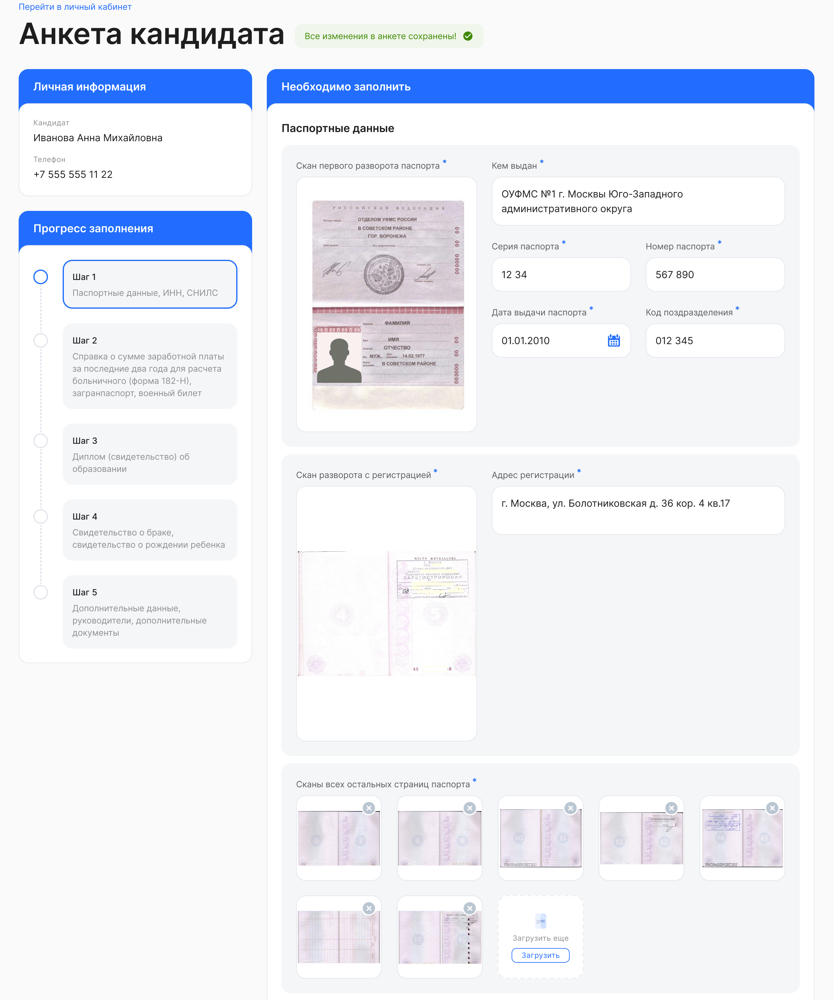
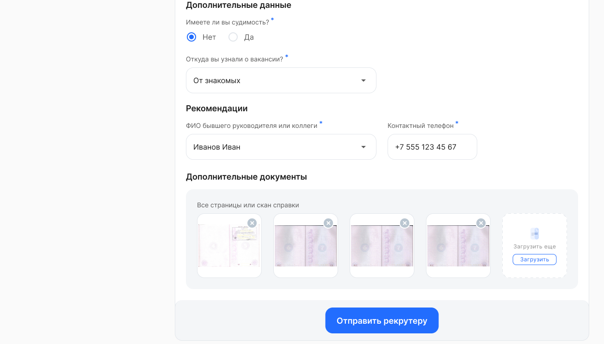

Следующий шаг для кандидата — заполнение личных данных. В личном кабинете VK HR Tek кандидат заполняет анкету и загружает сканы необходимых документов. Допустимые форматы файлов: PDF, AVIF, JPEG, PNG, SVG, WebP, DNG, HEIC, HEIF, OCR, не более 20 Mб.

Для удобства кандидата процедура заполнения анкеты разделена на шаги, в каждом из которых он должен предоставить определенный набор данных. Например, на шаге 1, как правило, необходимо указать паспортные данные и приложить сканы:

 

<info>
Количество шагов и набор требуемых данных могут различаться в зависимости от типа БП и настроек системы.
</info>

При заполнении анкеты все личные данные автосохраняются. Кандидат может дозаполнить анкету позже, не беспокоясь о потере данных.

Когда все обязательные данные в анкете заполнены, кандидат нажимает «Продолжить» и попадает на форму предпросмотра анкеты, где может проверить внесенные данные и при необходимости их отредактировать.

Если все данные указаны корректно и требуемые сканы документов загружены, то кандидат нажимает кнопку «Отправить рекрутеру»:

После этого заявка переходит на проверку в компанию. 