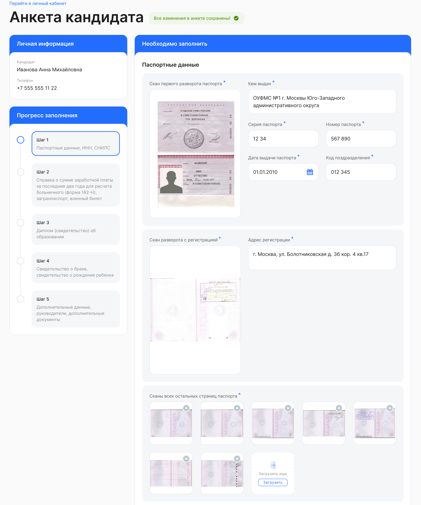
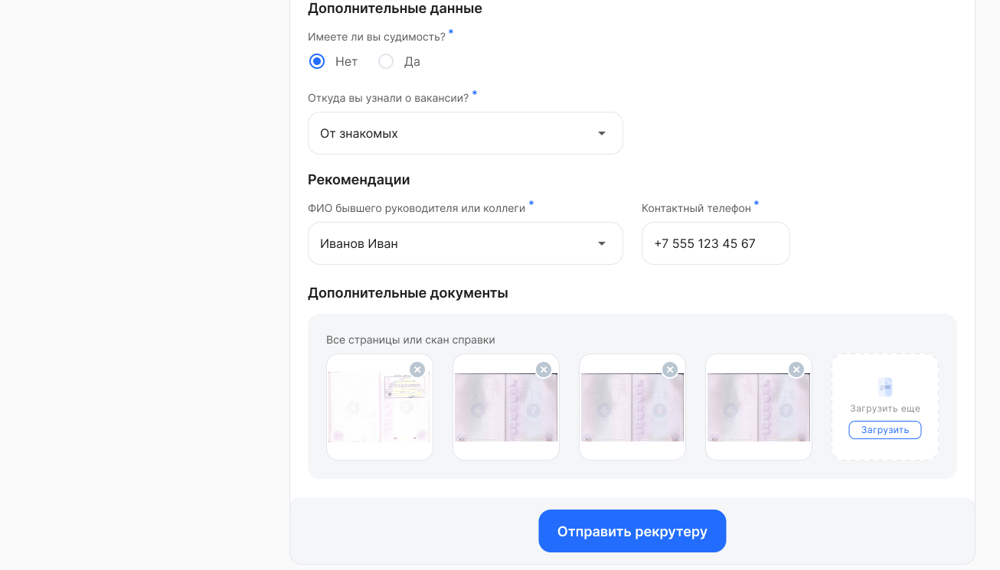
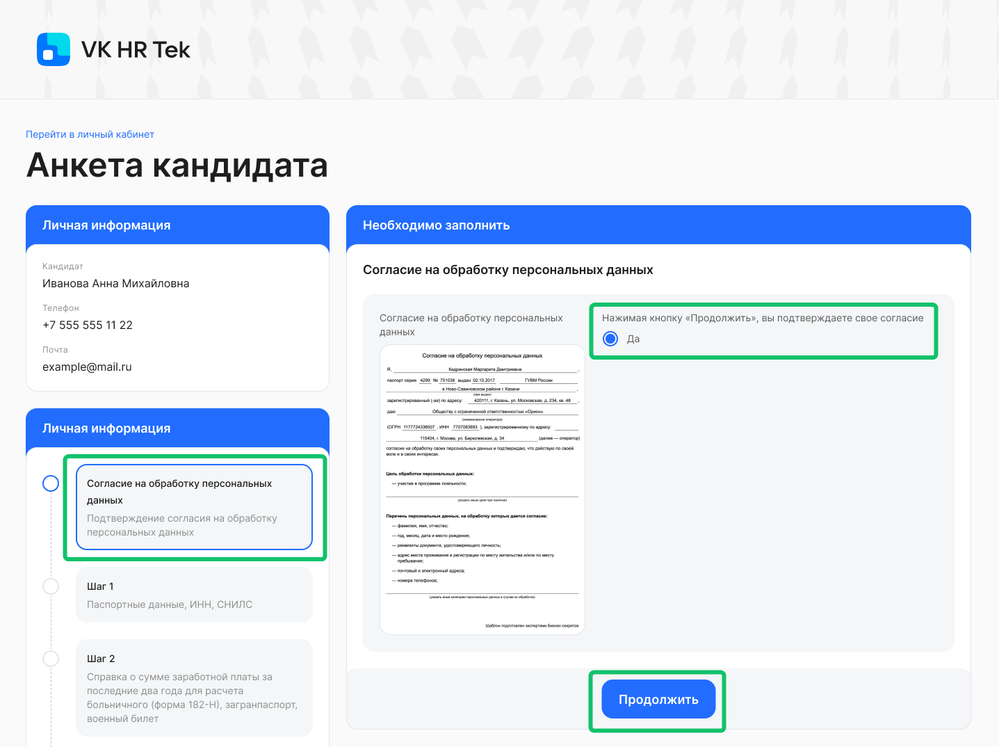
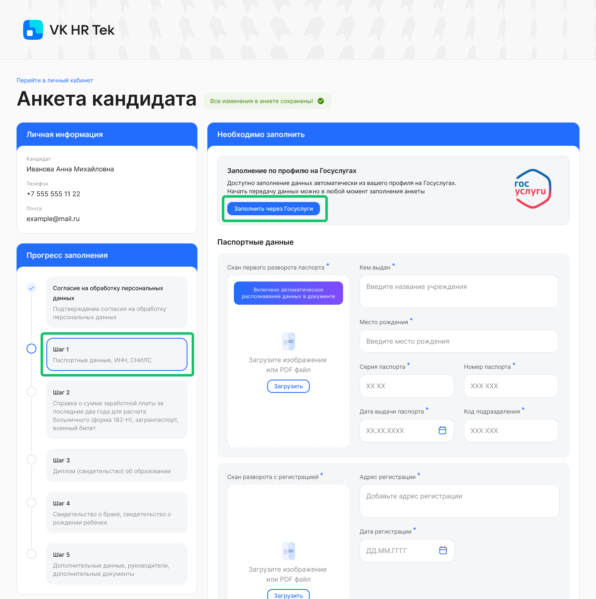
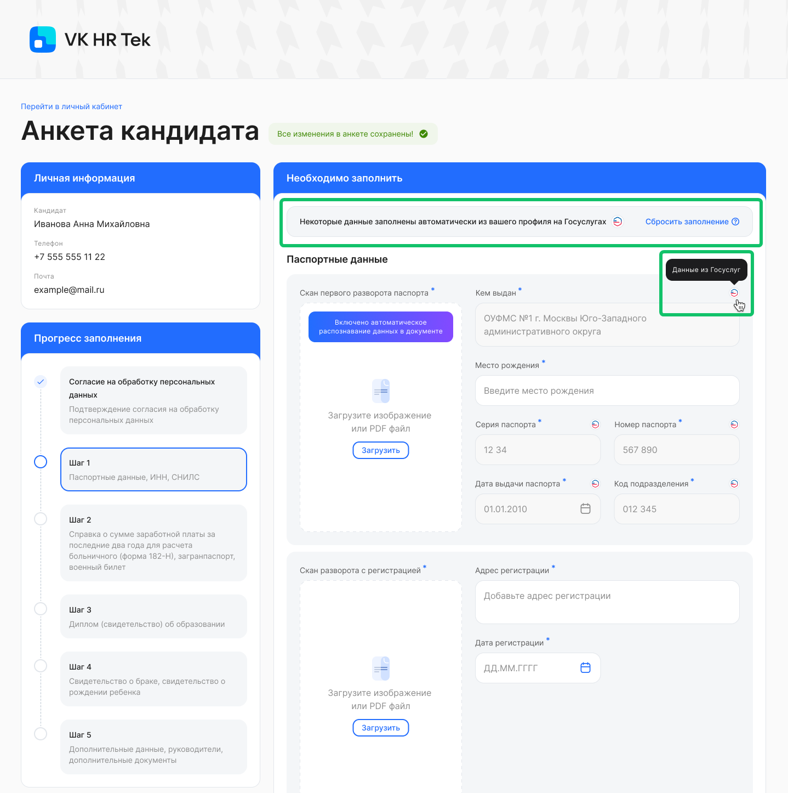
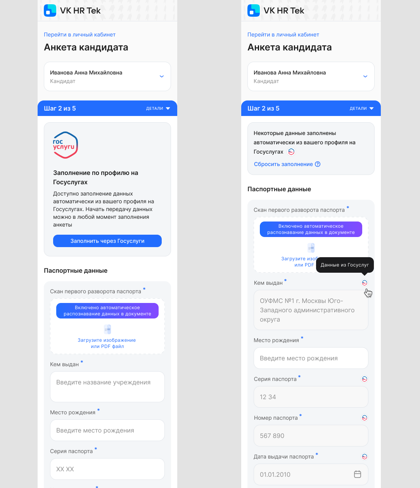

Следующий шаг для кандидата — заполнение личных данных. В личном кабинете VK HR Tek кандидат заполняет анкету и загружает сканы необходимых документов. Допустимые форматы файлов: PDF, AVIF, JPEG, PNG, SVG, WebP, DNG, HEIC, HEIF, OCR, не более 20 Mб.

Для удобства кандидата процедура заполнения анкеты разделена на шаги, в каждом из которых он должен предоставить определённый набор данных. Например, на шаге 1, как правило, необходимо указать паспортные данные и приложить сканы:

 

<info>
Количество шагов и набор требуемых данных могут различаться в зависимости от типа бизнес-процесса и настроек системы
</info>

При заполнении анкеты все личные данные автосохраняются. Кандидат может дозаполнить анкету позже, не беспокоясь о потере данных.

Когда все обязательные данные в анкете заполнены, кандидат нажимает **Продолжить** и попадает на форму предпросмотра анкеты, где может проверить внесённые данные и при необходимости их отредактировать.

Если все данные указаны корректно и требуемые сканы документов загружены, то кандидат нажимает кнопку **Отправить рекрутеру**:

После этого заявка переходит на проверку в компанию. 

## **Интеграция с Госуслугами для авторизации кандидатов и заполнения данных в анкете**

В КЭДО доступна возможность включения/выключения заполнения анкеты кандидатов по данным цифрового профиля кандидата на Госуслугах.  

Инструкция для кандидата
 

1. Кандидат открывает анкету и дает согласие на обработку персональных данных.

2. Кандидат дает разрешение на чтение данных из ЕСИА (Госуслуги).  

Система отправляет запрос к ЕСИА на чтение данных кандидата и полученный ответ распределяет по соответствующим атрибутам анкеты, в анкете присутствует индикация, что данные заполнены из профиля на Госуслугах.  

Данные, которые возможно получать через REST API ЕСИА:
* Паспортные данные   
  * Серия паспорта  
  * Номер паспорта  
  * Кем выдан паспорт  
  * Дата выдачи паспорта  
  * Код подразделения
* Идентификационные номера   
  * Номер ИНН  
  * Номер СНИЛС
* Трудовая деятельность   
  * Есть трудовая книжка?

Мобильная версия
 

Бизнес-ценность:

* минимизировать риски ошибок при ручном заполнении анкеты кандидатом;  
* сократить время на заполнение анкеты кандидатом;  
* сократить время получения данных рекрутером и передачу анкеты на следующий этап найма.

<info>

Настройка анкеты кандидата является платной. Для подключения обратитесь в [поддержку VK HR Tek](/ru/hr/support/contact_channels)  

</info>