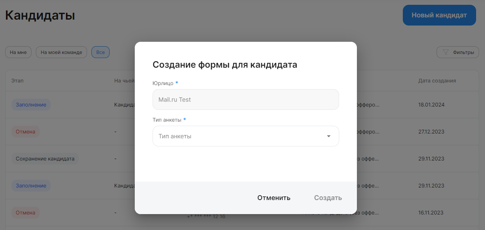
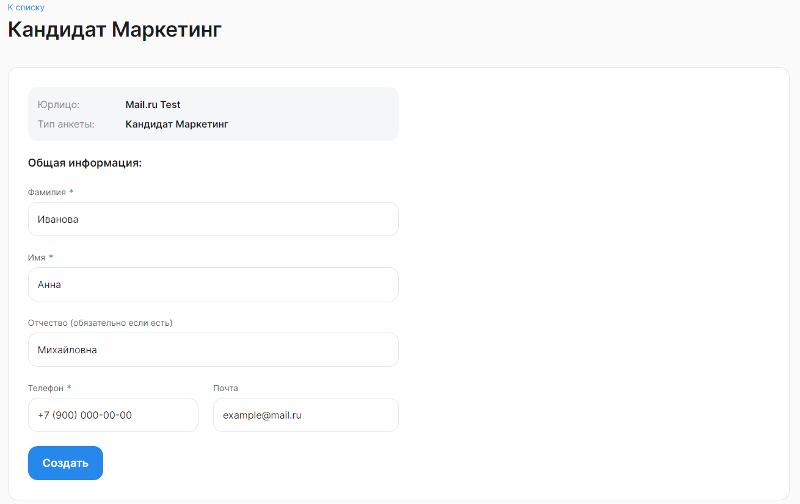
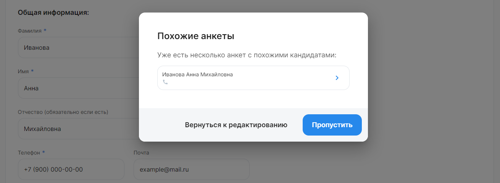
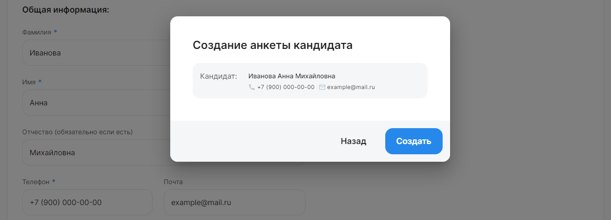

Перейдите в Кабинет компании, выберите раздел «Кандидаты» в главном меню. Нажмите на кнопку «Новый кандидат» в правом верхнем углу, затем выберите юрлицо и тип анкеты из предложенного списка и нажмите «Создать»:

 

От выбранного типа анкеты зависит маршрут согласований, по которому будет направлена анкета кандидата, а также набор запрашиваемых персональных данных.

**Общая информация** — данные, указанные в этой форме, можно редактировать только на этапе создания анкеты кандидата. Если, например, вы создали анкету, не заполнив адрес электронной почты, то кандидат получит уведомление с предложением о работе только по СМС. Чтобы отправить уведомление по электронной почте, нужно будет отменить ранее созданную заявку и повторить процедуру создания формы для кандидата.

Заполните данные кандидата и нажмите кнопку «Создать».

 

После этого система ищет активные анкеты кандидатов с похожими ФИО. Если найдены совпадения, то анкеты отображаются списком, в котором вы можете нажать на подходящую анкету и просмотреть ее в новом окне.

Также на этом шаге можно вернуться к редактированию текущей формы для кандидата, либо перейти на следующий шаг, нажав кнопку «Пропустить»:

 

Если совпадений не найдено, либо вы нажали «Пропустить» в списке похожих анкет, то на экране появляется форма подтверждения создания анкеты кандидата. Нажмите кнопку «Создать», чтобы перейти на следующий шаг:

 

После создания анкеты кандидата автоматически открывается страница заявки — на следующем этапе в соответствии с маршрутом. Продолжить работу с этой заявкой можно сразу, либо вернуться к ней позже, найдя ее в общем списке на главной странице модуля «Кандидаты».