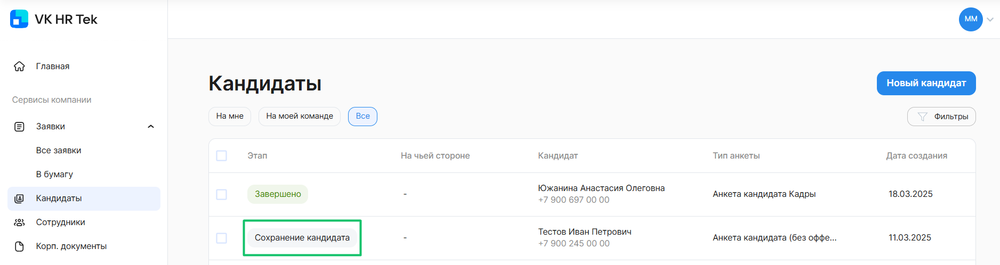
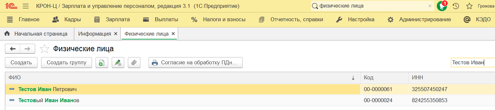
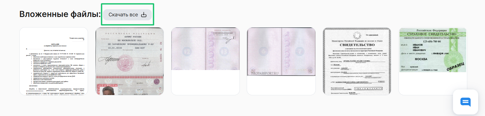
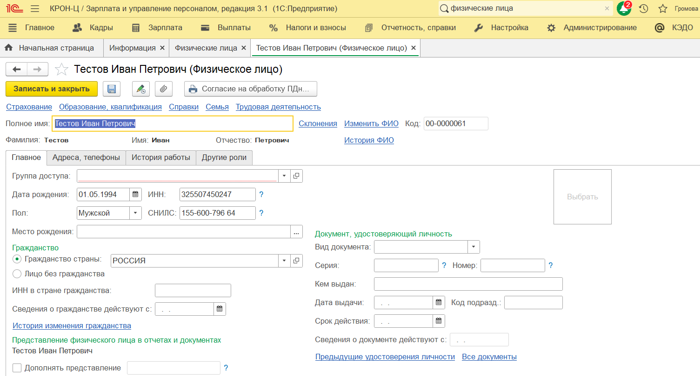
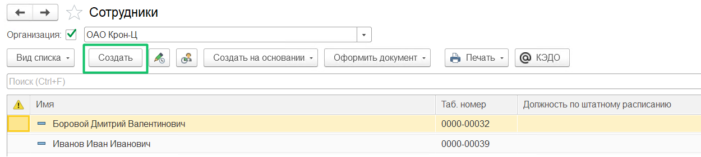
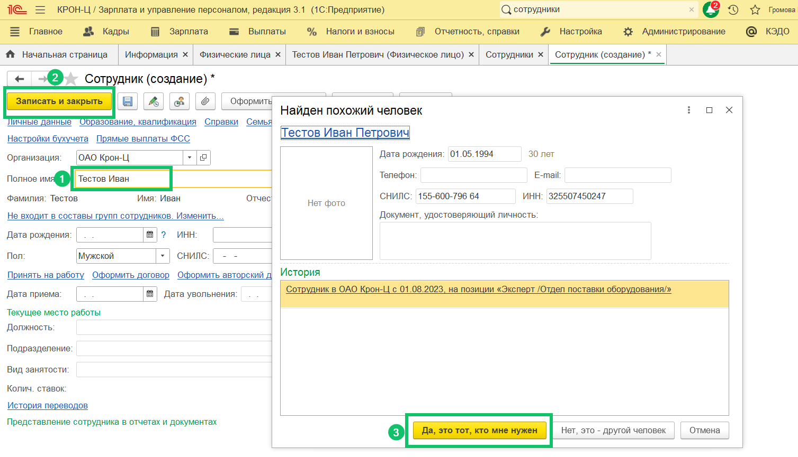
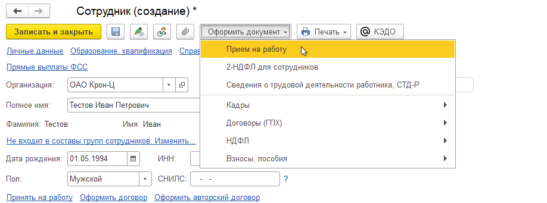
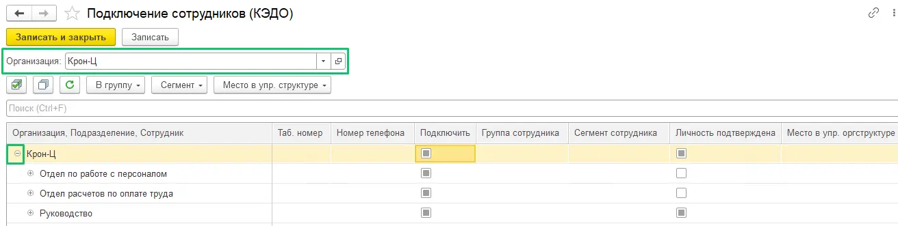
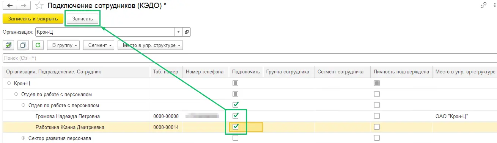
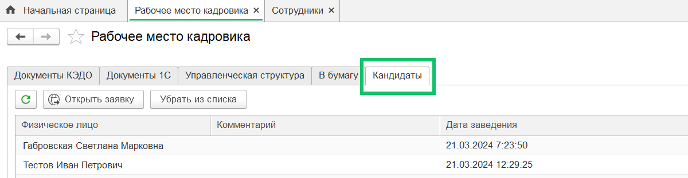

В статье описан процесс перевода кандидат-заявки из статуса **Сохранение кандидата** в статус **Завершено**. Просмотр этапов кандидат-заявок доступен в веб-сервисе, в разделе **Кандидаты**.

Этап **Сохранение кандидата** следует после проверки заполненной анкеты и вложенных документов кандидата. Успешным результатом проверки документов рекрутером в КЭДО является автоматическое создание физического лица в модуле 1С.

Этап **Сохранение кандидата** недоступен для просмотра. Чтобы этап **Сохранение кандидата** перешёл на этап **Завершено**, выполните следующие действия: 

1. Найдите и откройте карточку физлица.
2. Скачайте документы кандидата, сверьте данные с карточкой физлица.
3. Создайте сотрудника на основе данных о физлице.
4. Оформите приём на работу.
5. Подключите сотрудника к КЭДО.
6. Проверьте результат в сервисе VK HR Tek.
 

## Проверка и редактирование данных физического лица в 1С

1. Перейдите в модуль 1С, в раздел **Физические лица**.
2. Найдите нового кандидата в списке физлиц.

3. Откройте карточку физического лица, нажав на его имя.
4. В сервисе VK HR Tek, на этапе **Проверка** кандидат-заявки скачайте все документы, которые прикрепил кандидат. 

<warn>

На этапе **Сохранение кандидата** документы будут недоступны.

</warn>

5. В 1С, в карточке физического лица сверьте загруженные данные с документами и внесите недостающую информацию, необходимую для приёма на работу.
6. Нажмите кнопку **Записать и закрыть** для сохранения данных.

 

## Создание сотрудника в 1С

1. Перейдите в раздел **Сотрудники**.
2. Нажмите кнопку **Создать**.

3. Введите фамилию и имя сотрудника в поле **Полное имя**. Подробнее см. в [статье](/ru/1C/user/employees/add_employees).
4. Нажмите **Записать и закрыть**, запустится поиск физического лица с таким же именем.
5. Подтвердите, что найденный человек тот, кто нужен.

 

## Приём сотрудника в компанию

1. Нажмите кнопку **Оформить документ**.
2. Выберите документ **Приём на работу**.

3. Заполните необходимые поля в документе **Приём на работу** подробнее в [статье](/ru/1C/user/employees/new_employees).
4. Нажмите кнопку **Записать и закрыть**.
 

## Подключение сотрудника к КЭДО

1. Перейдите в раздел **КЭДО** → **Подключение сотрудников**.
2. В форме **Подключение сотрудников (КЭДО)**, в поле **Организация** выберите наименование организации. Далее отобразится дерево верхнеуровневых подразделений организации, раскройте подразделение нужного сотрудника.

3. Чтобы подключить всех сотрудников сразу или по отдельности, установите флажок в столбце **Подключить** напротив необходимых сотрудников и нажмите кнопку **Записать**.

Подробнее см. в [статье](/ru/1C/user/employees/connect). 

Проверить, что кандидат успешно создался в 1С как физическое лицо, можно в разделе **КЭДО** → **Рабочее место кадровика** → вкладка **Кандидаты**.

После выполнения всех вышеописанных шагов статус **Сохранение кандидата** изменится на **Завершено** в кандидат-заявке веб-сервиса, в разделе **Кандидаты**.