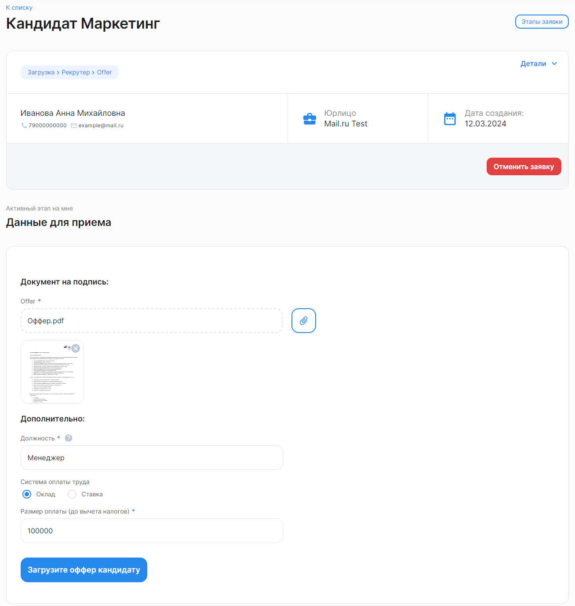

Для отправки оффера кандидату заполните данные для приема и загрузите файл с предложением о работе. Допустимый формат файла — .pdf или .docx размером до 20 Мб.

Если в процессе больше не предусмотрено согласований на стороне компании, то по нажатию кнопки «Загрузите оффер кандидату» заявка перейдет на кандидата. 

Кандидат получит ссылку-приглашение по СМС на номер телефона, указанный при [создании анкеты](/ru/hr/company/candidates/create), и по электронной почте, если она была указана.