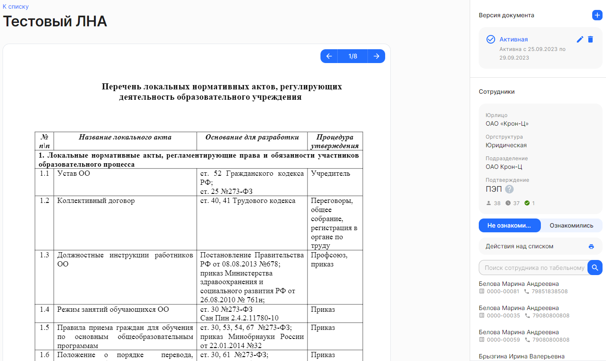
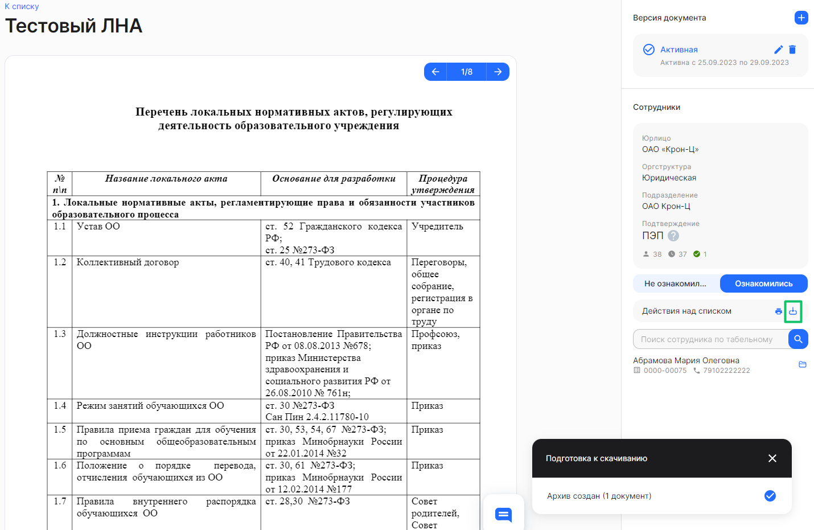

По каждой версии корп. документа отслеживается прогресс ознакомления: 

- показано общее количество сотрудников;
- количество и список ознакомившихся;
- количество и список не ознакомившихся;
- есть поиск по табельному номеру по обоим спискам;
- каждый список можно распечатать.

Чтобы посмотреть список сотрудников, ознакомившихся с корп. документом, перейдите на вкладку **Ознакомились**. Помимо возможности распечатать список можно скачать архив с файлом корп. документа и листом ознакомления сотрудников. 

