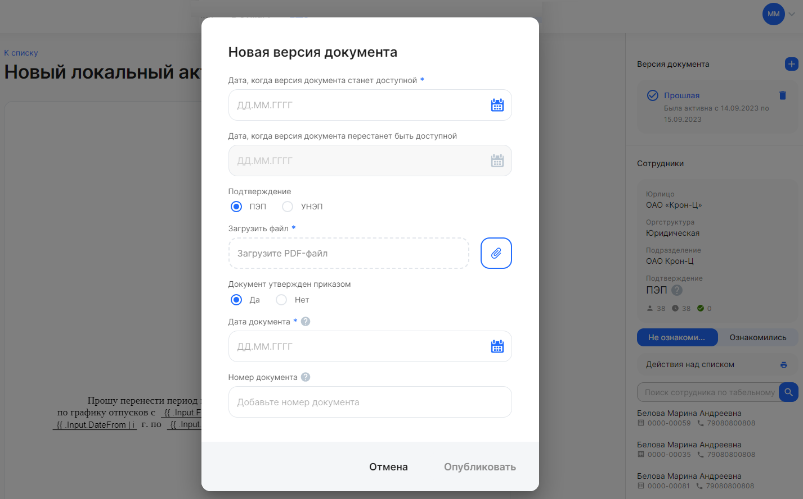
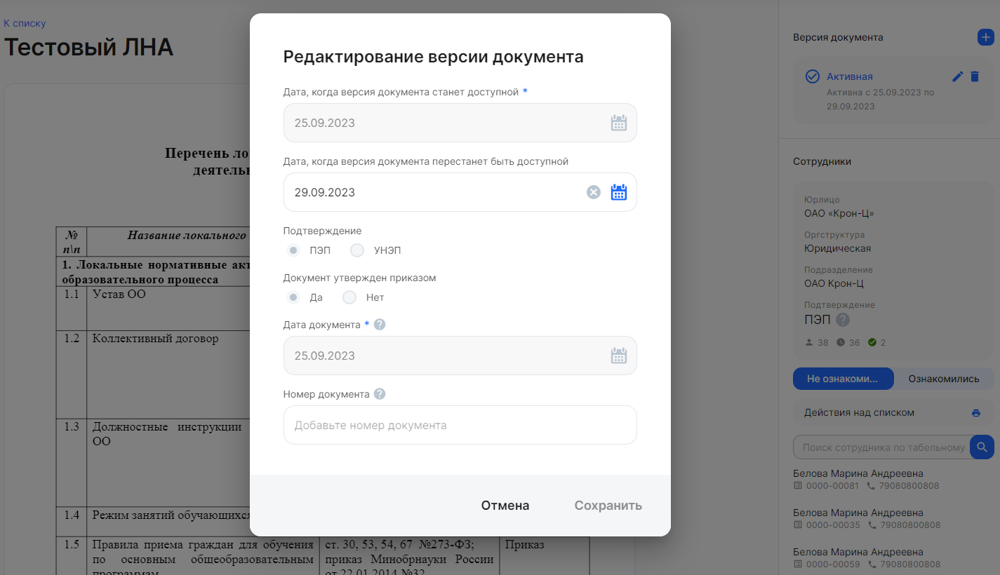

Чтобы добавить новую версию корпоративного документа, необходимо:

1. Нажать кнопку  в блоке **Версия документа**.
1. В форме **Новая версия документа** заполните следующие поля:
- **Дата, когда версия документа станет доступна для ознакомления**. В календаре выберите любую дату, когда сотрудники смогут ознакомиться с корп. документом.
- **Дата, когда версия документа перестанет быть доступной для ознакомления**. В календаре выберите любую дату, следующую за датой, доступной для ознакомления с корп. документом.
- **Подтверждение**. Выберите способ подписания документа: простая электронная подпись (ПЭП) или усиленная неквалифицированная электронная подпись (УНЭП).
- **Загрузить файл**. Прикрепите документ в формате pdf.
- **Документ утвержден приказом**. Выберите один вариант: «Да» или «Нет».
- **Дата документа**. В календаре выберите дату документа или дату приказа, которым был утвержден документ.
- **Номер документа**. Введите дату документа или дату приказа, которым был утвержден документ.
3. Нажмите кнопку **Опубликовать**. 
1. Подтвердите публикацию. Сотрудники подразделения получат уведомления о публикации новой версии документа.

У корп. документа бывает 3 версии:

- **Актуальная (активная)**. Документ доступен для ознакомления сотрудниками в текущий период времени. Если у документа есть активная версия, то новую версию документа можно добавить только после даты, когда документ перестанет быть доступным для ознакомления. Или удалить активную версию и добавить новую на любую дату.
- **Будущая**. Дата, когда версия документа станет доступной, еще не настала.
- **Прошлая**. Настала дата, когда версия документа перестала быть доступной для ознакомления. 

Для удаления доступны все версии документа: активные, будущие, прошлые. Чтобы удалить версию, нажмите кнопку  в карточке версии. При удалении последней версии документа, удаляется сам документ.

Для редактирования доступны только актуальные (активные) и будущие версии корп. документов. Чтобы изменить версии, нажмите кнопку .

Если с актуальной версией корп. документа уже ознакомился хотя бы один сотрудник, то в активной версии можно будет поменять значения в следующих полях:

1. **Дата, когда версия документа перестанет быть доступной для ознакомления**. Дату можно изменить, если она больше или равна текущей. 
1. **Номер документа**. Введите дату документа или дату приказа, которым был утвержден документ.

При редактировании будущих версий корп. документа можно менять значения в полях, аналогичные тем, что доступны в форме **Новая версия документа** при создании версии.