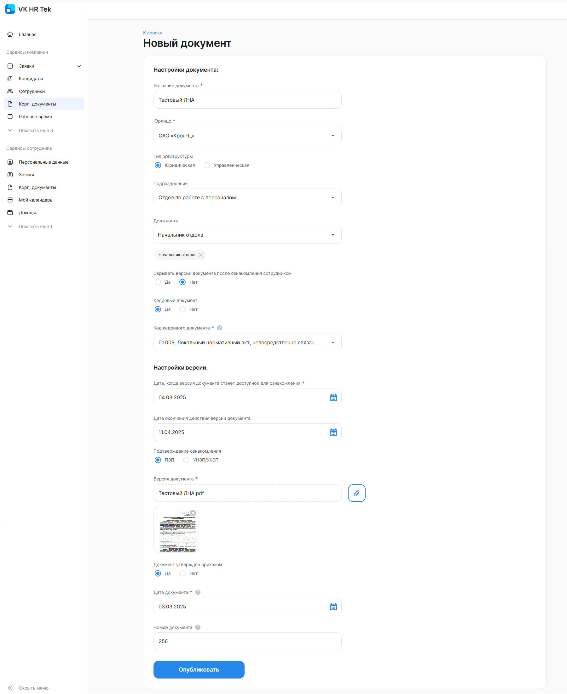

Чтобы создать корпоративный документ, необходимо:

1. Перейти в **Сервисы компании → Корп. документы** и нажать на кнопку **Новый документ**.
1. В форме **Новый документ** заполните следующие поля:
- **Название документа***. Введите название корп. документа.
- **Юрлицо***. Выберите название своей компании из списка, если компания входит в аккаунт.
- **Тип оргструктуры**. Выберите Юридическую или Управленческую оргструктуру.
- **Подразделение**. Выберите одно подразделение компании, в котором работают сотрудники, которые должны ознакомиться с корп. документом. Или оставьте поле пустым, тогда корп. документ станет доступным для ознакомления всем сотрудникам юрлица.
- **Должность**. Выберите хотя бы одно название должности подразделения из списка. Или оставьте поле пустым, тогда с корп. документом смогут ознакомиться все сотрудники выбранного подразделения. 
- **Скрывать версии документа после ознакомления сотрудником**. Если документ нужно оставить доступным для сотрудника после ознакомления, выберите вариант «Нет». А чтобы корп. документ исчез из общего списка документов после того, как сотрудник ознакомился с ним, выберите вариант «Да».   
- **Кадровый документ**. Если корп. документ является кадровым, то выберите вариант «Да», иначе — вариант «Нет».
- **Код кадрового документа***. Если документ является кадровым (в поле **Кадровый документ** выбран варинат «Да»), то обязательно выберите код документа из списка. В списке перечислены коды и названия кадровых мероприятий согласно приказу Минтруда России от 20.09.2022 № 578н.
- **Дата, когда версия документа станет доступна для ознакомления***. В календаре выберите доступную дату, когда сотрудники смогут ознакомиться с корп. документом.
- **Дата окончания действия версии документа**. В календаре выберите любую дату, следующую за датой, доступной для ознакомления с корп. документом. Или оставьте поле пустым, тогда документ станет бессрочным для ознакомления.
- **Подтверждение ознакомления**. Выберите способ подписания документа: простая электронная подпись (ПЭП) или усиленная неквалифицированная электронная подпись / усиленная квалифицированная электронная подпись (УНЭП/УКЭП).
- **Версия документа***. Прикрепите документ в формате pdf.
- **Документ утвержден приказом**. Выберите один вариант: «Да» или «Нет».
- **Дата документа***. В календаре выберите дату документа или дату приказа, которым был утвержден документ.
- **Номер документа**. Введите номер документа или номер приказа, которым был утвержден документ.

Поля, выделенные звездочкой (*), являются обязательными для заполнения.

3. Нажмите кнопку **Опубликовать**. 
1. Подтвердите публикацию. Сотрудники подразделения получат уведомления о публикации нового документа.

