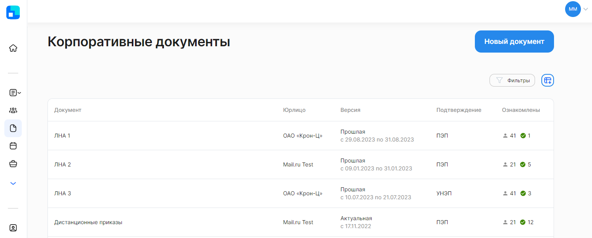
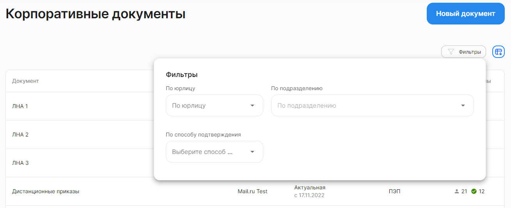

Корпоративные документы — раздел КЭДО для внутренних документов компании, с которыми должны быть ознакомлены сотрудники (**Сервисы компании → Корп. документы**).

В корпоративных документах поддерживается версионность, кадровый сотрудник может загружать новые версии документа.

 

Актуальная версия документа доступна для просмотра и ознакомления всем сотрудникам компании. После ознакомления в системе сохраняются данные сотрудника, дата и время ознакомления.

Кадровый сотрудник может:

- создавать документы;
- добавлять и удалять версии документов;
- редактировать даты версий, если дата позже текущей.

При необходимости (большом количестве корпоративных документов) для компании можно создать несколько типов корпоративных документов для удобства работы со списком.

## Применение фильтров
Для вашего удобства предусмотрена более тонкая настройка отображения списка корпоративных документов. Нажмите на кнопку **Фильтры**. Откроются поля для редактирования фильтра с выбором значений из выпадающего списка.

Рассмотрим фильтры подробнее:

**По юрлицу** — как правило, здесь уже указано название вашей компании и поле недоступно для редактирования. В случае если к вашему аккаунту привязано несколько юридических лиц, то в этом фильтре можно выбрать все юрлица или одно из них.

**По подразделению** — выбор одного значения из предложенного списка с возможностью текстового поиска.

**По способу подтверждению** — выбор одного варианта из списка: ПЭП или УНЭП.

В момент применения фильтров происходит поиск документов и список документов автоматически обновляется.

Чтобы сбросить сразу все параметры фильтра, нажмите кнопку **Сбросить** в правом верхнем углу формы.

Для выхода из формы установки фильтра нажмите на любое место на странице за пределами этой формы. Список заявок на странице будет отображаться с учетом настроенного фильтра.

Список корпоративных документов можно скачать в формате XLSX-таблицы. Для этого нажмите на кнопку  над общим списком корпоративных документов. Все результаты выгружаются с учетом установленных фильтров.