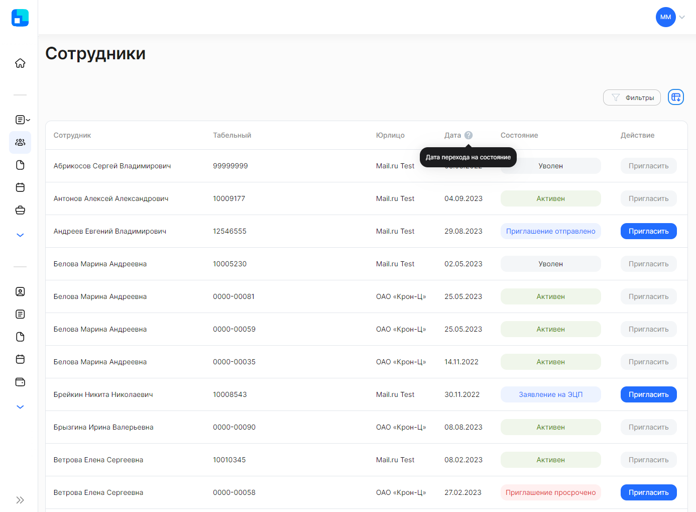
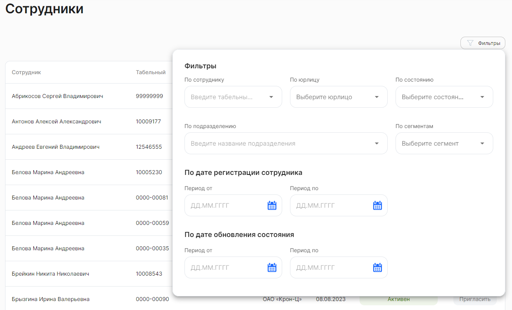

Список сотрудников компании, включая уволенных работников, доступен в **Сервисах компании**, в разделе **Сотрудники**. 

Список сотрудников содержит следующие сведения:

- **Сотрудник**. ФИО сотрудника компании.
- **Табельный**. Табельный номер сотрудника в компании.
- **Юрлицо**. Наименование компании, в которой работает сотрудник.
- **Дата**. Дата перехода сотрудника в текущее состояние. 
- **Состояние**. Чтобы посмотреть подробное описание каждого состояния, наведите указатель мыши на метку состояния. Для сотрудника доступны следующие состояния: 

    - **Получены данные**,
    - **Приглашение отправлено**,
    - **Ожидание регистрации** (только если используется Public API),
    - **Приглашение просрочено**,
    - **Проверка документов**,
    - **Заявление на ЭЦП**,
    - **Выпуск ЭЦП**,
    - **Ошибка выпуска ЭЦП**,
    - **Ручная проверка данных**,
    - **Активен**,
    - **Уволен**.

- **Действие**. Кнопка **Пригласить** будет доступна для регистрации сотрудника в сервисе VK HR Tek, если сотрудник НЕ находится в состояниях *Активен* или *Уволен*. После нажатия кнопки **Пригласить** сотруднику будет отправлена ссылка-приглашение на адрес электронной почты или в СМС. Отправка нового приглашения отменяет предыдущее приглашение.

## Применение фильтров
Для вашего удобства предусмотрена более тонкая настройка отображения списка сотрудников. Нажмите на кнопку **Фильтры**. Откроются поля для редактирования фильтра с выбором значений из выпадающего списка.

Рассмотрим фильтры подробнее:

**По сотруднику** — выбор одного значения из предложенного списка с возможностью текстового поиска по ФИО или табельному номеру сотрудника. 

**По юрлицу** — как правило, здесь уже указано название вашей компании и поле недоступно для редактирования. В случае если к вашему аккаунту привязано несколько юридических лиц, то в этом фильтре можно выбрать все юрлица или одно из них.

**По состоянию** — выбор любого количества значений из предложенных вариантов.

**По подразделению** — выбор одного значения из предложенного списка с возможностью текстового поиска.

**По сегментам** — выбор любого количества значений из предложенных вариантов. Пример: офис, склад, название города или помещения.

**По дате регистрации сотрудника** — выбор любой даты из открывшегося календаря. При этом нет необходимости указывать весь период, можно выбрать одну дату либо начала, либо окончания периода. 

**По дате обновления состояния** — выбор любой даты из открывшегося календаря. При этом нет необходимости указывать весь период, можно выбрать одну дату либо начала, либо окончания периода. 

В момент применения фильтров происходит поиск сотрудников и список сотрудников автоматически обновляется.

При необходимости вы можете сбросить любой из установленных параметров:

- Если параметр предполагает одно значение, то нажмите «Х» справа от этого значения.
- Если параметр предполагает множественный выбор, то откройте список вариантов и снимите галочки у соответствующих чекбоксов.
- Для сброса даты завершения заявки кликните на дату и нажмите **Сбросить** внизу открывшегося календаря.

Чтобы сбросить сразу все параметры фильтра, нажмите кнопку **Сбросить** в правом верхнем углу формы.

Для выхода из формы установки фильтра нажмите на любое место на странице за пределами этой формы. Список заявок на странице будет отображаться с учетом настроенного фильтра.

Список сотрудников можно скачать в формате XLSX-таблицы. Для этого нажмите на кнопку  над общим списком сотрудников. Все результаты выгружаются с учетом установленных фильтров. 