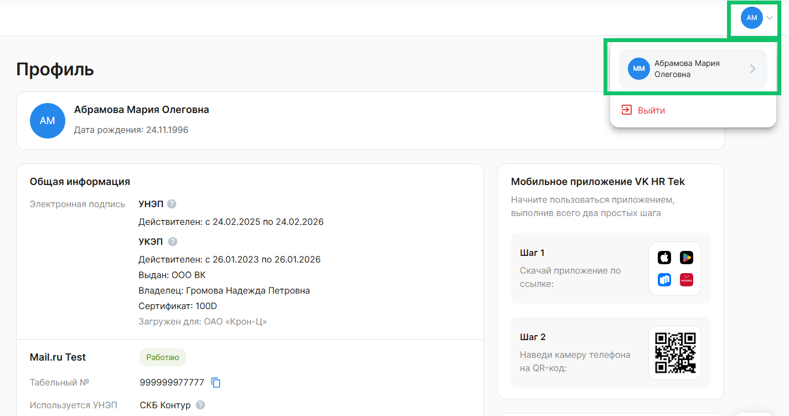
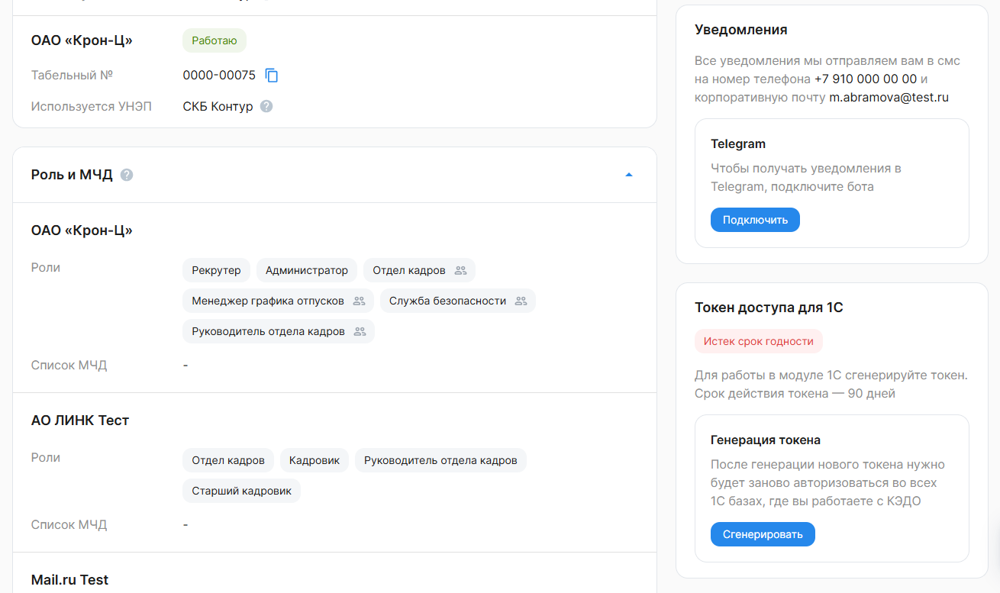
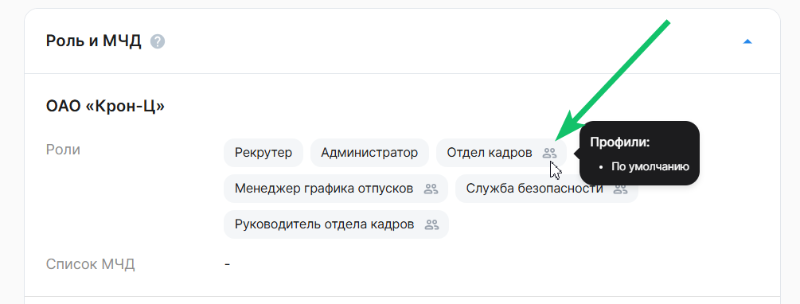

Представитель компании — это сотрудник, уполномоченный компанией на проведение процессов, связанных с кадровым документооборотом. Представителями компании являются сотрудники Отдела кадров, Бухгалтерии и других подразделений, назначенных компанией для обработки заявок в сервисе КЭДО. 

Чтобы перейти в **Профиль**, нажмите на аватар с первыми буквами вашего имени или текущим фото, а затем на ссылку с ФИО.

В блоке **Общая информация** указаны:
- типы электронной подписи со сроком действия сертификата;
- одно или несколько названий компаний, в которых работает представитель;
- статус работы в компании: *Работаю* или *Уволен*;
- табельный номер сотрудника в компании;
- тип УНЭП для подписания документов в заявках.

Если представитель компании подписывает документы в **Сервисах сотрудника → Заявки**, то он использует усиленную неквалифицированную электронную подпись (УНЭП).  

Для подписания документов в **Сервисах компании → Заявки** потребуется УКЭП — усиленная квалифицированная электронная подпись, загруженная для конкретной компании. Информация об УКЭП: 

- срок действия; 
- организация, которая выдала сертификат;
- ФИО владельца сертификата;
- серия сертификата;
- компания, для которой загружен сертификат.

 

Представитель компании получает базовые уведомления о кадровых процессах на электронную почту и телефон, указанные в **Профиле**. 

Если для компании настроены дополнительные уведомления, то их можно получать в мессенджере Telegram. Чтобы получать уведомления в Telegram, в блоке **Уведомления** нажмите кнопку **Подключить**.

Если компания не настроит дополнительные уведомления, то представитель не сможет получать эти уведомления в Telegram. 

В блоке **Роль и МЧД** приведены перечень групп доступа, определяющих роли представителей работодателя в сервисе, и список  машиночитаемых доверенностей (МЧД). 

Подробнее об управлении МЧД в **Профиле** описано в статье [Выбор активной МЧД](/ru/hr/company/MRA/selecting_active).

Если представитель работает в нескольких компаниях, то отображаются все компании и роли этого сотрудника.

 

Для работы в модуле 1С сгенерируйте токен в блоке **Токен доступа для 1С → Сгенерировать**. Срок действия токена — 90 дней. После генерации нового токена нужно заново авторизоваться во всех 1С базах, где вы работаете с КЭДО.

Если в компании настроено ограничение доступа к заявкам сотрудников, то в блоке **Роль и МЧД** представитель может посмотреть, какие профили доступа ему заданы в рамках каждой компании. Подробнее о профилях доступа в [статьях](/ru/admin_actions/access_profiles).

Для просмотра назначенных профилей доступа в компании наведите указатель мыши на название роли со значком .

 

