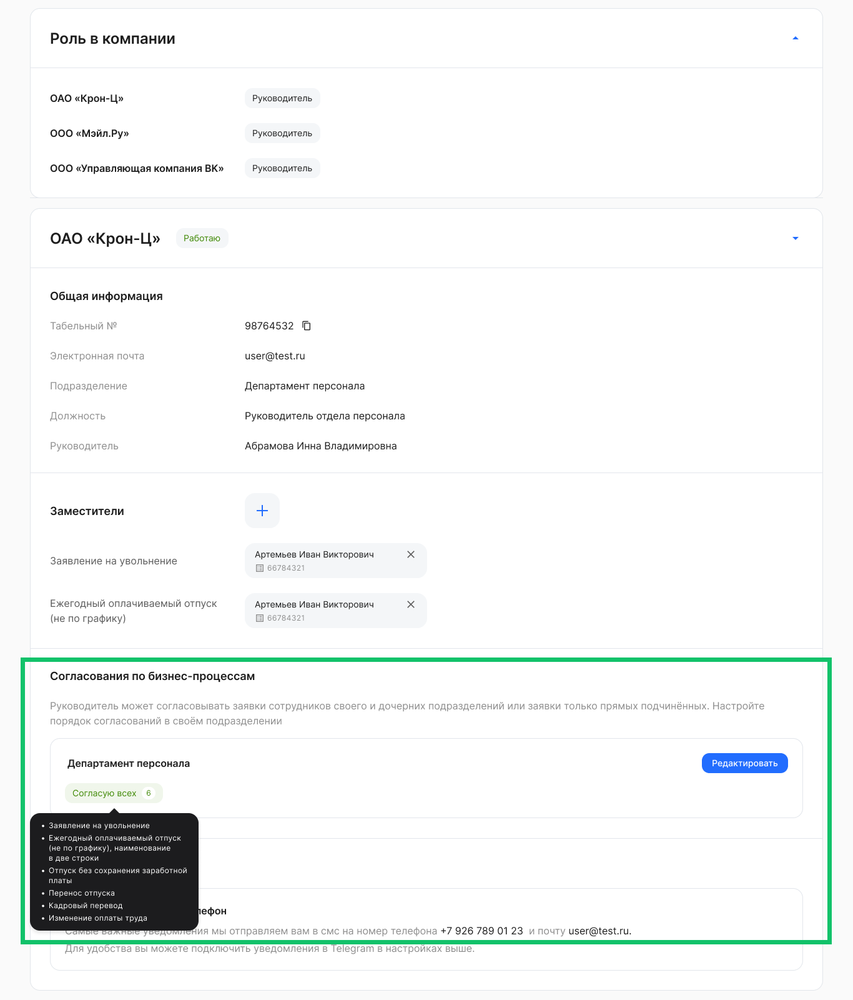
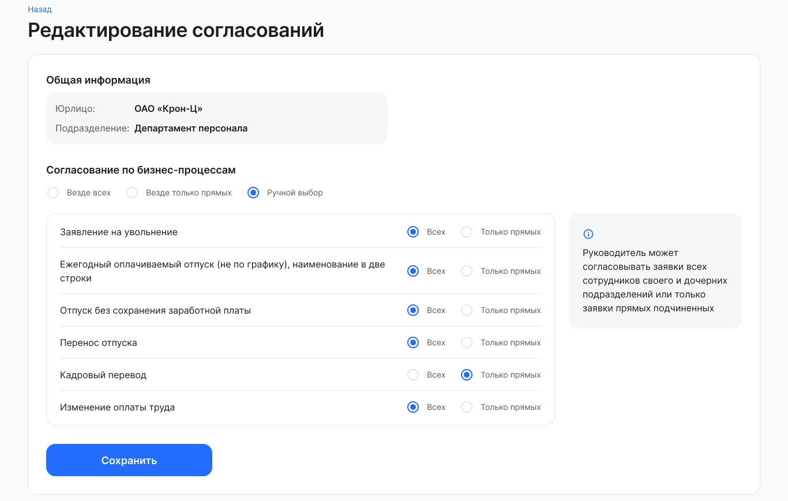

В своем Профиле руководители по оргструктуре и функциональные руководители могут добавлять и удалять заместителей. Для добавления заместителя перейдите к блоку **Заместители** и нажмите кнопку . Далее выберите сотрудника и все/некоторые типы заявок для замещения. Подробнее в статье [Выбор заместителей для руководителей](/ru/admin_actions/management_structure/substitutes). 

Помимо сведений, приведенных в [Профиле представителя компании](/ru/hr/company/profile), руководителю по управленческой оргструктуре доступна настройка согласований по бизнес-процессам.

Перейдите в блок **Согласование по бизнес-процессам** компании. Найдите нужное подразделение, если руководите в нескольких подразделениях, и нажмите кнопку **Редактировать**.

 

Далее в блоке согласования по бизнес-процессам выберите один из пунктов:

- **Везде всех**. Руководитель сможет согласовывать заявки всех сотрудников своего и дочерних подразделений.
- **Везде только прямых**. Руководитель сможет согласовывать заявки только прямых подчиненных
- **Ручной выбор**. Руководитель сможет согласовывать часть заявок всех сотрудников и часть заявок только прямых подчиненных. При ручном выборе установите нужную настройку напротив бизнес-процесса.

Нажмите кнопку **Сохранить**.

 

Все сохраненные изменения согласований в Профиле будут отображаться в Кабинете компании, в разделе **Компания**. Если Администратор поменяет настройки согласований в разделе **Компания**, то изменения отобразятся в Профиле руководителя.

Подробности о согласовании по бизнес-процессам в статье [Управление настройками согласования](/ru/admin_actions/management_structure/alignment_of_processes).  

Чтобы просмотреть статус работы, количество накопленных дней отпуска и другие сведения о сотруднике в рамках компании, перейдите к блоку с названием компании. 

Общая информация о сотруднике: 

- табельный номер;
- корпоративная электронная почта; 
- подразделение, в котором оформлен сотрудник; 
- должность;
- тип УНЭП для подписания документов в заявках.

Если руководитель работает по совместительству у нескольких работодателей, то он может просмотреть сведения о себе в этих компаниях.
