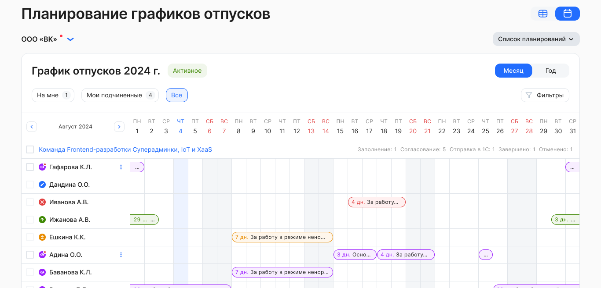

В соответствии с [настройками](/ru/hr/company/vacation/create/settings) график отпусков подразделения может согласовать:

- руководитель по оргструктуре или руководитель из 1С;
- представитель компании — обычно это кадровый сотрудник.

В **Сервисах компании →** **Графики отпусков** руководитель/кадровый сотрудник может просмотреть графики, в которых он участвует как согласующий. Согласовать графики можно единично или массово.

<warn>

Если руководитель подразделения, который согласовывал планирование своих сотрудников, уволился или перевёлся в другое подразделение, то Администратор может включить настройку смены руководителя в **Сервисах компании → Настройки → Настройки компании**, и тогда в действующем планировании предыдущий руководитель сменится на нового.

Для сотрудника, который перевёлся в другое подразделение, график отпусков будет согласовывать предыдущий руководитель подразделения, который был назначен согласующим на момент старта действующего планирования.

</warn>

Руководитель/кадровый сотрудник может возвращать график на доработку сотруднику с указанием причины:

- индивидуально/массово (при этом отклоняется весь график сотрудника, а не одна из его частей);
- затем сотрудник вносит изменения в свой график и направляет его на повторное согласование;
- если возврат на доработку произошел после наступления дедлайна на этапе заполнения графика, то возврат не попадет к сотруднику и сразу же вернется обратно к руководителю (или представителю компании).

Сотрудники отдела кадров могут просматривать график отпусков по статусам заполнения и согласования сотрудниками, с разбивкой по подразделениям, за один месяц или год.

Отдел кадров может согласовать график отпусков каждого сотрудника/подразделения отдельно или весь график отпусков сразу.

После финального согласования графика одного сотрудника, график автоматически отправляется в 1С.