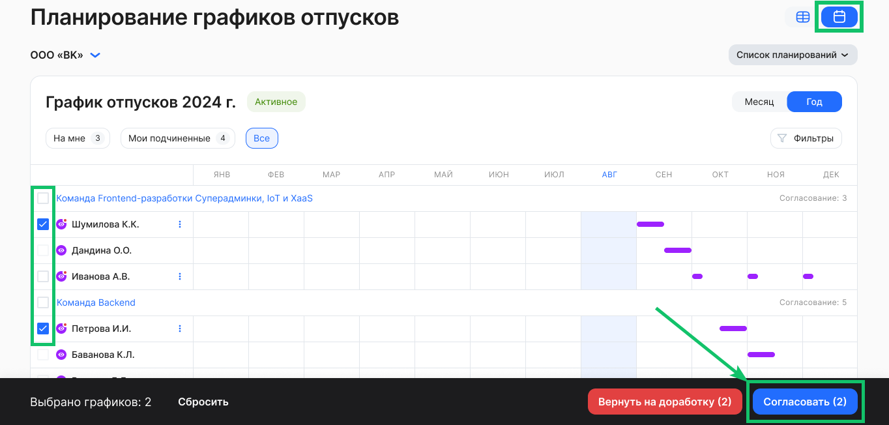
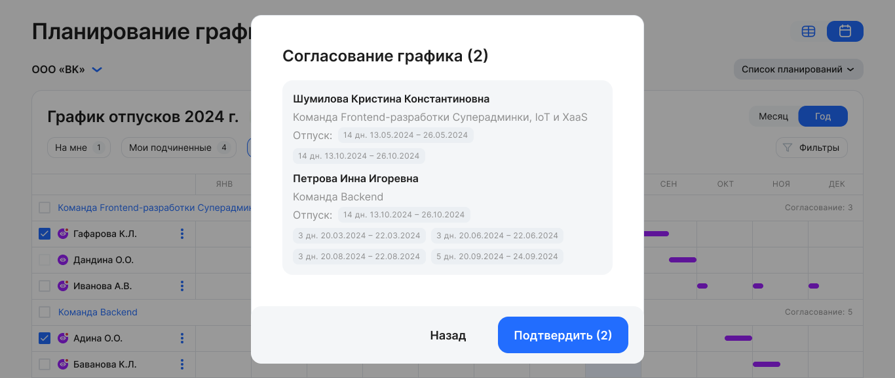
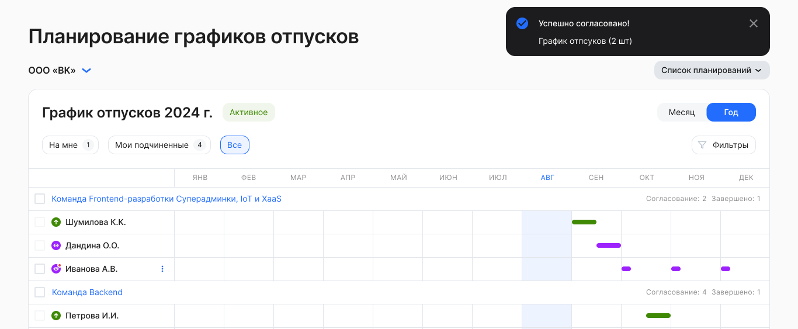
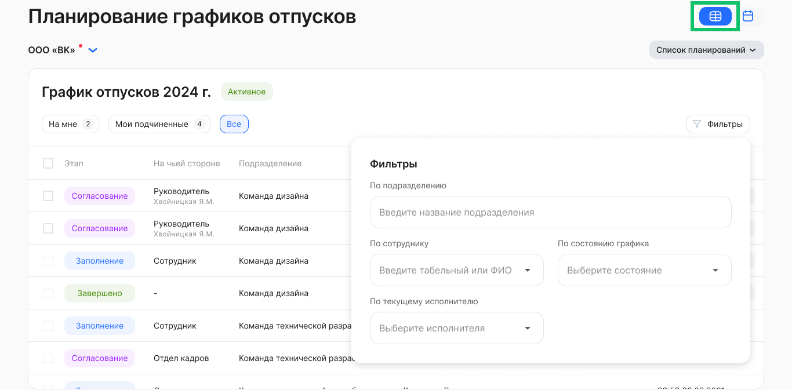

## *Представление графика отпусков в календарном виде* 

Для массового согласования графиков установите флажки напротив нужных заявок сотрудников и нажмите кнопку **Согласовать**. 

Чтобы согласовать графики <u>по подразделению</u>, установите флажок слева от названия подразделения и нажмите кнопку **Согласовать**.  

 

Подтвердите согласование графика и дождитесь уведомления об успехе.

 

Успешно согласованные графики отпусков перейдут на следующий этап. 

## *Представление графика отпусков в табличном виде* 

Для массового согласования графиков установите флажки напротив нужных заявок сотрудников и нажмите кнопку **Согласовать** в нижней части страницы. 

Чтобы согласовать графики <u>по подразделению</u>, нужно:

1. В фильтре **По подразделению** выбрать название подразделения.
1. Установить флажок слева от слова «Этап».
1. Нажать кнопку **Согласовать**.  
1. Подтвердить согласование графика.

