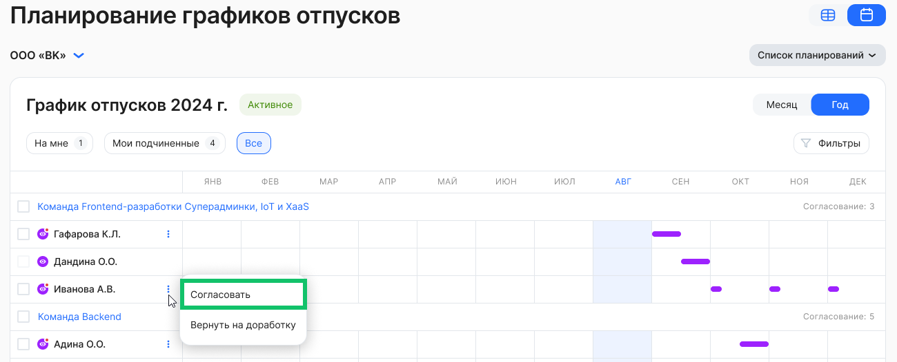

Откройте нужный график сотрудника на этапе «Согласование» в разделе **Графики отпусков**.

Чтобы согласовать график, в блоке **Проверка графиков отпусков** нажмите кнопку **Согласовать**. График перейдет на следующий этап.

 

Подтвердите согласование графика и дождитесь уведомления об успехе.

 

Также можно согласовать одну заявку из списка графиков отпусков, нажав кнопку **→ Согласовать**. 

Представление графиков отпусков в табличном виде:

 

Представление графиков отпусков в календарном виде:

Подтвердите согласование графика и дождитесь уведомления об успехе.